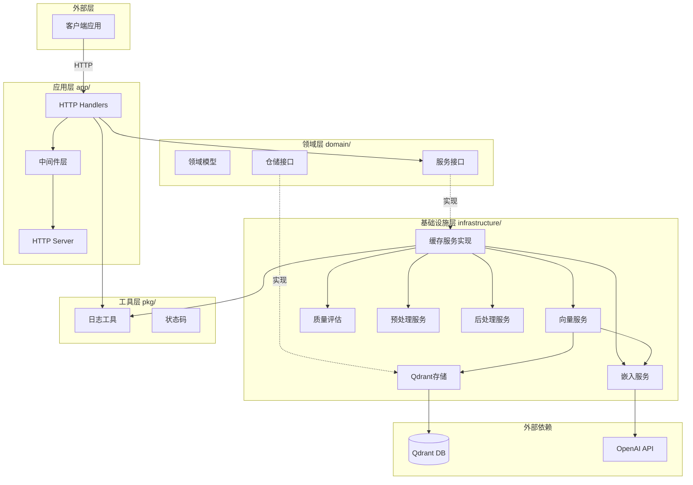
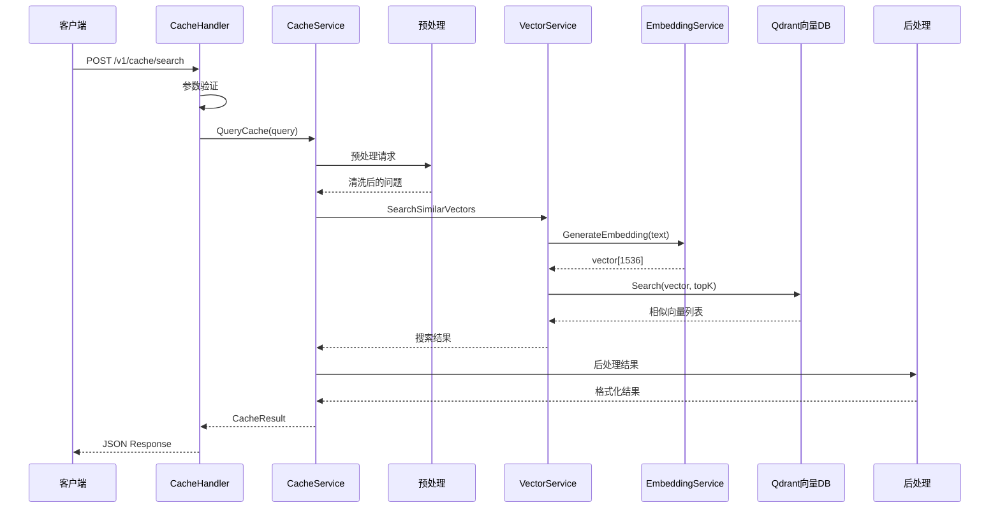
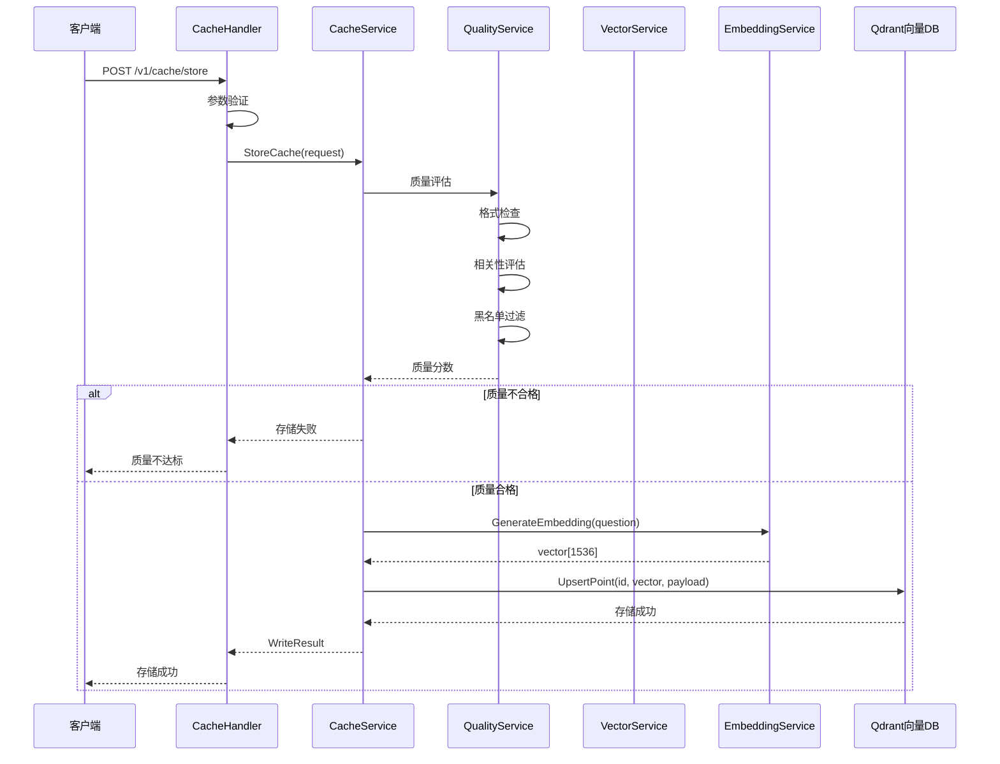
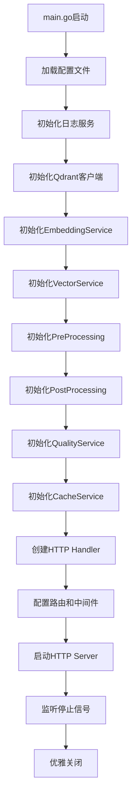

# 技术架构文档

> **项目名称**：LLM-Cache - 基于语义的大模型缓存系统  
> **文档版本**：1.0  
> **最后更新**：2025-01-01

---

## 1. 系统概述

### 1.1 系统定位
LLM-Cache 是一个基于 Go 语言开发的企业级 LLM 语义缓存中间件系统，通过语义相似度匹配优化大模型调用效率，实现成本降低90%、响应速度提升100倍的显著业务价值。

### 1.2 核心功能
- **语义缓存查询**：基于向量相似度的智能缓存匹配
- **缓存写入存储**：支持质量评估的问答对存储
- **向量化服务**：文本到向量的高效转换
- **质量评估**：多策略的缓存内容质量控制
- **预处理/后处理**：请求预处理和召回结果后处理

### 1.3 技术栈概览

| 分类 | 技术选型 | 版本 |
|------|---------|------|
| 编程语言 | Go | 1.22.2+ |
| Web框架 | Gin | 1.10.1 |
| 向量数据库 | Qdrant | 1.15.2 (go-client) |
| 向量化模型 | OpenAI API | 1.12.0 (go-client) |
| 配置管理 | YAML | 3.0.1 |
| 日志系统 | log/slog | Go标准库 |
| 依赖管理 | Go Modules | - |

---

## 2. 架构设计

### 2.1 整体架构



### 2.2 架构模式
本项目采用 **DDD（领域驱动设计）+ Clean Architecture**，具体分为以下层次：

#### 2.2.1 应用层（Application Layer）
- **职责**：处理HTTP请求、参数验证、响应序列化、路由管理
- **目录**：`internal/app/`
- **核心组件**：
  - `handlers/` - HTTP请求处理器
  - `middleware/` - 日志、恢复等中间件
  - `server/` - HTTP服务器和路由配置

#### 2.2.2 领域层（Domain Layer）
- **职责**：定义核心业务实体、服务接口、仓储接口
- **目录**：`internal/domain/`
- **核心组件**：
  - `models/` - 核心领域模型（CacheItem, Vector, Request等）
  - `services/` - 业务服务接口定义
  - `repositories/` - 数据访问接口定义

#### 2.2.3 基础设施层（Infrastructure Layer）
- **职责**：具体技术实现、外部服务集成
- **目录**：`internal/infrastructure/`
- **核心组件**：
  - `cache/` - 缓存服务实现
  - `vector/` - 向量服务实现
  - `embedding/remote/` - 远程嵌入服务（OpenAI）
  - `stores/qdrant/` - Qdrant向量存储
  - `quality/` - 质量评估服务
  - `preprocessing/` - 请求预处理
  - `postprocessing/` - 召回后处理

#### 2.2.4 工具层（Package Layer）
- **职责**：通用工具和辅助功能
- **目录**：`pkg/`
- **核心组件**：
  - `logger/` - 基于slog的日志封装
  - `status/` - 统一状态码定义

---

## 3. 核心模块设计

### 3.1 模块划分

```
LLM-Cache/
├── cmd/server/          # 应用入口（依赖注入、生命周期管理）
├── internal/app/        # 应用层（HTTP处理、路由、中间件）
├── internal/domain/     # 领域层（模型、接口定义）
├── internal/infrastructure/  # 基础设施层（具体实现）
├── configs/             # 配置管理
├── pkg/                 # 工具包
└── docs/                # 项目文档
```

### 3.2 模块职责说明

#### 缓存服务模块 (CacheService)
- **功能**：协调各组件完成缓存的查询、存储、删除
- **核心类**：
  - `CacheService` 接口 - 定义缓存服务契约
  - 具体实现 (infrastructure/cache/) - 组合各个服务
- **对外接口**：
  - `POST /v1/cache/search`：语义缓存查询
  - `POST /v1/cache/store`：问答对存储
  - `GET /v1/cache/:cache_id`：获取缓存项
  - `DELETE /v1/cache/:cache_id`：删除缓存
  - `DELETE /v1/cache/batch`：批量删除
  - `GET /v1/cache/statistics`：获取统计信息
  - `GET /v1/cache/health`：健康检查

#### 向量服务模块 (VectorService)
- **功能**：文本向量化和向量相似度搜索
- **核心类**：
  - `VectorService` 接口 - 向量服务契约
  - 实现类 (infrastructure/vector/) - 组合嵌入和存储
- **核心能力**：
  - 文本转向量
  - 向量相似度搜索
  - 批量向量处理

#### 嵌入服务模块 (EmbeddingService)
- **功能**：调用OpenAI API生成文本向量
- **核心类**：
  - `EmbeddingService` 接口 - 嵌入服务契约
  - `RemoteEmbeddingService` - 远程API实现
- **特性**：
  - 支持单个/批量文本向量化
  - 可配置模型和端点
  - 自动重试机制

#### 向量存储模块 (VectorRepository)
- **功能**：向量数据的持久化和检索
- **核心类**：
  - `VectorRepository` 接口 - 仓储契约
  - `QdrantVectorStore` - Qdrant实现
- **核心操作**：
  - 单个/批量向量存储
  - 向量相似度搜索
  - 向量删除和获取

#### 质量评估模块 (QualityService)
- **功能**：评估缓存内容质量，过滤低质量问答
- **核心策略**：
  - 格式检查策略
  - 相关性评估策略
  - 黑名单过滤
- **配置化**：支持多策略组合和权重配置

#### 预处理/后处理模块
- **预处理**：请求标准化、文本清洗
- **后处理**：结果格式化、相似度调整

---

## 4. 数据设计

### 4.1 核心领域模型

#### 4.1.1 缓存模型 (CacheItem)

```go
type CacheItem struct {
    ID           string          // 唯一标识符
    Question     string          // 问题文本
    Answer       string          // 答案文本
    Vector       []float32       // 问题向量
    UserType     string          // 用户类型
    Metadata     *CacheMetadata  // 元数据
    CreatedAt    time.Time       // 创建时间
    UpdatedAt    time.Time       // 更新时间
}
```

#### 4.1.2 向量模型 (Vector)

```go
type Vector struct {
    ID         string     // 向量ID
    Values     []float32  // 向量值
    Dimension  int        // 向量维度
    CreatedAt  time.Time  // 创建时间
}
```

### 4.2 向量存储设计

**Qdrant Collection 结构**：

| 字段 | 类型 | 说明 |
|------|------|------|
| id | string | 向量点ID（对应CacheItem ID） |
| vector | float32[] | 1536维向量（OpenAI embedding） |
| payload.user_type | string | 用户类型 |
| payload.question | string | 问题文本 |
| payload.answer | string | 答案文本 |
| payload.created_at | timestamp | 创建时间 |

**索引策略**：
- 距离度量：Cosine 余弦相似度
- HNSW索引：高性能近似最近邻搜索
- 过滤器：支持user_type等字段过滤

---

## 5. 接口设计

### 5.1 API规范

- **协议**：HTTP/1.1, RESTful
- **基础URL**：`http://localhost:8080`
- **数据格式**：JSON
- **响应格式**：统一的APIResponse结构

**统一响应格式**：
```json
{
  "success": true,
  "code": 0,
  "message": "操作成功",
  "data": {},
  "request_id": "uuid",
  "timestamp": 1234567890
}
```

### 5.2 核心接口

#### 5.2.1 缓存查询
```
POST /v1/cache/search
Content-Type: application/json

Request:
{
  "question": "什么是机器学习?",
  "user_type": "free",
  "similarity_threshold": 0.85,
  "top_k": 5,
  "include_statistics": false
}

Response:
{
  "success": true,
  "code": 0,
  "data": {
    "found": true,
    "cache_id": "xxx",
    "answer": "机器学习是...",
    "similarity": 0.92,
    "response_time": 50.5
  }
}
```

#### 5.2.2 缓存存储
```
POST /v1/cache/store
Content-Type: application/json

Request:
{
  "question": "什么是深度学习?",
  "answer": "深度学习是...",
  "user_type": "premium",
  "force_write": false
}

Response:
{
  "success": true,
  "code": 0,
  "data": {
    "cache_id": "xxx",
    "stored": true,
    "quality_score": 0.95
  }
}
```

---

## 6. 技术选型理由

### 6.1 编程语言选择

**选型**：Go (Golang) 1.22+

**理由**：
- **高性能**：编译型语言，接近C的执行效率
- **并发优势**：原生goroutine和channel支持高并发
- **部署简单**：单二进制文件，跨平台编译
- **标准库强大**：内置HTTP服务器、JSON处理等
- **内存安全**：GC自动管理，无内存泄漏风险

### 6.2 Web框架选择

**选型**：Gin Web Framework

**理由**：
- **高性能**：基于httprouter，路由性能优秀
- **中间件丰富**：支持灵活的中间件链
- **参数绑定**：自动JSON/表单参数解析和验证
- **错误处理**：统一的错误处理机制
- **社区活跃**：Go生态中最流行的Web框架

### 6.3 向量数据库选择

**选型**：Qdrant

**理由**：
- **专为向量优化**：高性能HNSW索引
- **功能完整**：支持过滤、混合查询
- **Go客户端成熟**：官方go-client支持完善
- **易于部署**：Docker一键部署
- **开源免费**：商业友好的Apache 2.0协议

### 6.4 其他关键技术

| 技术 | 作用 | 选型理由 |
|------|------|---------|
| log/slog | 日志 | Go 1.21+标准库，结构化日志，性能优秀 |
| YAML | 配置 | 人类可读，层次清晰，Go生态支持好 |
| OpenAI API | 向量化 | 业界领先的embedding模型，精度高 |
| Context | 请求上下文 | Go标准库，超时控制、值传递 |

---

## 7. 核心流程

### 7.1 缓存查询流程



### 7.2 缓存存储流程



### 7.3 应用启动流程



---

## 8. 非功能性设计

### 8.1 日志系统
- **框架**：Go标准库 `log/slog`
- **日志级别**：Debug < Info < Warn < Error
- **日志格式**：结构化文本日志（TextHandler）
- **输出方式**：stdout / stderr / file
- **关键特性**：
  - 带Context的日志记录
  - 请求ID追踪
  - 性能优化的零分配

### 8.2 配置管理
- **方案**：YAML配置文件 + 环境变量
- **配置文件**：`configs/config.yaml`
- **加载器**：`configs/loader.go`
- **环境区分**：通过环境变量覆盖配置
- **配置验证**：启动时自动验证配置有效性

### 8.3 错误处理
- **业务错误码**：
  - `0` - 成功
  - `1001` - 参数错误
  - `1002` - 内部错误
  - `1003` - 服务不可用
  - `1004` - 资源不存在
- **HTTP状态码**：所有业务请求返回200，错误信息在响应体中
- **错误传播**：使用`fmt.Errorf`包装错误，保留调用栈

### 8.4 性能优化
- **并发处理**：Goroutine池处理并发请求
- **连接复用**：HTTP客户端连接池
- **批量操作**：向量批量存储和查询
- **索引优化**：Qdrant HNSW索引快速检索

### 8.5 安全设计
- **输入验证**：Gin参数绑定和验证
- **超时控制**：Context超时机制
- **资源限制**：连接数、请求大小限制
- **敏感信息**：API Key通过环境变量配置

### 8.6 可观测性
- **结构化日志**：所有操作记录详细日志
- **请求追踪**：全链路请求ID追踪
- **性能指标**：响应时间、向量维度等
- **健康检查**：`/v1/cache/health` 端点

---

## 9. 部署架构

### 9.1 部署方式
- **容器化**：Docker + Docker Compose
- **进程管理**：systemd / supervisord
- **反向代理**：Nginx（可选）

### 9.2 最小部署架构

```
┌─────────────────┐
│   Nginx (可选)   │
└────────┬────────┘
         │
┌────────▼────────┐
│  LLM-Cache      │
│  (Go Binary)    │
└────┬──────┬─────┘
     │      │
     │      └──────┐
     │             │
┌────▼─────┐  ┌───▼────┐
│ Qdrant   │  │OpenAI  │
│ Vector DB│  │  API   │
└──────────┘  └────────┘
```

### 9.3 Docker部署示例

```yaml
# docker-compose.yml
version: '3.8'
services:
  qdrant:
    image: qdrant/qdrant:latest
    ports:
      - "6333:6333"
    volumes:
      - qdrant_data:/qdrant/storage

  llm-cache:
    build: .
    ports:
      - "8080:8080"
    environment:
      - OPENAI_API_KEY=${OPENAI_API_KEY}
    depends_on:
      - qdrant
    volumes:
      - ./configs:/app/configs
      - ./logs:/app/logs

volumes:
  qdrant_data:
```

### 9.4 环境变量配置

```bash
# OpenAI配置
OPENAI_API_KEY=sk-xxx
OPENAI_API_ENDPOINT=https://api.openai.com/v1

# Qdrant配置
QDRANT_HOST=localhost
QDRANT_PORT=6333

# 服务配置
SERVER_PORT=8080
LOG_LEVEL=info
```

---

## 10. 开发指南

### 10.1 项目初始化

```bash
# 克隆项目
git clone <repository-url>
cd LLM-Cache

# 安装依赖
go mod download

# 复制配置文件
cp configs/config.yaml.example configs/config.yaml
# 编辑配置文件，填入必要的API Key等

# 启动Qdrant（Docker）
docker run -p 6333:6333 qdrant/qdrant

# 运行项目
go run cmd/server/main.go
```

### 10.2 目录职责

```
cmd/server/main.go          # 应用入口，依赖注入
internal/app/handlers/       # HTTP请求处理
internal/app/middleware/     # 中间件
internal/app/server/         # 服务器配置
internal/domain/models/      # 领域模型
internal/domain/services/    # 服务接口
internal/domain/repositories/# 仓储接口
internal/infrastructure/     # 具体实现
configs/                     # 配置文件
pkg/                         # 工具包
```

### 10.3 核心接口实现规范

- **服务接口**：定义在`internal/domain/services/`
- **具体实现**：放在`internal/infrastructure/`对应模块
- **依赖注入**：通过工厂模式在`main.go`组装
- **错误处理**：返回包装的error，记录日志

---

## 11. 扩展性设计

### 11.1 支持多种向量数据库

当前实现Qdrant，可扩展支持：
- **Milvus**：实现`VectorRepository`接口
- **Weaviate**：实现`VectorRepository`接口
- **Pinecone**：实现`VectorRepository`接口

### 11.2 支持多种嵌入模型

当前实现OpenAI，可扩展支持：
- **本地模型**：ONNX/TensorFlow模型
- **其他API**：Cohere、HuggingFace等
- **自定义模型**：实现`EmbeddingService`接口

### 11.3 插件化质量策略

质量评估支持多策略组合，可灵活添加：
- 自定义评分策略
- 基于ML的质量预测
- 业务规则引擎

---

## 12. 性能指标

### 12.1 关键性能指标

| 指标 | 目标值 | 说明 |
|------|--------|------|
| 缓存查询延迟 | < 100ms | P95，包含向量化和检索 |
| 缓存写入延迟 | < 200ms | P95，包含质量评估和存储 |
| 并发QPS | > 1000 | 单实例，8核16G |
| 缓存命中率 | > 80% | 取决于业务场景 |
| 向量检索准确率 | > 95% | Top-10召回率 |

### 12.2 资源消耗

- **CPU**：2-4核（推荐4核）
- **内存**：4-8GB（推荐8GB）
- **磁盘**：取决于缓存规模，建议SSD
- **网络**：稳定的互联网连接（调用OpenAI API）

---

## 13. 已知限制与未来规划

### 13.1 当前限制

1. **单实例部署**：暂不支持分布式集群
2. **向量数据库单一**：仅支持Qdrant
3. **缓存淘汰策略**：未实现TTL和LRU淘汰
4. **监控指标**：缺少Prometheus等监控集成

### 13.2 未来规划

- [ ] 分布式部署支持
- [ ] 更多向量数据库适配
- [ ] 缓存淘汰策略
- [ ] Prometheus监控指标
- [ ] gRPC接口支持
- [ ] 流式响应支持
- [ ] 更丰富的质量评估策略

---

## 14. 附录

### 14.1 参考文档

- [Go官方文档](https://golang.org/doc/)
- [Gin框架文档](https://gin-gonic.com/docs/)
- [Qdrant文档](https://qdrant.tech/documentation/)
- [OpenAI API文档](https://platform.openai.com/docs/api-reference)

### 14.2 代码规范

- 遵循[Effective Go](https://golang.org/doc/effective_go.html)
- 使用`gofmt`格式化代码
- 每个exported函数必须有注释
- 使用有意义的变量和函数命名

### 14.3 Git分支策略

- `main` - 稳定发布分支
- `develop` - 开发主分支
- `feature/*` - 功能分支
- `hotfix/*` - 紧急修复分支

---

**文档维护者**：LLM-Cache开发团队  
**联系方式**：[待补充]  
**最后审核日期**：2025-01-01

