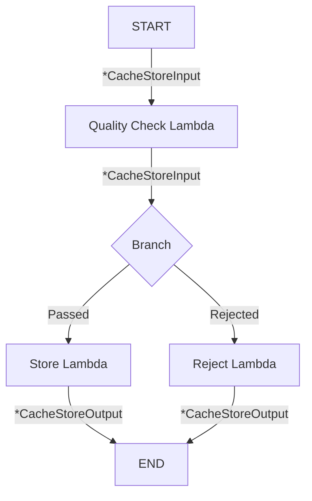

# LLM-Cache 项目 Eino 框架重构方案

> **文档版本**: 3.0  
> **创建日期**: 2025-01-01  
> **最后更新**: 2025-01-30  
> **作者**: AI Assistant  
> **状态**: 待评审

---

## 更新日志

| 版本 | 日期 | 更新内容 |
|------|------|----------|
| 3.0 | 2025-01-30 | **重大更新**：从"适配器集成"改为"完全重构"方案。删除所有自定义接口定义，直接使用 Eino 原生类型；Handler 层改为依赖 `compose.Runnable`；添加重构边界图和代码删除清单；更新迁移检查清单 |
| 2.1 | 2025-01-16 | 补充 Qianfan/Tencentcloud Embedding 配置、完善 Callback 集成详情（Langfuse/APMPlus/Cozeloop/Langsmith 完整配置）、添加 VikingDB 配置示例、更新环境变量列表 |
| 2.0 | 2025-01-15 | 完善 Eino-ext 组件详情、更新向量数据库支持列表、添加具体 API 配置 |
| 1.0 | 2025-01-01 | 初始版本 |

---

## 目录

1. [项目现状深度分析](#一项目现状深度分析)
2. [Eino 框架概述与优势分析](#二eino-框架概述与优势分析)
3. [改造目标与原则](#三改造目标与原则)
4. [分阶段改造方案](#四分阶段改造方案)
5. [技术实施细节](#五技术实施细节)
6. [风险评估与缓解](#六风险评估与缓解)
7. [预期收益](#七预期收益)
8. [实施路线图](#八实施路线图)
9. [总结](#九总结)
10. [附录](#附录)
    - [附录 A：完整配置文件示例](#附录-a完整配置文件示例)
    - [附录 B：环境变量配置](#附录-b环境变量配置)
    - [附录 C：常见问题与解决方案](#附录-c常见问题与解决方案)
    - [附录 D：性能优化建议](#附录-d性能优化建议)
    - [附录 E：迁移检查清单](#附录-e迁移检查清单)
    - [附录 F：术语表](#附录-f术语表)
    - [附录 G：参考资料](#附录-g参考资料)

---

## 核心重构理念

> **⚠️ 重要声明**  
> 本文档描述的是**完全重构方案**，而非适配器集成方案。
> 
> **核心原则**：
> - **删除所有自定义接口**：`internal/domain/services/` 和 `internal/domain/repositories/` 下的所有接口定义将被删除
> - **直接使用 Eino 类型**：业务代码直接依赖 `embedding.Embedder`、`retriever.Retriever`、`compose.Runnable` 等 Eino 原生类型
> - **不创建任何适配器**：不存在"包装 Eino 实现自定义接口"的情况
> - **Handler 层重构**：HTTP Handler 直接依赖 `compose.Runnable` 而非自定义 Service 接口
>
> **重构后的依赖关系**：
> ```
> Handler → compose.Runnable → Eino Flow/Graph → Eino Components
>                                    ↓
>                         embedding.Embedder / retriever.Retriever / indexer.Indexer
> ```

---

## 一、项目现状深度分析

### 1.1 架构特点

当前项目采用 **DDD（领域驱动设计）+ Clean Architecture** 架构模式，整体分层清晰：

```
├── cmd/server/              # 应用入口 - 依赖注入和服务启动
├── internal/
│   ├── app/                 # 应用层（HTTP处理、路由）
│   │   ├── handlers/        # HTTP请求处理器
│   │   ├── middleware/      # 中间件（日志、恢复等）
│   │   └── server/          # HTTP服务器和路由配置
│   ├── domain/              # 领域层（模型、接口定义）
│   │   ├── models/          # 核心领域模型（Cache、Vector、Request等）
│   │   ├── services/        # 业务服务接口定义
│   │   └── repositories/    # 数据访问接口定义
│   └── infrastructure/      # 基础设施层（具体实现）
│       ├── cache/           # 缓存服务实现（待完善）
│       ├── vector/          # 向量服务（已实现）
│       ├── embedding/       # Embedding服务（已实现远程调用）
│       ├── stores/qdrant/   # Qdrant向量存储（已实现）
│       ├── quality/         # 质量评估（待完善）
│       ├── preprocessing/   # 请求预处理（已实现）
│       └── postprocessing/  # 召回后处理（待完善）
├── configs/                 # 配置管理（结构定义已完成，加载待实现）
└── pkg/                     # 工具包（logger、status codes）
```

```
┌─────────────────────────────────────────┐
│  应用层 (app/)                          │
│  - handlers: CacheHandler HTTP请求处理  │
│  - middleware: 日志中间件、请求ID生成    │
│  - server: Gin HTTP服务器和路由配置      │
└─────────────────────────────────────────┘
              ↓ 调用
┌─────────────────────────────────────────┐
│  领域层 (domain/)                       │
│  - models: CacheItem, Vector, CacheQuery等 │
│  - services: CacheService, VectorService等接口 │
│  - repositories: VectorRepository接口    │
└─────────────────────────────────────────┘
              ↓ 实现
┌─────────────────────────────────────────┐
│  基础设施层 (infrastructure/)            │
│  - cache: CacheService实现（占位）        │
│  - embedding: RemoteEmbeddingService    │
│  - vector: DefaultVectorService         │
│  - quality: QualityService（占位）        │
│  - stores: QdrantVectorStore            │
│  - preprocessing: DefaultRequestPreprocessingService │
│  - postprocessing: 占位实现              │
└─────────────────────────────────────────┘
```

### 1.2 核心业务流程

#### 1.2.1 缓存查询流程（当前实际实现）

```
客户端请求
    ↓
CacheHandler.QueryCache()                   # HTTP 处理器
    ↓
CacheService.QueryCache()                   # 缓存服务接口
    ↓
VectorService.SearchCache()                 # 向量服务
    ↓
┌──────────────────────────────────────────────────────┐
│ 1. EmbeddingService.GenerateEmbedding()              │ ← 文本向量化（OpenAI API）
│ 2. VectorRepository.Search()                         │ ← Qdrant 相似度搜索
│ 3. SelectBestResult()                                │ ← 结果选择策略
│    ├─ FirstSelectionStrategy                         │   （选择第一个）
│    ├─ HighestScoreSelectionStrategy                  │   （选择最高分）
│    └─ TemperatureSoftmaxSelectionStrategy            │   （温度采样）
│ 4. 从 Payload 提取答案和元数据                         │ ← 结果格式化
└──────────────────────────────────────────────────────┘
    ↓
返回 CacheResult
```

**注意**: 当前查询流程中：
- `RequestPreprocessingService` 已注册但实际预处理逻辑需用户自行注册
- `RecallPostprocessingService` 工厂已创建但实现为空
- 流程编排在 `main.go` 中通过依赖注入硬编码

#### 1.2.2 缓存存储流程（当前实际实现）

```
客户端请求
    ↓
CacheHandler.StoreCache()                   # HTTP 处理器
    ↓
CacheService.StoreCache()                   # 缓存服务接口
    ↓
VectorService.StoreCache()                  # 向量服务
    ↓
┌──────────────────────────────────────────────────────┐
│ 1. EmbeddingService.GenerateEmbedding()              │ ← 文本向量化
│ 2. 构建 Payload（question, answer, metadata等）       │ ← 元数据封装
│ 3. VectorRepository.Store()                          │ ← Qdrant 存储
│    └─ QdrantClient.UpsertPoint()                     │   （支持 Upsert）
└──────────────────────────────────────────────────────┘
    ↓
返回 CacheWriteResult
```

**注意**: 当前存储流程中：
- `QualityService` 工厂已创建但实现文件为空，质量评估未生效
- 缺少去重检查和质量过滤逻辑
- `ForceWrite` 参数已定义但未实际使用

### 1.3 组件实现状态详情

| 组件 | 接口定义 | 实现状态 | 说明 |
|------|---------|---------|------|
| **CacheService** | ✅ 完整 | ❌ 空实现 | 核心编排层，当前为空文件 |
| **VectorService** | ✅ 完整 | ✅ 已实现 | DefaultVectorService，含搜索/存储/删除 |
| **EmbeddingService** | ✅ 完整 | ✅ 已实现 | RemoteEmbeddingService，基于 OpenAI API |
| **VectorRepository** | ✅ 完整 | ✅ 已实现 | QdrantVectorStore，支持单条/批量操作 |
| **QualityService** | ✅ 完整 | ❌ 空实现 | 接口丰富但实现为空 |
| **RequestPreprocessingService** | ✅ 完整 | ⚠️ 框架实现 | 支持注册预处理函数，但无内置预处理器 |
| **RecallPostprocessingService** | ✅ 完整 | ❌ 空实现 | 工厂存在但服务实现为空 |
| **ResultSelectionStrategy** | ✅ 完整 | ✅ 已实现 | 3种策略：first/highest_score/temperature_softmax |

### 1.4 当前架构的痛点

#### 1.4.1 核心编排层缺失

- **问题**: `CacheService` 作为设计中的核心编排层，实际实现逻辑薄弱
- **影响**: HTTP Handler 虽然依赖 `CacheService` 接口，但底层逻辑主要依赖 `VectorService`，导致预处理、质量评估、后处理等步骤未被有效编排
- **现状**: 流程编排逻辑硬编码在 `main.go` 的 `initializeServices()` 中
- **示例**: 当前 `StoreCache` 没有经过质量评估就直接存储

#### 1.4.2 流程编排分散且不完整

- **问题**: 预设的预处理→质量评估→向量化→存储/检索→后处理流程未完整实现
- **影响**: 
  - 预处理服务框架存在但无内置预处理器
  - 质量评估服务仅有接口定义
  - 后处理服务仅有接口定义
- **示例**: 用户注册自定义预处理函数后，实际不会被调用（因为 CacheService 为空）

#### 1.4.3 组件耦合与依赖注入不够灵活

- **问题**: 依赖关系在 `main.go` 中硬编码，缺少灵活的组件切换机制
- **影响**: 切换 Embedding 提供商或向量数据库需要修改初始化代码
- **现状**: 
  - 工厂模式已建立（VectorServiceFactory, QdrantVectorStoreFactory等）
  - 但缺少统一的依赖注入容器或配置驱动的组件选择

#### 1.4.4 配置管理待完善

- **问题**: 配置结构体已定义完善，但配置加载（`configs/loader.go`）为空
- **影响**: 
  - 无法从 YAML 文件加载配置
  - 部分配置在代码中硬编码（如质量评估阈值）
- **现状**: `configs/config.yaml` 为空文件

#### 1.4.5 可观测性不足

- **问题**: 缺乏统一的监控和追踪机制
- **影响**: 难以进行性能分析和问题排查
- **现状**: 
  - 仅有基于 `log/slog` 的基础日志记录
  - 中间件提供请求 ID 生成
  - 缺乏链路追踪（Tracing）和指标收集（Metrics）
  - 无统一的 Callback 机制

#### 1.4.6 扩展性受限

- **问题**: 添加新的模型或存储后端需要修改初始化代码
- **影响**: 开发效率低，无法通过配置切换后端
- **示例**: 
  - 支持 Milvus 需要实现新的 `VectorRepository` 并修改 `main.go`
  - 支持其他 Embedding 模型需要修改 `initializeInfrastructure()`

### 1.5 技术栈现状

| 组件 | 当前实现 | 版本/备注 |
|------|---------|----------|
| **Go 版本** | Go 1.22.2 | toolchain go1.23.4 |
| **Web 框架** | Gin | v1.10.1 |
| **向量数据库** | Qdrant | go-client v1.15.2 |
| **Embedding 服务** | OpenAI API | openai-go v1.12.0 |
| **日志系统** | log/slog | Go 标准库（封装为 Logger 接口） |
| **配置管理** | YAML 结构定义 | gopkg.in/yaml.v3（加载未实现） |
| **ID 生成** | UUID | google/uuid v1.6.0 |

### 1.6 设计亮点（可保留）

尽管存在上述问题，项目在架构设计上仍有值得保留的特点：

1. **清晰的分层架构**: DDD + Clean Architecture 的分层模式为后续改造提供了良好基础
2. **接口驱动设计**: 所有核心服务都定义了接口，便于实现替换和测试
3. **工厂模式**: 各服务已建立工厂模式（VectorServiceFactory, QdrantVectorStoreFactory），为依赖注入提供基础
4. **Builder 模式**: VectorServiceBuilder 提供了灵活的构建方式
5. **策略模式**: ResultSelectionStrategy 接口支持多种结果选择策略的插拔
6. **函数式预处理**: RequestPreprocessingService 支持注册自定义预处理函数链
7. **完善的领域模型**: CacheItem, Vector, CacheQuery 等模型定义完整，包含验证逻辑

---

## 1.7 重构范围界定

本次重构将**彻底重写**项目的核心组件，直接使用 Eino 框架的原生接口和类型，而非在现有代码上做适配器包装。

### 1.7.1 重构边界图

```
┌─────────────────────────────────────────────────────────────────┐
│                      保留层（调整依赖类型）                        │
├─────────────────────────────────────────────────────────────────┤
│  cmd/server/main.go          → 重写依赖注入，使用 Eino 组件       │
│  internal/app/handlers/      → 调整依赖类型为 Eino 原生类型       │
│  internal/app/server/        → 路由保留                          │
│  internal/app/middleware/    → 保留                              │
│  internal/domain/models/     → 保留领域模型（CacheItem 等）        │
│  pkg/logger/                 → 保留                              │
│  pkg/status/                 → 保留                              │
│  configs/                    → 扩展配置结构，支持 Eino 配置        │
└─────────────────────────────────────────────────────────────────┘

┌─────────────────────────────────────────────────────────────────┐
│                      删除层（完全移除）                           │
├─────────────────────────────────────────────────────────────────┤
│  internal/domain/services/embedding_service.go     → 删除       │
│  internal/domain/services/vector_service.go        → 删除       │
│  internal/domain/services/cache_service.go         → 删除       │
│  internal/domain/services/quality_service.go       → 删除       │
│  internal/domain/services/*_service.go             → 全部删除   │
│  internal/domain/repositories/                     → 删除       │
│  internal/infrastructure/embedding/                → 删除       │
│  internal/infrastructure/stores/                   → 删除       │
│  internal/infrastructure/vector/                   → 删除       │
│  internal/infrastructure/cache/                    → 删除       │
│  internal/infrastructure/quality/                  → 删除       │
│  internal/infrastructure/preprocessing/            → 删除       │
│  internal/infrastructure/postprocessing/           → 删除       │
└─────────────────────────────────────────────────────────────────┘

┌─────────────────────────────────────────────────────────────────┐
│                      新建层（Eino 原生实现）                      │
├─────────────────────────────────────────────────────────────────┤
│  internal/eino/                                                 │
│  ├── components/     Eino 组件工厂（Embedder/Retriever/Indexer）  │
│  ├── flows/          Graph/Chain 流程定义                        │
│  ├── nodes/          自定义 Lambda 节点实现                       │
│  ├── callbacks/      Callback 处理器                             │
│  └── config/         Eino 配置结构                               │
└─────────────────────────────────────────────────────────────────┘
```

### 1.7.2 代码删除清单

| 待删除文件/目录 | 行数 | Eino 替代方案 |
|---------------|------|---------------|
| `internal/domain/services/embedding_service.go` | 20 | `embedding.Embedder` 接口 |
| `internal/domain/services/vector_service.go` | 37 | `compose.Runnable` 编排 |
| `internal/domain/services/cache_service.go` | 47 | `compose.Runnable` 编排 |
| `internal/domain/services/quality_service.go` | 50+ | Lambda 节点 |
| `internal/domain/repositories/vector_repository.go` | 60+ | `retriever.Retriever` + `indexer.Indexer` |
| `internal/infrastructure/embedding/remote/` | 237 | `eino-ext/embedding/openai` |
| `internal/infrastructure/stores/qdrant/` | 443+ | `eino-ext/retriever/qdrant` + `indexer/qdrant` |
| `internal/infrastructure/vector/` | 535+ | Eino Graph 编排 |
| `internal/infrastructure/cache/` | 空 | Eino Graph 编排 |
| `internal/infrastructure/quality/` | 100+ | Lambda 节点 |
| `internal/infrastructure/preprocessing/` | 194 | Lambda 节点 |
| `internal/infrastructure/postprocessing/` | 100+ | Lambda 节点 |

### 1.7.3 接口类型迁移对照表

| 现有接口/类型 | Eino 替代类型 | 说明 |
|-------------|--------------|------|
| `services.EmbeddingService` | `embedding.Embedder` | 直接使用 Eino 接口 |
| `services.VectorService` | `compose.Runnable[I, O]` | 用 Graph 编排替代 |
| `services.CacheService` | `compose.Runnable[I, O]` | 用 Graph 编排替代 |
| `services.QualityService` | `compose.InvokableLambda` | 用 Lambda 节点替代 |
| `services.RequestPreprocessingService` | `compose.InvokableLambda` | 用 Lambda 节点替代 |
| `services.RecallPostprocessingService` | `compose.InvokableLambda` | 用 Lambda 节点替代 |
| `repositories.VectorRepository` | `retriever.Retriever` + `indexer.Indexer` | 拆分为检索和索引 |

### 1.7.4 Handler 层类型变更

```go
// ==================== 改造前 ====================
// internal/app/handlers/cache_handler.go
type CacheHandler struct {
    cacheService services.CacheService  // 自定义接口
    logger       logger.Logger
}

func (h *CacheHandler) QueryCache(c *gin.Context) {
    result, err := h.cacheService.QueryCache(ctx, query)
    // ...
}

// ==================== 改造后 ====================
// internal/app/handlers/cache_handler.go
type CacheHandler struct {
    queryRunner  compose.Runnable[*QueryInput, *QueryOutput]   // Eino 原生类型
    storeRunner  compose.Runnable[*StoreInput, *StoreOutput]   // Eino 原生类型
    deleteRunner compose.Runnable[*DeleteInput, *DeleteOutput] // Eino 原生类型
    logger       logger.Logger
}

func (h *CacheHandler) QueryCache(c *gin.Context) {
    result, err := h.queryRunner.Invoke(ctx, input)  // 直接调用 Eino Runnable
    // ...
}
```

---


## 二、Eino 框架概述与优势分析

### 2.1 Eino是什么？

**Eino** 是由字节跳动开源的基于 Go 语言的大模型应用开发框架，专注于提供：
- 🧩 **可组合性**：丰富的组件抽象，易于组合和扩展
- 🔄 **流处理能力**：原生支持流式数据处理（`StreamReader`/`StreamWriter`）
- 🏗️ **工程化能力**：类型安全、并发管理、可观测性

**GitHub**: https://github.com/cloudwego/eino  
**扩展组件库**: https://github.com/cloudwego/eino-ext  
**官方文档**: https://www.cloudwego.io/docs/eino/

### 2.1.1 Eino 生态系统概览

Eino 框架由核心库和扩展库组成：

| 仓库 | 描述 | 用途 |
|------|------|------|
| `cloudwego/eino` | 核心框架 | 接口定义、编排能力、Callback 机制 |
| `cloudwego/eino-ext` | 扩展组件库 | 具体实现：模型、向量库、Embedding 等 |

**Eino-ext 支持的组件矩阵**：

| 组件类型 | 支持的提供商/后端 |
|---------|------------------|
| **ChatModel** | OpenAI, ARK (火山引擎), Ollama, Qwen (通义千问), ARK Bot |
| **Embedding** | OpenAI, ARK, Ollama, Dashscope (阿里云), Qianfan (百度), Tencentcloud |
| **Retriever** | Qdrant, Milvus, Redis, Elasticsearch (ES8), VikingDB, Dify |
| **Indexer** | Qdrant, Milvus, Redis, Elasticsearch (ES8), VikingDB |
| **Callbacks** | Langfuse, APMPlus, Cozeloop |

### 2.2 Eino核心组件接口定义

#### 2.2.1 Embedding 组件

**接口定义** (位置: `github.com/cloudwego/eino/components/embedding/interface.go`):

```go
// Embedder 接口定义
type Embedder interface {
    EmbedStrings(ctx context.Context, texts []string, opts ...Option) ([][]float64, error)
}

// 配置选项
type Options struct {
    Model *string  // 模型名称
}

// Callback 输入输出结构
type CallbackInput struct {
    Texts  []string
    Config *Config
    Extra  map[string]any
}

type CallbackOutput struct {
    Embeddings [][]float64
    Config     *Config
    TokenUsage *TokenUsage
    Extra      map[string]any
}

type TokenUsage struct {
    PromptTokens     int
    CompletionTokens int
    TotalTokens      int
}
```

**Eino-ext 支持的 Embedding 提供商详情**：

| 提供商 | 包路径 | 配置结构 | 默认模型 |
|--------|--------|----------|---------|
| **OpenAI** | `eino-ext/components/embedding/openai` | `EmbeddingConfig` | text-embedding-3-small |
| **ARK (火山引擎)** | `eino-ext/components/embedding/ark` | `EmbeddingConfig` | doubao-embedding |
| **Ollama** | `eino-ext/components/embedding/ollama` | `EmbeddingConfig` | nomic-embed-text |
| **Dashscope (阿里云)** | `eino-ext/components/embedding/dashscope` | `EmbeddingConfig` | text-embedding-v3 |
| **Qianfan (百度千帆)** | `eino-ext/components/embedding/qianfan` | `EmbeddingConfig` | Embedding-V1 |
| **Tencentcloud (腾讯云)** | `eino-ext/components/embedding/tencentcloud` | `EmbeddingConfig` | hunyuan-embedding |

**OpenAI Embedding 配置详情**：

```go
import "github.com/cloudwego/eino-ext/components/embedding/openai"

type EmbeddingConfig struct {
    // Timeout 指定等待 API 响应的最大时间
    // 如果设置了 HTTPClient，Timeout 将不会被使用
    // 可选，默认：无超时
    Timeout time.Duration `json:"timeout"`
    
    // HTTPClient 指定发送 HTTP 请求的客户端
    // 可选，默认：&http.Client{Timeout: Timeout}
    HTTPClient *http.Client `json:"http_client"`
    
    // APIKey 是您的身份验证密钥
    // 必填
    APIKey string `json:"api_key"`
    
    // 以下三个字段仅在使用 Azure OpenAI Service 时需要
    // ByAzure 表示是否使用 Azure OpenAI Service
    ByAzure bool `json:"by_azure"`
    
    // BaseURL 是 Azure OpenAI 端点 URL
    // 格式：https://{YOUR_RESOURCE_NAME}.openai.azure.com
    BaseURL string `json:"base_url"`
    
    // APIVersion 指定 Azure OpenAI API 版本
    APIVersion string `json:"api_version"`
    
    // Model 指定用于生成嵌入的模型 ID
    // 必填
    Model string `json:"model"`
    
    // EncodingFormat 指定嵌入输出的格式
    // 可选，默认：EmbeddingEncodingFormatFloat
    EncodingFormat *EmbeddingEncodingFormat `json:"encoding_format,omitempty"`
    
    // Dimensions 指定输出嵌入应具有的维度数
    // 可选，仅在 text-embedding-3 及更高版本模型中支持
    Dimensions *int `json:"dimensions,omitempty"`
    
    // User 是代表您的最终用户的唯一标识符
    // 可选，帮助 OpenAI 监控和检测滥用
    User *string `json:"user,omitempty"`
}

// 使用示例
embedder, err := openai.NewEmbedder(ctx, &openai.EmbeddingConfig{
    APIKey:     os.Getenv("OPENAI_API_KEY"),
    Model:      "text-embedding-3-small",
    BaseURL:    os.Getenv("OPENAI_BASE_URL"), // 可选，自定义端点
    Dimensions: &defaultDim,                   // 可选，如 1024
    Timeout:    30 * time.Second,
})
```

**ARK (火山引擎) Embedding 配置详情**：

```go
import "github.com/cloudwego/eino-ext/components/embedding/ark"

type EmbeddingConfig struct {
    // Timeout 指定等待 API 响应的最大时间
    // 可选，默认：10 分钟
    Timeout *time.Duration `json:"timeout"`
    
    // HTTPClient 指定发送 HTTP 请求的客户端
    HTTPClient *http.Client `json:"http_client"`
    
    // RetryTimes 指定失败 API 调用的重试次数
    // 可选，默认：2
    RetryTimes *int `json:"retry_times"`
    
    // BaseURL 指定 Ark 服务的基础 URL
    // 可选，默认："https://ark.cn-beijing.volces.com/api/v3"
    BaseURL string `json:"base_url"`
    
    // Region 指定 Ark 服务所在的区域
    // 可选，默认："cn-beijing"
    Region string `json:"region"`
    
    // APIKey 或 AccessKey/SecretKey 对用于身份验证
    // APIKey 优先级更高
    APIKey    string `json:"api_key"`
    AccessKey string `json:"access_key"`
    SecretKey string `json:"secret_key"`
    
    // Model 指定 ark 平台上的端点 ID
    // 必填
    Model string `json:"model"`
    
    // APIType 指定使用哪种 API：文本或多模态
    // 可选，默认：APITypeText
    APIType *string `json:"api_type"`
}

// 使用示例
embedder, err := ark.NewEmbedder(ctx, &ark.EmbeddingConfig{
    APIKey: os.Getenv("ARK_API_KEY"),
    Model:  os.Getenv("ARK_MODEL"), // 例如 "ep-20240909094235-xxxx"
})
```

**Ollama Embedding 配置详情**：

```go
import "github.com/cloudwego/eino-ext/components/embedding/ollama"

type EmbeddingConfig struct {
    // Timeout 指定等待 API 响应的最大时间
    // 可选，默认：无超时
    Timeout time.Duration `json:"timeout"`
    
    // HTTPClient 指定发送 HTTP 请求的客户端
    HTTPClient *http.Client `json:"http_client"`
    
    // BaseURL 指定 Ollama 服务端点 URL
    // 可选，默认："http://localhost:11434"
    BaseURL string `json:"base_url"`
    
    // Model 指定用于生成嵌入的模型 ID
    // 必填
    Model string `json:"model"`
    
    // Truncate 指定是否将文本截断到模型的最大上下文长度
    // 可选
    Truncate *bool `json:"truncate,omitempty"`
    
    // KeepAlive 控制模型在此请求后在内存中保持加载的时间
    // 可选，默认：5 分钟
    KeepAlive *time.Duration `json:"keep_alive,omitempty"`
    
    // Options 列出模型特定的选项
    // 可选
    Options map[string]any `json:"options,omitempty"`
}

// 使用示例
embedder, err := ollama.NewEmbedder(ctx, &ollama.EmbeddingConfig{
    BaseURL: "http://localhost:11434",
    Model:   "nomic-embed-text",
    Timeout: 10 * time.Second,
})
```

**Dashscope (阿里云) Embedding 配置详情**：

```go
import "github.com/cloudwego/eino-ext/components/embedding/dashscope"

type EmbeddingConfig struct {
    // APIKey 是您的身份验证密钥
    // 必填
    APIKey string `json:"api_key"`
    
    // Timeout 指定 HTTP 请求超时时间
    Timeout time.Duration `json:"timeout"`
    
    // HTTPClient 指定发送 HTTP 请求的客户端
    HTTPClient *http.Client `json:"http_client"`
    
    // Model 可用模型：text-embedding-v1 / text-embedding-v2 / text-embedding-v3
    // 不支持异步嵌入模型
    Model string `json:"model"`
    
    // Dimensions 指定输出向量维度
    // 仅适用于 text-embedding-v3 模型，只能选择 1024、768 和 512 三个值
    // 默认值为 1024
    Dimensions *int `json:"dimensions,omitempty"`
}

// 使用示例
embedder, err := dashscope.NewEmbedder(ctx, &dashscope.EmbeddingConfig{
    APIKey: os.Getenv("DASHSCOPE_API_KEY"),
    Model:  "text-embedding-v3",
})
```

**Qianfan (百度千帆) Embedding 配置详情**：

```go
import "github.com/cloudwego/eino-ext/components/embedding/qianfan"

type EmbeddingConfig struct {
    // Model 指定使用的模型
    // 可选值：Embedding-V1
    // 必填
    Model string `json:"model"`
    
    // LLMRetryCount 指定 LLM 调用失败时的重试次数
    // 可选
    LLMRetryCount *int `json:"llm_retry_count"`
    
    // LLMRetryTimeout 指定重试超时时间（秒）
    // 可选
    LLMRetryTimeout *float32 `json:"llm_retry_timeout"`
    
    // LLMRetryBackoffFactor 指定重试退避因子
    // 可选
    LLMRetryBackoffFactor *float32 `json:"llm_retry_backoff_factor"`
}

// 使用示例
// 注意：Qianfan 使用单例配置，需要先设置认证信息
qcfg := qianfan.GetQianfanSingletonConfig()
qcfg.AccessKey = os.Getenv("QIANFAN_ACCESS_KEY")
qcfg.SecretKey = os.Getenv("QIANFAN_SECRET_KEY")

embedder, err := qianfan.NewEmbedder(ctx, &qianfan.EmbeddingConfig{
    Model: "Embedding-V1",
})
```

**Tencentcloud (腾讯云混元) Embedding 配置详情**：

```go
import "github.com/cloudwego/eino-ext/components/embedding/tencentcloud"

type EmbeddingConfig struct {
    // SecretID 腾讯云 Secret ID
    // 必填
    SecretID string `json:"secret_id"`
    
    // SecretKey 腾讯云 Secret Key
    // 必填
    SecretKey string `json:"secret_key"`
    
    // Region 腾讯云地域
    // 例如：ap-guangzhou、ap-shanghai、ap-beijing
    // 必填
    Region string `json:"region"`
}

// 使用示例
embedder, err := tencentcloud.NewEmbedder(ctx, &tencentcloud.EmbeddingConfig{
    SecretID:  os.Getenv("TENCENTCLOUD_SECRET_ID"),
    SecretKey: os.Getenv("TENCENTCLOUD_SECRET_KEY"),
    Region:    "ap-guangzhou",
})
```

**Embedding 提供商完整对比表**：

| 提供商 | 包路径 | 认证方式 | 默认模型 | 向量维度 | 特点 |
|--------|--------|----------|---------|---------|------|
| **OpenAI** | `embedding/openai` | API Key | text-embedding-3-small | 1536/3072 | 通用性强，支持 Azure |
| **ARK (火山引擎)** | `embedding/ark` | API Key / AK+SK | doubao-embedding | 1024 | 国内访问快 |
| **Ollama** | `embedding/ollama` | 无需认证 | nomic-embed-text | 768 | 本地部署，免费 |
| **Dashscope (阿里云)** | `embedding/dashscope` | API Key | text-embedding-v3 | 512/768/1024 | 多维度可选 |
| **Qianfan (百度千帆)** | `embedding/qianfan` | AK+SK | Embedding-V1 | 384 | 中文优化 |
| **Tencentcloud (腾讯云)** | `embedding/tencentcloud` | Secret ID+Key | hunyuan-embedding | 1024 | 自动批处理 |

#### 2.2.2 Retriever 组件

**接口定义** (位置: `github.com/cloudwego/eino/components/retriever/interface.go`):

```go
// Retriever 接口定义
type Retriever interface {
    Retrieve(ctx context.Context, query string, opts ...Option) ([]*schema.Document, error)
}

// Document 结构
type Document struct {
    ID       string
    Content  string
    MetaData map[string]any
}

// 配置选项
type Options struct {
    Index          *string            // 索引名称
    SubIndex       *string            // 子索引名称
    TopK           *int               // 返回文档数量上限
    ScoreThreshold *float64           // 相似度阈值
    Embedding      embedding.Embedder // 向量生成组件
    DSLInfo        map[string]any     // DSL 过滤信息
}

// Callback 输入输出结构
type CallbackInput struct {
    Query          string
    TopK           int
    Filter         string
    ScoreThreshold *float64
    Extra          map[string]any
}

type CallbackOutput struct {
    Docs  []*schema.Document
    Extra map[string]any
}
```

**Eino-ext 支持的向量数据库 Retriever 详情**：

| 向量数据库 | 包路径 | 特点 | 推荐场景 |
|------------|--------|------|----------|
| **Qdrant** | `eino-ext/components/retriever/qdrant` | 高性能、支持过滤 | 生产环境首选 |
| **Milvus** | `eino-ext/components/retriever/milvus` | 分布式、大规模 | 企业级部署 |
| **Redis** | `eino-ext/components/retriever/redis` | 低延迟、易部署 | 缓存场景 |
| **Elasticsearch** | `eino-ext/components/retriever/es8` | 全文+向量混合 | 混合检索 |
| **VikingDB** | `eino-ext/components/retriever/vikingdb` | 火山引擎托管 | 云原生环境 |
| **Dify** | `eino-ext/components/retriever/dify` | 知识库集成 | Dify 平台用户 |

**Qdrant Retriever 配置详情**：

```go
import (
    "github.com/cloudwego/eino-ext/components/retriever/qdrant"
    "github.com/qdrant/go-client/qdrant"
)

type Config struct {
    // Client Qdrant 客户端实例
    // 必填
    Client *qdrant.Client
    
    // Collection 集合名称
    // 必填
    Collection string
    
    // Embedding 向量生成组件
    // 必填
    Embedding embedding.Embedder
    
    // TopK 返回结果数量上限
    // 可选，默认：10
    TopK int
    
    // ScoreThreshold 相似度阈值
    // 可选
    ScoreThreshold *float64
    
    // VectorName 向量字段名称（用于多向量场景）
    // 可选
    VectorName string
    
    // PartitionKey 分区键（用于多租户场景）
    // 可选
    PartitionKey string
}

// 使用示例
import qdrantClient "github.com/qdrant/go-client/qdrant"

// 创建 Qdrant 客户端
client, err := qdrantClient.NewClient(&qdrantClient.Config{
    Host: "localhost",
    Port: 6334, // gRPC 端口
})

// 创建 Retriever
retriever, err := qdrant.NewRetriever(ctx, &qdrant.Config{
    Client:         client,
    Collection:     "llm_cache",
    Embedding:      embedder,
    TopK:           10,
    ScoreThreshold: ptrFloat64(0.7),
})

// 检索文档（支持过滤）
docs, err := retriever.Retrieve(ctx, "What is semantic caching?",
    qdrant.WithFilter(&qdrantClient.Filter{
        Must: []*qdrantClient.Condition{
            qdrantClient.NewMatch("user_type", "premium"),
        },
    }),
)
```

**Milvus Retriever 配置详情**：

```go
import (
    "github.com/cloudwego/eino-ext/components/retriever/milvus"
    "github.com/milvus-io/milvus-sdk-go/v2/client"
)

type RetrieverConfig struct {
    // Client Milvus 客户端
    // 必填
    Client client.Client
    
    // Collection 集合名称
    // 必填
    Collection string
    
    // VectorField 向量字段名称
    // 必填
    VectorField string
    
    // OutputFields 输出字段列表
    // 可选
    OutputFields []string
    
    // MetricType 度量类型
    // 可选，默认：IP（内积）
    MetricType string
    
    // TopK 返回结果数量上限
    // 可选，默认：10
    TopK int
    
    // Embedding 向量生成组件
    // 必填
    Embedding embedding.Embedder
    
    // Partition 分区名称
    // 可选
    Partition string
    
    // Expr 过滤表达式
    // 可选
    Expr string
}

// 使用示例
milvusClient, err := client.NewClient(ctx, client.Config{
    Address:  "localhost:19530",
    Username: "root",
    Password: "milvus",
})

retriever, err := milvus.NewRetriever(ctx, &milvus.RetrieverConfig{
    Client:       milvusClient,
    Collection:   "llm_cache",
    VectorField:  "vector",
    OutputFields: []string{"question", "answer", "user_type"},
    TopK:         10,
    Embedding:    embedder,
})
```

**Redis Retriever 配置详情**：

```go
import (
    "github.com/cloudwego/eino-ext/components/retriever/redis"
    "github.com/redis/go-redis/v9"
)

type RetrieverConfig struct {
    // Client Redis 客户端
    // 必填
    Client redis.UniversalClient
    
    // Index 索引名称
    // 必填
    Index string
    
    // VectorField 向量字段名称
    // 必填
    VectorField string
    
    // TopK 返回结果数量上限
    // 可选，默认：10
    TopK int
    
    // DistanceThreshold 距离阈值
    // 可选
    DistanceThreshold *float64
    
    // Embedding 向量生成组件
    // 必填
    Embedding embedding.Embedder
    
    // ReturnFields 返回字段列表
    // 可选
    ReturnFields []string
    
    // Filter 过滤表达式
    // 可选
    Filter string
}

// 使用示例
rdb := redis.NewClient(&redis.Options{
    Addr:     "localhost:6379",
    Password: "",
    DB:       0,
})

retriever, err := redis.NewRetriever(ctx, &redis.RetrieverConfig{
    Client:      rdb,
    Index:       "llm_cache_idx",
    VectorField: "vector",
    TopK:        10,
    Embedding:   embedder,
})
```

**Elasticsearch (ES8) Retriever 配置详情**：

```go
import (
    "github.com/cloudwego/eino-ext/components/retriever/es8"
    "github.com/elastic/go-elasticsearch/v8"
)

type RetrieverConfig struct {
    // Client Elasticsearch 客户端
    // 必填
    Client *elasticsearch.Client
    
    // Index 索引名称
    // 必填
    Index string
    
    // TopK 返回结果数量上限
    // 可选，默认：10
    TopK int
    
    // ScoreThreshold 分数阈值
    // 可选
    ScoreThreshold *float64
    
    // Embedding 向量生成组件
    // 必填
    Embedding embedding.Embedder
    
    // SearchMode 搜索模式：knn / hybrid
    // 可选，默认：knn
    SearchMode string
    
    // VectorField 向量字段名称
    // 可选，默认：vector
    VectorField string
    
    // TextField 文本字段名称（用于混合搜索）
    // 可选
    TextField string
}

// 使用示例
esClient, err := elasticsearch.NewClient(elasticsearch.Config{
    Addresses: []string{"http://localhost:9200"},
})

retriever, err := es8.NewRetriever(ctx, &es8.RetrieverConfig{
    Client:     esClient,
    Index:      "llm_cache",
    TopK:       10,
    Embedding:  embedder,
    SearchMode: "hybrid", // knn 或 hybrid
})
```

**VikingDB Retriever 配置详情**：

```go
import "github.com/cloudwego/eino-ext/components/retriever/vikingdb"

type RetrieverConfig struct {
    // Collection 集合信息
    // 必填
    Collection *vikingdb.Collection
    
    // Index 索引信息
    // 必填
    Index *vikingdb.Index
    
    // Embedding 向量生成组件
    // 可选（VikingDB 支持内置 Embedding）
    Embedding embedding.Embedder
    
    // TopK 返回结果数量上限
    // 可选，默认：10
    TopK int
    
    // ScoreThreshold 分数阈值
    // 可选
    ScoreThreshold *float64
    
    // SparseWeight 稀疏向量权重（用于混合检索）
    // 可选
    SparseWeight *float64
}

// 使用示例
vikingDBClient := vikingdb.NewVikingDBService(...)
collection := vikingDBClient.GetCollection(...)
index := collection.GetIndex(...)

retriever, err := vikingdb.NewRetriever(ctx, &vikingdb.RetrieverConfig{
    Collection: collection,
    Index:      index,
    TopK:       10,
    Embedding:  embedder, // 或使用 VikingDB 内置 Embedding
})
```

#### 2.2.3 Indexer 组件

**接口定义** (位置: `github.com/cloudwego/eino/components/indexer/interface.go`):

```go
// Indexer 接口定义
type Indexer interface {
    Store(ctx context.Context, docs []*schema.Document, opts ...Option) (ids []string, err error)
}

// 配置选项
type Options struct {
    SubIndexes []string           // 子索引列表
    Embedding  embedding.Embedder // 向量生成组件
}

// Callback 输入输出结构
type CallbackInput struct {
    Docs  []*schema.Document
    Extra map[string]any
}

type CallbackOutput struct {
    IDs   []string
    Extra map[string]any
}
```

**Eino-ext 支持的向量数据库 Indexer 详情**：

| 向量数据库 | 包路径 | 自动创建集合 | 批量写入 |
|------------|--------|-------------|---------|
| **Qdrant** | `eino-ext/components/indexer/qdrant` | ✅ | ✅ |
| **Milvus** | `eino-ext/components/indexer/milvus` | ✅ | ✅ |
| **Redis** | `eino-ext/components/indexer/redis` | ✅ | ✅ |
| **Elasticsearch** | `eino-ext/components/indexer/es8` | ✅ | ✅ |
| **VikingDB** | `eino-ext/components/indexer/vikingdb` | ✅ | ✅ |

**Qdrant Indexer 配置详情**：

```go
import "github.com/cloudwego/eino-ext/components/indexer/qdrant"

type Config struct {
    // Client Qdrant 客户端实例
    // 必填
    Client *qdrant.Client
    
    // Collection 集合名称
    // 必填
    Collection string
    
    // Embedding 向量生成组件
    // 必填
    Embedding embedding.Embedder
    
    // VectorParams 向量参数配置（用于自动创建集合）
    // 可选
    VectorParams *qdrant.VectorParams
    
    // DocumentToPayload 自定义文档到 Payload 的转换函数
    // 可选
    DocumentToPayload func(*schema.Document) map[string]any
}

// 使用示例
indexer, err := qdrant.NewIndexer(ctx, &qdrant.Config{
    Client:     qdrantClient,
    Collection: "llm_cache",
    Embedding:  embedder,
    VectorParams: &qdrant.VectorParams{
        Size:     1536,
        Distance: qdrant.Distance_Cosine,
    },
})

// 存储文档
docs := []*schema.Document{
    {
        ID:      "doc-1",
        Content: "Semantic caching uses vector similarity for cache lookup",
        MetaData: map[string]any{
            "question":  "What is semantic caching?",
            "answer":    "Semantic caching is...",
            "user_type": "default",
        },
    },
}
ids, err := indexer.Store(ctx, docs)
```

**Milvus Indexer 配置详情**：

```go
import "github.com/cloudwego/eino-ext/components/indexer/milvus"

type IndexerConfig struct {
    // Client Milvus 客户端
    // 必填
    Client client.Client
    
    // Collection 集合名称
    // 必填
    Collection string
    
    // Embedding 向量生成组件
    // 必填
    Embedding embedding.Embedder
    
    // VectorField 向量字段名称
    // 可选，默认：vector
    VectorField string
    
    // Partition 分区名称
    // 可选
    Partition string
    
    // Schema 集合 Schema（用于自动创建集合）
    // 可选
    Schema *entity.Schema
}

// 使用示例
indexer, err := milvus.NewIndexer(ctx, &milvus.IndexerConfig{
    Client:      milvusClient,
    Collection:  "llm_cache",
    Embedding:   embedder,
    VectorField: "vector",
})
```

**Redis Indexer 配置详情**：

```go
import "github.com/cloudwego/eino-ext/components/indexer/redis"

type IndexerConfig struct {
    // Client Redis 客户端
    // 必填
    Client redis.UniversalClient
    
    // Index 索引名称
    // 必填
    Index string
    
    // Prefix Key 前缀
    // 可选，默认：doc:
    Prefix string
    
    // VectorField 向量字段名称
    // 必填
    VectorField string
    
    // Embedding 向量生成组件
    // 必填
    Embedding embedding.Embedder
    
    // Schema 索引 Schema（用于自动创建索引）
    // 可选
    Schema *IndexSchema
}

// 使用示例
indexer, err := redis.NewIndexer(ctx, &redis.IndexerConfig{
    Client:      rdb,
    Index:       "llm_cache_idx",
    Prefix:      "cache:",
    VectorField: "vector",
    Embedding:   embedder,
})
```

### 2.3 Eino编排层核心概念

#### 2.3.1 Runnable 接口

所有可执行组件都实现了 `Runnable` 接口，支持四种执行范式：

```go
// Runnable 接口 - 四种执行范式
type Runnable[I, O any] interface {
    Invoke(ctx context.Context, input I, opts ...Option) (O, error)
    Stream(ctx context.Context, input I, opts ...Option) (*schema.StreamReader[O], error)
    Collect(ctx context.Context, input *schema.StreamReader[I], opts ...Option) (O, error)
    Transform(ctx context.Context, input *schema.StreamReader[I], opts ...Option) (*schema.StreamReader[O], error)
}
```

#### 2.3.2 Chain 编排

**Chain** 适合线性流程编排：

```go
import "github.com/cloudwego/eino/compose"

// 创建 Chain：[]string -> [][]float64
chain := compose.NewChain[[]string, [][]float64]()
chain.AppendEmbedding(embedder)

// 编译并运行
runnable, _ := chain.Compile(ctx)
vectors, _ := runnable.Invoke(ctx, []string{"hello", "world"})
```

#### 2.3.3 Graph 编排

**Graph** 适合 DAG（有向无环图）流程：

```go
import "github.com/cloudwego/eino/compose"

// 创建 Graph
graph := compose.NewGraph[string, []*schema.Document]()

// 添加节点
graph.AddEmbeddingNode("embed", embedder)
graph.AddRetrieverNode("retrieve", retriever)

// 添加边
graph.AddEdge(compose.START, "embed")
graph.AddEdge("embed", "retrieve")
graph.AddEdge("retrieve", compose.END)

// 编译并运行
runnable, _ := graph.Compile(ctx)
docs, _ := runnable.Invoke(ctx, "What is caching?")
```

#### 2.3.4 Lambda 组件

**Lambda** 用于包装自定义函数：

```go
import "github.com/cloudwego/eino/compose"

// 创建 Lambda 节点
preprocessLambda := compose.InvokableLambda(func(ctx context.Context, query string) (string, error) {
    // 自定义预处理逻辑
    return strings.TrimSpace(strings.ToLower(query)), nil
})

// 在 Graph 中使用
graph.AddLambdaNode("preprocess", preprocessLambda)
```

### 2.4 Eino Callback 机制

#### 2.4.1 Callback 回调点

Eino 组件在执行过程中会触发以下回调：

| 回调点 | 触发时机 | 用途 |
|--------|----------|------|
| `OnStart` | 组件开始执行 | 记录输入、开始计时 |
| `OnEnd` | 组件执行完成 | 记录输出、统计耗时 |
| `OnError` | 组件执行出错 | 错误日志、告警 |
| `OnStartWithStreamInput` | 流式输入开始 | 流式场景 |
| `OnEndWithStreamOutput` | 流式输出完成 | 流式场景 |

#### 2.4.2 Callback Handler 接口

```go
// Handler 接口定义 (位置: github.com/cloudwego/eino/callbacks)
type Handler interface {
    OnStart(ctx context.Context, info *RunInfo, input CallbackInput) context.Context
    OnEnd(ctx context.Context, info *RunInfo, output CallbackOutput) context.Context
    OnError(ctx context.Context, info *RunInfo, err error) context.Context
    OnStartWithStreamInput(ctx context.Context, info *RunInfo, 
        input *schema.StreamReader[CallbackInput]) context.Context
    OnEndWithStreamOutput(ctx context.Context, info *RunInfo, 
        output *schema.StreamReader[CallbackOutput]) context.Context
}

// RunInfo 运行信息
type RunInfo struct {
    Name      string              // 节点名称（用于显示）
    Type      string              // 组件实现类型
    Component components.Component // 组件类型
}
```

#### 2.4.3 Eino-ext 支持的 Callback 集成

Eino-ext 提供了三种可观测性集成方案，支持不同的监控平台：

| 平台 | 包路径 | 特点 | 适用场景 |
|------|--------|------|----------|
| **Langfuse** | `callbacks/langfuse` | 开源可自托管、LLM 专用 | LLM 应用监控、Prompt 管理 |
| **APMPlus** | `callbacks/apmplus` | 火山引擎 APM、OpenTelemetry | 企业级 APM、火山云用户 |
| **Cozeloop** | `callbacks/cozeloop` | 扣子平台集成、Agent 追踪 | Coze 平台用户、Agent 开发 |
| **Langsmith** | `callbacks/langsmith` | LangChain 生态、Prompt Hub | LangChain 用户、提示词管理 |

**Langfuse 集成（完整配置）**：

```go
import "github.com/cloudwego/eino-ext/callbacks/langfuse"

// Langfuse 配置结构
type Config struct {
    // Host 是 Langfuse 服务器 URL（必填）
    // 示例："https://cloud.langfuse.com"
    Host string
    
    // PublicKey 是公钥（必填）
    // 示例："pk-lf-..."
    PublicKey string
    
    // SecretKey 是密钥（必填）
    // 示例："sk-lf-..."
    SecretKey string
    
    // Threads 并发处理事件的工作线程数（可选）
    // 默认：1
    Threads int
    
    // Timeout HTTP 请求超时时间（可选）
    // 默认：无超时
    Timeout time.Duration
    
    // MaxTaskQueueSize 事件缓冲队列最大容量（可选）
    // 默认：100
    MaxTaskQueueSize int
    
    // FlushAt 批量发送的事件数量阈值（可选）
    // 默认：15
    FlushAt int
    
    // FlushInterval 自动刷新事件的间隔（可选）
    // 默认：500ms
    FlushInterval time.Duration
    
    // SampleRate 事件采样率（可选）
    // 默认：1.0（100%）
    // 示例：0.5（50%）
    SampleRate float64
    
    // MaskFunc 敏感数据脱敏函数（可选）
    MaskFunc func(string) string
    
    // Name 追踪名称（可选）
    Name string
    
    // UserID 用户标识（可选）
    UserID string
    
    // SessionID 会话标识（可选）
    SessionID string
    
    // Release 版本标识（可选）
    Release string
    
    // Tags 追踪标签（可选）
    Tags []string
    
    // Public 是否公开追踪（可选）
    Public bool
}

// 创建 Langfuse Handler
langfuseHandler, flusher := langfuse.NewLangfuseHandler(&langfuse.Config{
    Host:       "https://cloud.langfuse.com",
    PublicKey:  os.Getenv("LANGFUSE_PUBLIC_KEY"),
    SecretKey:  os.Getenv("LANGFUSE_SECRET_KEY"),
    Name:       "llm-cache-trace",
    SessionID:  "session-123",
    UserID:     "user-456",
    FlushAt:    50,
    SampleRate: 1.0,
})
defer flusher() // 确保刷新所有事件

// 设置为全局 Callback
callbacks.AppendGlobalHandlers(langfuseHandler)

// 或在单次调用中使用
ctx = langfuse.SetTrace(ctx,
    langfuse.WithName("cache-query"),
    langfuse.WithSessionID("session-123"),
    langfuse.WithUserID("user-456"),
)
result, err := runnable.Invoke(ctx, input)
```

**APMPlus 集成（完整配置）**：

```go
import "github.com/cloudwego/eino-ext/callbacks/apmplus"

// APMPlus 配置结构
type Config struct {
    // Host 是 APMPlus 服务器 URL（必填）
    // 示例："https://apmplus-cn-beijing.volces.com:4317"
    Host string
    
    // AppKey 是认证密钥（必填）
    // 从 APMPlus 控制台获取
    AppKey string
    
    // ServiceName 服务名称（必填）
    // 示例："llm-cache"
    ServiceName string
    
    // Release 版本标识（可选）
    // 示例："v1.2.3"
    Release string
}

// 创建 APMPlus Handler
apmplusHandler, shutdown, err := apmplus.NewApmplusHandler(&apmplus.Config{
    Host:        "apmplus-cn-beijing.volces.com:4317",
    AppKey:      os.Getenv("APMPLUS_APP_KEY"),
    ServiceName: "llm-cache",
    Release:     "v1.0.0",
})
if err != nil {
    log.Fatal(err)
}
defer shutdown(ctx) // 确保上报完成

// 设置为全局 Callback
callbacks.AppendGlobalHandlers(apmplusHandler)

// 设置会话信息
ctx = apmplus.SetSession(ctx,
    apmplus.WithSessionID("session-123"),
    apmplus.WithUserID("user-456"),
)
result, err := runnable.Invoke(ctx, input)
```

**Cozeloop 集成（完整配置）**：

```go
import (
    ccb "github.com/cloudwego/eino-ext/callbacks/cozeloop"
    "github.com/coze-dev/cozeloop-go"
)

// 环境变量配置
// COZELOOP_WORKSPACE_ID=your_workspace_id
// COZELOOP_API_TOKEN=your_token

// 创建 Cozeloop 客户端
client, err := cozeloop.NewClient()
if err != nil {
    log.Fatal(err)
}
defer client.Close(ctx)

// 创建 Handler（支持多种选项）
handler := ccb.NewLoopHandler(client,
    ccb.WithEnableTracing(true),           // 启用追踪
    ccb.WithAggrMessageOutput(true),       // 聚合消息输出
    ccb.WithLogger(cozeloop.GetLogger()),  // 自定义日志
    ccb.WithEinoVersionFn(func() string {  // 版本信息
        return "1.0.0"
    }),
)

// 设置为全局 Callback
callbacks.AppendGlobalHandlers(handler)

// 执行调用
result, err := runnable.Invoke(ctx, input)
```

**Langsmith 集成（补充）**：

```go
import "github.com/cloudwego/eino-ext/callbacks/langsmith"

// Langsmith 配置
cfg := &langsmith.Config{
    APIKey: os.Getenv("LANGSMITH_API_KEY"),
    APIURL: "https://api.smith.langchain.com",
    RunIDGen: func(ctx context.Context) string {
        return uuid.NewString()
    },
}

// 创建 Handler
langsmithHandler, err := langsmith.NewLangsmithHandler(cfg)
if err != nil {
    log.Fatal(err)
}

// 设置为全局 Callback
callbacks.AppendGlobalHandlers(langsmithHandler)

// 设置追踪信息
ctx = langsmith.SetTrace(ctx,
    langsmith.WithSessionName("cache-session"),
    langsmith.AddTag("production"),
    langsmith.AddTag("llm-cache"),
)
result, err := runnable.Invoke(ctx, input)
```

#### 2.4.4 自定义 Callback 实现

```go
import (
    "github.com/cloudwego/eino/callbacks"
    "github.com/cloudwego/eino/components/embedding"
    callbacksHelper "github.com/cloudwego/eino/utils/callbacks"
)

// 创建自定义 Embedding 回调处理器
handler := &callbacksHelper.EmbeddingCallbackHandler{
    OnStart: func(ctx context.Context, info *callbacks.RunInfo, input *embedding.CallbackInput) context.Context {
        log.Printf("[Embedding] Start - texts count: %d", len(input.Texts))
        return ctx
    },
    OnEnd: func(ctx context.Context, info *callbacks.RunInfo, output *embedding.CallbackOutput) context.Context {
        log.Printf("[Embedding] End - vectors: %d, tokens: %d", 
            len(output.Embeddings), output.TokenUsage.TotalTokens)
        return ctx
    },
    OnError: func(ctx context.Context, info *callbacks.RunInfo, err error) context.Context {
        log.Printf("[Embedding] Error - %v", err)
        return ctx
    },
}

// 构建 Handler
callbackHandler := callbacksHelper.NewHandlerHelper().
    Embedding(handler).
    Handler()

// 在执行时传入回调
runnable, _ := chain.Compile(ctx)
vectors, _ := runnable.Invoke(ctx, texts, compose.WithCallbacks(callbackHandler))
```

### 2.4.5 ChatModel 组件（可选集成）

对于缓存未命中时的 LLM 回退场景，Eino 提供了统一的 ChatModel 接口：

**支持的 ChatModel 提供商**：

| 提供商 | 包路径 | 特点 |
|--------|--------|------|
| **OpenAI** | `eino-ext/components/model/openai` | GPT 系列、支持 Azure |
| **ARK (火山引擎)** | `eino-ext/components/model/ark` | 豆包大模型 |
| **Ollama** | `eino-ext/components/model/ollama` | 本地部署模型 |
| **Qwen (通义千问)** | `eino-ext/components/model/qwen` | 阿里云模型 |
| **ARK Bot** | `eino-ext/components/model/arkbot` | 火山引擎 Bot |

**OpenAI ChatModel 配置示例**：

```go
import "github.com/cloudwego/eino-ext/components/model/openai"

type ChatModelConfig struct {
    // APIKey 身份验证密钥
    // 必填
    APIKey string `json:"api_key"`
    
    // Timeout 等待 API 响应的最大时间
    // 可选，默认：无超时
    Timeout time.Duration `json:"timeout"`
    
    // HTTPClient HTTP 客户端
    HTTPClient *http.Client `json:"http_client"`
    
    // Azure OpenAI 配置
    ByAzure    bool   `json:"by_azure"`
    BaseURL    string `json:"base_url"`
    APIVersion string `json:"api_version"`
    
    // Model 模型 ID
    // 必填
    Model string `json:"model"`
    
    // 生成参数
    MaxTokens           *int     `json:"max_tokens"`
    MaxCompletionTokens *int     `json:"max_completion_tokens"`
    Temperature         *float32 `json:"temperature"`
    TopP                *float32 `json:"top_p"`
    Stop                []string `json:"stop"`
    PresencePenalty     *float32 `json:"presence_penalty"`
    FrequencyPenalty    *float32 `json:"frequency_penalty"`
    
    // 推理努力程度（用于 o1 等推理模型）
    ReasoningEffort ReasoningEffortLevel `json:"reasoning_effort"`
}

// 使用示例
chatModel, err := openai.NewChatModel(ctx, &openai.ChatModelConfig{
    APIKey:  os.Getenv("OPENAI_API_KEY"),
    Model:   "gpt-4",
    BaseURL: os.Getenv("OPENAI_BASE_URL"),
})

// 生成回复
resp, err := chatModel.Generate(ctx, []*schema.Message{
    {
        Role:    schema.User,
        Content: "What is semantic caching?",
    },
})
```

**ARK (火山引擎) ChatModel 配置示例**：

```go
import "github.com/cloudwego/eino-ext/components/model/ark"

chatModel, err := ark.NewChatModel(ctx, &ark.ChatModelConfig{
    APIKey: os.Getenv("ARK_API_KEY"),
    Model:  os.Getenv("ARK_MODEL_ID"),
    // 可选配置
    Timeout:    ptr(10 * time.Minute),
    RetryTimes: ptr(2),
    BaseURL:    "https://ark.cn-beijing.volces.com/api/v3",
})
```

**Ollama ChatModel 配置示例**：

```go
import "github.com/cloudwego/eino-ext/components/model/ollama"

chatModel, err := ollama.NewChatModel(ctx, &ollama.ChatModelConfig{
    BaseURL: "http://localhost:11434",
    Model:   "llama3",
    Options: &ollama.Options{
        Temperature: 0.7,
        TopP:        0.9,
    },
})
```

### 2.3 Eino核心能力

#### 2.3.1 标准化组件抽象

- **Embedding 组件**: 统一的文本向量化接口，支持多种模型（OpenAI、Qwen、Gemini等）
- **Retriever 组件**: 统一的向量检索接口，支持多种向量数据库（Qdrant、Milvus、Redis等）
- **Indexer 组件**: 统一的向量索引接口，简化向量存储逻辑

#### 2.3.2 流程编排能力

- **Chain**: 线性流程编排，适合顺序执行的业务流程
- **Graph**: 有向无环图编排，适合条件分支和并行处理
- **Workflow**: 复杂工作流编排，支持循环和状态管理

#### 2.3.3 可观测性机制

- **Callback 机制**: 统一的回调接口，支持日志、监控、追踪
- **第三方集成**: 支持 Langfuse、APMPlus 等监控工具
- **性能指标**: 自动收集各节点的执行时间和资源消耗

#### 2.3.4 多后端支持

- **模型无关**: 统一的接口抽象，轻松切换 Embedding 模型
- **存储无关**: 统一的存储接口，支持多种向量数据库
- **插件化**: 通过插件机制扩展新功能

### 2.4 Eino的优势

| 优势 | 描述 | 对应痛点 |
|-----|------|---------|
| 🔌 **组件可插拔** | 统一接口，易于替换和扩展 | 解决扩展性受限问题 |
| 🎼 **灵活编排** | Chain/Graph支持复杂流程 | 解决编排能力有限问题 |
| 🌊 **流式处理** | 原生支持流式输入输出 | 解决流式处理支持弱问题 |
| 🔍 **可观测性** | 内置追踪和监控能力 | 解决可观测性不足问题 |
| 🧪 **易测试** | 组件独立，易于单元测试 | 解决测试覆盖率低问题 |
| 📦 **开箱即用** | 提供常见模式的Flow | 加速开发效率 |

### 2.5 集成价值分析

#### 2.5.1 代码质量提升

- **减少重复代码**: 使用标准化组件，避免重复实现相似功能
- **提高可维护性**: 清晰的流程编排，代码结构更清晰
- **统一错误处理**: 统一的错误处理和重试机制

#### 2.5.2 开发效率提升

- **快速集成新模型**: 通过配置即可切换 Embedding 模型
- **快速集成新存储**: 通过配置即可切换向量数据库
- **流程可视化**: Chain/Graph 流程可视化，降低理解成本

#### 2.5.3 可观测性增强

- **全链路追踪**: 统一的追踪机制，追踪整个请求流程
- **性能分析**: 自动收集性能指标，便于优化
- **错误诊断**: 详细的错误信息和调用栈

#### 2.5.4 扩展性增强

- **插件化架构**: 通过插件机制扩展新功能
- **生态兼容**: 与 Eino 生态更好地集成
- **未来演进**: 为 Agent 能力等高级功能预留接口

---

## 三、改造目标与原则

### 3.1 核心目标

**目标**：将LLM-Cache从纯缓存中间件升级为**智能LLM应用开发平台**，支持：
1. ✅ **智能缓存+LLM回退**：缓存未命中时自动调用LLM
2. ✅ **RAG增强回答**：支持检索增强生成
3. ✅ **多轮对话**：管理对话上下文和历史
4. ✅ **工具调用**：集成外部工具增强能力
5. ✅ **流式响应**：支持流式输出
6. ✅ **多模型支持**：灵活切换不同LLM和Embedding模型
7. ✅ **可视化编排**：通过配置文件定义复杂流程

### 3.2 非功能性目标

- 🚀 **性能**：保持现有的高性能（QPS > 10,000）
- 🔧 **可维护性**：提升代码质量和可维护性
- 🧪 **可测试性**：单元测试覆盖率 > 80%
- 📊 **可观测性**：完整的链路追踪和指标监控
- 🔌 **可扩展性**：轻松扩展新功能和新模型

### 3.3 整体架构设计

#### 新架构概览

```
┌─────────────────────────────────────────────────────────────┐
│                    客户端应用层                              │
└─────────────────────────────────────────────────────────────┘
                              ↓
┌─────────────────────────────────────────────────────────────┐
│                  API 接口层 (HTTP/gRPC)                      │
│                     (保持不变)                               │
└─────────────────────────────────────────────────────────────┘
                              ↓
┌─────────────────────────────────────────────────────────────┐
│              Eino 编排层 (NEW)                               │
│   ┌─────────────┐  ┌─────────────┐  ┌─────────────┐       │
│   │ Cache Flow  │  │  RAG Flow   │  │ Agent Flow  │       │
│   │   (缓存)    │  │  (检索增强)  │  │ (智能体)    │       │
│   └─────────────┘  └─────────────┘  └─────────────┘       │
│                                                              │
│   ┌─────────────────────────────────────────┐              │
│   │         Graph/Chain 编排器               │              │
│   └─────────────────────────────────────────┘              │
└─────────────────────────────────────────────────────────────┘
                              ↓
┌─────────────────────────────────────────────────────────────┐
│              Eino 组件层 (Components)                        │
│   ┌───────────┐  ┌───────────┐  ┌───────────┐             │
│   │ ChatModel │  │ Embedding │  │ Retriever │             │
│   │  组件     │  │   组件    │  │   组件    │             │
│   └───────────┘  └───────────┘  └───────────┘             │
│                                                              │
│   ┌───────────┐  ┌───────────┐  ┌───────────┐             │
│   │  Indexer  │  │  Prompt   │  │  Memory   │             │
│   │   组件    │  │   组件    │  │   组件    │             │
│   └───────────┘  └───────────┘  └───────────┘             │
└─────────────────────────────────────────────────────────────┘
                              ↓
┌─────────────────────────────────────────────────────────────┐
│              基础设施层 (由 Eino-ext 直接管理)               │
│   ┌─────────────┐  ┌─────────────┐  ┌─────────────┐       │
│   │   Qdrant    │  │  OpenAI API │  │   Redis     │       │
│   └─────────────┘  └─────────────┘  └─────────────┘       │
└─────────────────────────────────────────────────────────────┘
```


### 3.4 分层设计

#### Layer 1: API层（保持不变）
- ✅ 保留现有的Gin HTTP服务器
- ✅ 保留现有的REST API接口
- ✅ 添加新的流式接口支持

#### Layer 2: Eino编排层（新增）
- 🆕 基于Eino的Graph/Chain构建业务流程
- 🆕 提供预定义的Flow（Cache Flow、RAG Flow等）
- 🆕 支持通过配置文件定义流程

#### Layer 3: Eino组件层（直接使用 Eino 类型）
- 🆕 直接使用 Eino 组件接口（`embedding.Embedder`、`retriever.Retriever` 等）
- 🆕 引入新的Eino组件（ChatModel、Indexer等）
- ❌ 不创建任何包装层

#### Layer 4: 基础设施层（由 Eino-ext 管理）
- ❌ 删除现有的 Qdrant、OpenAI 自定义封装
- 🆕 直接使用 `eino-ext` 中的组件（qdrant、openai 等）
- ✅ 保留现有的配置管理和日志系统

### 3.5 关键模块映射（彻底重构）

> **核心原则**: **删除所有自定义接口和实现**，直接使用 Eino 框架的接口体系重构项目。

| 现有模块 | 处理方式 | Eino 替代方案 |
|---------|---------|--------------|
| `services.EmbeddingService` | **删除** | 直接使用 `embedding.Embedder` |
| `services.VectorService` | **删除** | 使用 `retriever.Retriever` + `indexer.Indexer` + Graph 编排 |
| `repositories.VectorRepository` | **删除** | 直接使用 `retriever.Retriever` + `indexer.Indexer` |
| `services.CacheService` | **删除+重写** | 使用 Eino `Graph` 编排实现 |
| `services.QualityService` | **删除+重写为 Lambda** | Graph 中的 `LambdaNode` |
| `services.RequestPreprocessingService` | **删除+重写为 Lambda** | Graph 中的 `LambdaNode` |
| `services.RecallPostprocessingService` | **删除+重写为 Lambda** | Graph 中的 `LambdaNode` |
| **新增** | - | `model.ChatModel` 支持 LLM 回退 |
| **新增** | - | `callbacks.Handler` 统一可观测性 |

### 3.5.1 向量数据库能力对比

基于 Eino-ext 的支持，改造后项目将支持以下向量数据库：

| 特性 | Qdrant | Milvus | Redis | Elasticsearch | VikingDB |
|------|--------|--------|-------|---------------|----------|
| **部署方式** | 独立/云托管 | 独立/云托管 | 独立/云托管 | 独立/云托管 | 火山云托管 |
| **向量检索** | ✅ | ✅ | ✅ | ✅ | ✅ |
| **混合检索** | ✅ | ✅ | ✅ | ✅ | ✅ |
| **过滤支持** | ✅ 丰富 | ✅ 丰富 | ✅ 基础 | ✅ 丰富 | ✅ 丰富 |
| **分区/租户** | ✅ | ✅ | ❌ | ✅ | ✅ |
| **批量写入** | ✅ | ✅ | ✅ | ✅ | ✅ |
| **实时更新** | ✅ | ✅ | ✅ | ✅ | ✅ |
| **内置 Embedding** | ❌ | ❌ | ❌ | ❌ | ✅ |
| **稀疏向量** | ✅ | ✅ | ❌ | ❌ | ✅ |
| **Eino 包路径** | `qdrant` | `milvus` | `redis` | `es8` | `vikingdb` |
| **推荐场景** | 生产首选 | 大规模 | 低延迟 | 全文+向量 | 火山云用户 |

**选型建议**：

1. **生产环境首选 Qdrant**：性能优秀、功能丰富、社区活跃
2. **大规模数据选 Milvus**：支持分布式部署、亿级向量
3. **低延迟场景选 Redis**：内存存储、极低延迟
4. **全文+向量混合选 Elasticsearch**：成熟的混合检索能力
5. **火山云用户选 VikingDB**：深度集成、免运维

### 3.5.2 Embedding 服务能力对比

| 特性 | OpenAI | ARK | Ollama | Dashscope | Qianfan | Tencentcloud |
|------|--------|-----|--------|-----------|---------|--------------|
| **部署方式** | 云 API | 云 API | 本地部署 | 云 API | 云 API | 云 API |
| **代表模型** | text-embedding-3-small | doubao-embedding | nomic-embed-text | text-embedding-v3 | Embedding-V1 | hunyuan-embedding |
| **向量维度** | 1536/3072 | 2560 | 768 | 1024/768/512 | 384 | 1024 |
| **价格** | 按 Token | 按 Token | 免费 | 按 Token | 按 Token | 按 Token |
| **中文支持** | ✅ 一般 | ✅ 优秀 | ✅ 取决于模型 | ✅ 优秀 | ✅ 优秀 | ✅ 优秀 |
| **延迟** | 100-200ms | 50-100ms | 取决于硬件 | 50-100ms | 50-100ms | 50-100ms |
| **Azure 支持** | ✅ | ❌ | ❌ | ❌ | ❌ | ❌ |
| **离线可用** | ❌ | ❌ | ✅ | ❌ | ❌ | ❌ |
| **自动批处理** | ❌ | ❌ | ❌ | ❌ | ❌ | ✅ |
| **Token 追踪** | ✅ | ✅ | ❌ | ✅ | ✅ | ✅ |

**选型建议**：

1. **国际化应用选 OpenAI**：生态成熟、兼容性好
2. **国内应用选 ARK/Dashscope**：延迟低、中文效果好
3. **私有化部署选 Ollama**：数据安全、无网络依赖
4. **百度生态选 Qianfan**：与百度云服务深度集成
5. **腾讯云用户选 Tencentcloud**：混元模型、自动批处理

### 3.6 新的项目结构

```
llm-cache/
├── cmd/server/main.go              # 入口：初始化 Eino 组件和 Graph
├── configs/
│   ├── config.go                   # 配置结构（重构）
│   ├── config.yaml                 # 配置文件
│   └── loader.go                   # 配置加载
├── internal/
│   ├── app/                        # HTTP 层（保留，微调）
│   │   ├── handlers/
│   │   │   └── cache_handler.go    # 调用 CacheFlow
│   │   ├── middleware/
│   │   └── server/
│   ├── domain/
│   │   └── models/                 # 领域模型（保留）
│   │       ├── cache.go
│   │       ├── request.go
│   │       └── vector.go
│   ├── eino/                       # 【新】Eino 集成层
│   │   ├── components/             # Eino 组件初始化
│   │   │   ├── embedder.go         # Embedder 工厂
│   │   │   ├── retriever.go        # Retriever 工厂
│   │   │   ├── indexer.go          # Indexer 工厂
│   │   │   └── chatmodel.go        # ChatModel 工厂（可选）
│   │   ├── flows/                  # 业务流程 Graph/Chain
│   │   │   ├── cache_query.go      # 缓存查询 Graph
│   │   │   ├── cache_store.go      # 缓存存储 Graph
│   │   │   └── cache_delete.go     # 缓存删除流程
│   │   ├── nodes/                  # 自定义 Lambda 节点
│   │   │   ├── preprocessing.go    # 预处理节点
│   │   │   ├── postprocessing.go   # 后处理节点
│   │   │   ├── quality_check.go    # 质量检查节点
│   │   │   ├── result_select.go    # 结果选择节点
│   │   │   └── format.go           # 格式转换节点
│   │   ├── callbacks/              # Callback 处理器
│   │   │   ├── logging.go          # 日志回调
│   │   │   ├── metrics.go          # 指标回调
│   │   │   └── tracing.go          # 追踪回调
│   │   ├── config/                 # Eino 配置结构
│   │   │   └── config.go
│   │   └── factory.go              # 组件工厂总入口
│   └── infrastructure/             # 【完全删除】
│       # 所有实现都由 eino-ext 提供，无需自定义实现
├── pkg/
│   ├── logger/
│   └── status/
└── docs/
```

---

## 四、分阶段改造方案

> **改造策略**: 彻底重构项目，**删除所有现有接口定义和基础设施实现**，直接使用 Eino 框架的原生组件和编排能力。不创建任何适配器层。

### 阶段总览

| 阶段 | 目标 | 核心改动 | 预计工期 |
|------|------|---------|---------|
| **阶段一** | 基础组件替换 | 删除 EmbeddingService/VectorRepository，使用 Eino Embedder/Retriever/Indexer | 2-3 周 |
| **阶段二** | 流程编排重构 | 删除所有 Service 接口，使用 Eino Graph 编排业务流程 | 3-4 周 |
| **阶段三** | 可观测性增强 | 集成 Eino Callback 机制，实现统一的日志/指标/追踪 | 1-2 周 |
| **阶段四** | 功能扩展 | 利用 Eino 高级能力扩展功能（Tools、多模态等） | 持续 |

---

### 阶段一：基础组件替换（彻底重构）

**目标**: 删除现有的 `EmbeddingService`、`VectorRepository`、`VectorService` 等接口和实现，直接使用 Eino 组件。

#### 4.1 删除现有接口和实现，直接使用 Eino Embedder

**改造内容**:

1. **删除现有文件**
   ```bash
   # 删除领域层接口
   rm internal/domain/services/embedding_service.go
   
   # 删除基础设施层实现
   rm -rf internal/infrastructure/embedding/
   ```

2. **直接使用 Eino Embedder**

   在 Handler 和 Graph 中直接依赖 `embedding.Embedder` 接口：

   ```go
   // internal/eino/components/embedder.go
   package components

   import (
       "context"
       "fmt"
       "time"

       "github.com/cloudwego/eino/components/embedding"
       "github.com/cloudwego/eino-ext/components/embedding/openai"
       "github.com/cloudwego/eino-ext/components/embedding/ark"
       "github.com/cloudwego/eino-ext/components/embedding/ollama"
       "github.com/cloudwego/eino-ext/components/embedding/dashscope"
   )

   // EmbedderConfig Embedder 配置
   type EmbedderConfig struct {
       Provider  string `yaml:"provider"`   // openai, ark, ollama, dashscope
       APIKey    string `yaml:"api_key"`
       BaseURL   string `yaml:"base_url"`
       Model     string `yaml:"model"`
       Timeout   int    `yaml:"timeout"`    // 秒
       
       // OpenAI/Azure 专用
       ByAzure    bool   `yaml:"by_azure"`
       APIVersion string `yaml:"api_version"`
       Dimensions *int   `yaml:"dimensions"`
       
       // ARK 专用
       Region     string `yaml:"region"`
       AccessKey  string `yaml:"access_key"`
       SecretKey  string `yaml:"secret_key"`
       RetryTimes *int   `yaml:"retry_times"`
       
       // Tencentcloud 特有字段
       SecretID   string `yaml:"secret_id"`
   }

   // NewEmbedder 创建 Eino Embedder 实例
   func NewEmbedder(ctx context.Context, cfg *EmbedderConfig) (embedding.Embedder, error) {
       timeout := time.Duration(cfg.Timeout) * time.Second
       
       switch cfg.Provider {
       case "openai":
           return openai.NewEmbedder(ctx, &openai.EmbeddingConfig{
               APIKey:     cfg.APIKey,
               BaseURL:    cfg.BaseURL,
               Model:      cfg.Model,
               Timeout:    timeout,
               ByAzure:    cfg.ByAzure,
               APIVersion: cfg.APIVersion,
               Dimensions: cfg.Dimensions,
           })
           
       case "ark":
           return ark.NewEmbedder(ctx, &ark.EmbeddingConfig{
               APIKey:     cfg.APIKey,
               AccessKey:  cfg.AccessKey,
               SecretKey:  cfg.SecretKey,
               Model:      cfg.Model,
               BaseURL:    cfg.BaseURL,
               Region:     cfg.Region,
               Timeout:    &timeout,
               RetryTimes: cfg.RetryTimes,
           })
           
       case "ollama":
           return ollama.NewEmbedder(ctx, &ollama.EmbeddingConfig{
               BaseURL: cfg.BaseURL,
               Model:   cfg.Model,
               Timeout: timeout,
           })
           
       case "dashscope":
           return dashscope.NewEmbedder(ctx, &dashscope.EmbeddingConfig{
               APIKey:     cfg.APIKey,
               Model:      cfg.Model,
               Timeout:    timeout,
               Dimensions: cfg.Dimensions,
           })
       
       case "qianfan":
           // Qianfan 使用单例配置
           qcfg := qianfan.GetQianfanSingletonConfig()
           qcfg.AccessKey = cfg.AccessKey
           qcfg.SecretKey = cfg.SecretKey
           return qianfan.NewEmbedder(ctx, &qianfan.EmbeddingConfig{
               Model: cfg.Model,
           })
       
       case "tencentcloud":
           return tencentcloud.NewEmbedder(ctx, &tencentcloud.EmbeddingConfig{
               SecretID:  cfg.SecretID,
               SecretKey: cfg.SecretKey,
               Region:    cfg.Region,
           })
           
       default:
           return nil, fmt.Errorf("unsupported embedding provider: %s", cfg.Provider)
       }
   }
   ```

3. **配置结构**
   ```yaml
   # configs/config.yaml
   eino:
     embedder:
       provider: "openai"
       api_key: "${OPENAI_API_KEY}"
       base_url: "https://api.openai.com/v1"
       model: "text-embedding-3-small"
       timeout: 30
       dimensions: 1536
       # Azure OpenAI 配置（可选）
       # by_azure: true
       # api_version: "2024-02-01"
       
       # ARK 配置示例（替换 provider: "ark"）
       # provider: "ark"
       # api_key: "${ARK_API_KEY}"
       # model: "ep-20240909094235-xxxx"
       # region: "cn-beijing"
       
       # Ollama 配置示例（替换 provider: "ollama"）
       # provider: "ollama"
       # base_url: "http://localhost:11434"
       # model: "nomic-embed-text"
       
       # Dashscope 配置示例（替换 provider: "dashscope"）
       # provider: "dashscope"
       # api_key: "${DASHSCOPE_API_KEY}"
       # model: "text-embedding-v3"
       # dimensions: 1024
       
       # Qianfan 配置示例（替换 provider: "qianfan"）
       # provider: "qianfan"
       # access_key: "${QIANFAN_ACCESS_KEY}"
       # secret_key: "${QIANFAN_SECRET_KEY}"
       # model: "Embedding-V1"
       
       # Tencentcloud 配置示例（替换 provider: "tencentcloud"）
       # provider: "tencentcloud"
       # secret_id: "${TENCENTCLOUD_SECRET_ID}"
       # secret_key: "${TENCENTCLOUD_SECRET_KEY}"
       # region: "ap-guangzhou"
   ```

4. **使用方式**
   ```go
   // 在 Graph 节点中直接使用
   embedder, _ := components.NewEmbedder(ctx, &cfg.Eino.Embedder)
   
   // Eino 标准调用
   vectors, err := embedder.EmbedStrings(ctx, []string{"user query"})
   ```

#### 4.2 删除现有接口和实现，直接使用 Eino Retriever / Indexer

**改造内容**:

1. **删除现有文件**
   ```bash
   # 删除领域层接口
   rm internal/domain/repositories/vector_repository.go
   rm internal/domain/services/vector_service.go
   
   # 删除基础设施层实现
   rm -rf internal/infrastructure/stores/qdrant/
   rm -rf internal/infrastructure/vector/
   ```

2. **直接使用 Eino Retriever**

   在 Graph 中直接使用 `retriever.Retriever` 接口：

   ```go
   // internal/eino/components/retriever.go
   package components

   import (
       "context"
       "fmt"

       "github.com/cloudwego/eino/components/embedding"
       "github.com/cloudwego/eino/components/retriever"
       
       qdrantretriever "github.com/cloudwego/eino-ext/components/retriever/qdrant"
       milvusretriever "github.com/cloudwego/eino-ext/components/retriever/milvus"
       redisretriever "github.com/cloudwego/eino-ext/components/retriever/redis"
       es8retriever "github.com/cloudwego/eino-ext/components/retriever/es8"
       
       qdrantClient "github.com/qdrant/go-client/qdrant"
       milvusClient "github.com/milvus-io/milvus-sdk-go/v2/client"
       "github.com/redis/go-redis/v9"
       "github.com/elastic/go-elasticsearch/v8"
   )

   // RetrieverConfig Retriever 配置
   type RetrieverConfig struct {
       Provider       string  `yaml:"provider"`        // qdrant, milvus, redis, es8
       Collection     string  `yaml:"collection"`
       TopK           int     `yaml:"top_k"`
       ScoreThreshold float64 `yaml:"score_threshold"`
       
       // Qdrant 专用配置
       Qdrant struct {
           Host       string `yaml:"host"`
           Port       int    `yaml:"port"`
           APIKey     string `yaml:"api_key"`
           UseTLS     bool   `yaml:"use_tls"`
           VectorName string `yaml:"vector_name"`
       } `yaml:"qdrant"`
       
       // Milvus 专用配置
       Milvus struct {
           Host         string   `yaml:"host"`
           Port         int      `yaml:"port"`
           Username     string   `yaml:"username"`
           Password     string   `yaml:"password"`
           VectorField  string   `yaml:"vector_field"`
           OutputFields []string `yaml:"output_fields"`
           MetricType   string   `yaml:"metric_type"`
       } `yaml:"milvus"`
       
       // Redis 专用配置
       Redis struct {
           Addr        string   `yaml:"addr"`
           Password    string   `yaml:"password"`
           DB          int      `yaml:"db"`
           Index       string   `yaml:"index"`
           VectorField string   `yaml:"vector_field"`
           ReturnFields []string `yaml:"return_fields"`
       } `yaml:"redis"`
       
       // Elasticsearch 专用配置
       ES8 struct {
           Addresses   []string `yaml:"addresses"`
           Username    string   `yaml:"username"`
           Password    string   `yaml:"password"`
           Index       string   `yaml:"index"`
           VectorField string   `yaml:"vector_field"`
           SearchMode  string   `yaml:"search_mode"` // knn, hybrid
       } `yaml:"es8"`
   }

   // NewRetriever 创建 Eino Retriever 实例
   func NewRetriever(ctx context.Context, cfg *RetrieverConfig, embedder embedding.Embedder) (retriever.Retriever, error) {
       scoreThreshold := &cfg.ScoreThreshold
       
       switch cfg.Provider {
       case "qdrant":
           client, err := qdrantClient.NewClient(&qdrantClient.Config{
               Host:   cfg.Qdrant.Host,
               Port:   cfg.Qdrant.Port,
               APIKey: cfg.Qdrant.APIKey,
               UseTLS: cfg.Qdrant.UseTLS,
           })
           if err != nil {
               return nil, fmt.Errorf("failed to create qdrant client: %w", err)
           }
           
           return qdrantretriever.NewRetriever(ctx, &qdrantretriever.Config{
               Client:         client,
               Collection:     cfg.Collection,
               Embedding:      embedder,
               TopK:           cfg.TopK,
               ScoreThreshold: scoreThreshold,
               VectorName:     cfg.Qdrant.VectorName,
           })
           
       case "milvus":
           client, err := milvusClient.NewClient(ctx, milvusClient.Config{
               Address:  fmt.Sprintf("%s:%d", cfg.Milvus.Host, cfg.Milvus.Port),
               Username: cfg.Milvus.Username,
               Password: cfg.Milvus.Password,
           })
           if err != nil {
               return nil, fmt.Errorf("failed to create milvus client: %w", err)
           }
           
           return milvusretriever.NewRetriever(ctx, &milvusretriever.RetrieverConfig{
               Client:       client,
               Collection:   cfg.Collection,
               VectorField:  cfg.Milvus.VectorField,
               OutputFields: cfg.Milvus.OutputFields,
               MetricType:   cfg.Milvus.MetricType,
               TopK:         cfg.TopK,
               Embedding:    embedder,
           })
           
       case "redis":
           rdb := redis.NewClient(&redis.Options{
               Addr:     cfg.Redis.Addr,
               Password: cfg.Redis.Password,
               DB:       cfg.Redis.DB,
           })
           
           return redisretriever.NewRetriever(ctx, &redisretriever.RetrieverConfig{
               Client:            rdb,
               Index:             cfg.Redis.Index,
               VectorField:       cfg.Redis.VectorField,
               TopK:              cfg.TopK,
               DistanceThreshold: scoreThreshold,
               Embedding:         embedder,
               ReturnFields:      cfg.Redis.ReturnFields,
           })
           
       case "es8":
           esClient, err := elasticsearch.NewClient(elasticsearch.Config{
               Addresses: cfg.ES8.Addresses,
               Username:  cfg.ES8.Username,
               Password:  cfg.ES8.Password,
           })
           if err != nil {
               return nil, fmt.Errorf("failed to create elasticsearch client: %w", err)
           }
           
           return es8retriever.NewRetriever(ctx, &es8retriever.RetrieverConfig{
               Client:         esClient,
               Index:          cfg.ES8.Index,
               TopK:           cfg.TopK,
               ScoreThreshold: scoreThreshold,
               Embedding:      embedder,
               SearchMode:     cfg.ES8.SearchMode,
               VectorField:    cfg.ES8.VectorField,
           })
           
       default:
           return nil, fmt.Errorf("unsupported retriever provider: %s", cfg.Provider)
       }
   }
   ```

3. **直接使用 Eino Indexer**
   ```go
   // internal/eino/components/indexer.go
   package components

   import (
       "context"
       "fmt"

       "github.com/cloudwego/eino/components/embedding"
       "github.com/cloudwego/eino/components/indexer"
       
       qdrantindexer "github.com/cloudwego/eino-ext/components/indexer/qdrant"
       milvusindexer "github.com/cloudwego/eino-ext/components/indexer/milvus"
       redisindexer "github.com/cloudwego/eino-ext/components/indexer/redis"
       es8indexer "github.com/cloudwego/eino-ext/components/indexer/es8"
   )

   // IndexerConfig Indexer 配置（复用 RetrieverConfig 中的连接配置）
   type IndexerConfig struct {
       Provider   string `yaml:"provider"`
       Collection string `yaml:"collection"`
       VectorSize int    `yaml:"vector_size"`
       
       // 各数据库专用配置同 RetrieverConfig
       Qdrant struct {
           Host     string `yaml:"host"`
           Port     int    `yaml:"port"`
           APIKey   string `yaml:"api_key"`
           Distance string `yaml:"distance"` // Cosine, Euclid, Dot
       } `yaml:"qdrant"`
       
       Milvus struct {
           Host        string `yaml:"host"`
           Port        int    `yaml:"port"`
           Username    string `yaml:"username"`
           Password    string `yaml:"password"`
           VectorField string `yaml:"vector_field"`
       } `yaml:"milvus"`
       
       Redis struct {
           Addr        string `yaml:"addr"`
           Password    string `yaml:"password"`
           DB          int    `yaml:"db"`
           Index       string `yaml:"index"`
           Prefix      string `yaml:"prefix"`
           VectorField string `yaml:"vector_field"`
       } `yaml:"redis"`
       
       ES8 struct {
           Addresses   []string `yaml:"addresses"`
           Username    string   `yaml:"username"`
           Password    string   `yaml:"password"`
           Index       string   `yaml:"index"`
           VectorField string   `yaml:"vector_field"`
       } `yaml:"es8"`
   }

   // NewIndexer 创建 Eino Indexer 实例
   func NewIndexer(ctx context.Context, cfg *IndexerConfig, embedder embedding.Embedder) (indexer.Indexer, error) {
       switch cfg.Provider {
       case "qdrant":
           client, err := createQdrantClient(cfg)
           if err != nil {
               return nil, err
           }
           
           return qdrantindexer.NewIndexer(ctx, &qdrantindexer.Config{
               Client:     client,
               Collection: cfg.Collection,
               Embedding:  embedder,
               VectorParams: &qdrant.VectorParams{
                   Size:     uint64(cfg.VectorSize),
                   Distance: parseQdrantDistance(cfg.Qdrant.Distance),
               },
           })
           
       case "milvus":
           client, err := createMilvusClient(ctx, cfg)
           if err != nil {
               return nil, err
           }
           
           return milvusindexer.NewIndexer(ctx, &milvusindexer.IndexerConfig{
               Client:      client,
               Collection:  cfg.Collection,
               Embedding:   embedder,
               VectorField: cfg.Milvus.VectorField,
           })
           
       case "redis":
           rdb := createRedisClient(cfg)
           
           return redisindexer.NewIndexer(ctx, &redisindexer.IndexerConfig{
               Client:      rdb,
               Index:       cfg.Redis.Index,
               Prefix:      cfg.Redis.Prefix,
               VectorField: cfg.Redis.VectorField,
               Embedding:   embedder,
           })
           
       case "es8":
           esClient, err := createESClient(cfg)
           if err != nil {
               return nil, err
           }
           
           return es8indexer.NewIndexer(ctx, &es8indexer.IndexerConfig{
               Client:      esClient,
               Index:       cfg.ES8.Index,
               VectorField: cfg.ES8.VectorField,
               Embedding:   embedder,
           })
           
       default:
           return nil, fmt.Errorf("unsupported indexer provider: %s", cfg.Provider)
       }
   }
   ```

4. **配置结构**
   ```yaml
   # configs/config.yaml
   eino:
     retriever:
       provider: "qdrant"
       collection: "llm_cache"
       top_k: 5
       score_threshold: 0.7
       
       # Qdrant 配置
       qdrant:
         host: "localhost"
         port: 6334          # gRPC 端口，非 HTTP 6333
         api_key: ""
         use_tls: false
         vector_name: ""     # 默认向量字段
       
       # Milvus 配置示例（替换 provider: "milvus"）
       # milvus:
       #   host: "localhost"
       #   port: 19530
       #   username: "root"
       #   password: "milvus"
       #   vector_field: "vector"
       #   output_fields: ["question", "answer", "user_type"]
       #   metric_type: "IP"
       
       # Redis 配置示例（替换 provider: "redis"）
       # redis:
       #   addr: "localhost:6379"
       #   password: ""
       #   db: 0
       #   index: "llm_cache_idx"
       #   vector_field: "vector"
       #   return_fields: ["question", "answer"]
       
       # Elasticsearch 配置示例（替换 provider: "es8"）
       # es8:
       #   addresses: ["http://localhost:9200"]
       #   username: ""
       #   password: ""
       #   index: "llm_cache"
       #   vector_field: "vector"
       #   search_mode: "knn"  # knn 或 hybrid
     
     indexer:
       provider: "qdrant"
       collection: "llm_cache"
       vector_size: 1536
       qdrant:
         host: "localhost"
         port: 6334
         distance: "Cosine"   # Cosine, Euclid, Dot
   ```

---

### 阶段二：流程编排重构（彻底重构）

**目标**: 删除所有自定义 Service 接口（CacheService、QualityService 等），使用 Eino Graph 编排业务流程

#### 4.3 删除现有 Service 接口，使用 Eino Graph 编排

**改造内容**:

1. **删除现有 Service 接口和实现**
   ```bash
   # 删除所有 Service 接口定义
   rm internal/domain/services/cache_service.go
   rm internal/domain/services/quality_service.go
   rm internal/domain/services/request_preprocessing_service.go
   rm internal/domain/services/recall_postprocessing_service.go
   
   # 删除基础设施层实现
   rm -rf internal/infrastructure/cache/
   rm -rf internal/infrastructure/quality/
   rm -rf internal/infrastructure/preprocessing/
   rm -rf internal/infrastructure/postprocessing/
   ```

2. **创建缓存查询 Graph**

   使用 Eino Graph 替代原有的 `CacheService.QueryCache()` 方法：

   ```
   ┌─────────┐     ┌───────────────┐     ┌───────────────┐
   │  START  │ ──> │ PreprocessNode│ ──> │ EmbeddingNode │
   └─────────┘     │   (Lambda)    │     │  (Embedder)   │
                   └───────────────┘     └───────────────┘
                                                 │
                                                 ▼
   ┌─────────┐     ┌───────────────┐     ┌───────────────┐
   │   END   │ <── │  SelectNode   │ <── │ RetrieveNode  │
   │         │     │   (Lambda)    │     │  (Retriever)  │
   └─────────┘     └───────────────┘     └───────────────┘
   ```

3. **Graph 实现代码**

   ```go
   // internal/eino/flows/cache_query.go
   package flows

   import (
       "context"
       "fmt"

       "github.com/cloudwego/eino/compose"
       "github.com/cloudwego/eino/components/embedding"
       "github.com/cloudwego/eino/components/retriever"
       "github.com/cloudwego/eino/schema"
       
       "llm-cache/internal/domain/models"
       "llm-cache/internal/eino/nodes"
   )

   // CacheQueryInput 查询输入（替代原 models.CacheQuery）
   type CacheQueryInput struct {
       Query    string
       UserType string
       TopK     int
   }

   // CacheQueryOutput 查询输出（替代原 models.CacheResult）
   type CacheQueryOutput struct {
       Hit      bool
       Question string
       Answer   string
       Score    float64
       CacheID  string
       Metadata map[string]any
   }

   // CacheQueryGraph 缓存查询 Graph（替代原 CacheService）
   type CacheQueryGraph struct {
       graph    *compose.Graph[*CacheQueryInput, *CacheQueryOutput]
       embedder embedding.Embedder
       retriever retriever.Retriever
   }

   // NewCacheQueryGraph 创建缓存查询 Graph
   func NewCacheQueryGraph(
       embedder embedding.Embedder,
       ret retriever.Retriever,
       cfg *QueryGraphConfig,
   ) (*CacheQueryGraph, error) {
       
       graph := compose.NewGraph[*CacheQueryInput, *CacheQueryOutput]()
       
       // 1. 添加预处理节点（替代原 RequestPreprocessingService）
       preprocessNode := compose.InvokableLambda(nodes.PreprocessQuery)
       if err := graph.AddLambdaNode("preprocess", preprocessNode); err != nil {
           return nil, fmt.Errorf("add preprocess node: %w", err)
       }
       
       // 2. 添加 Embedding 节点（直接使用 Eino Embedder）
       embeddingNode := compose.InvokableLambda(func(ctx context.Context, query string) ([]float64, error) {
           vectors, err := embedder.EmbedStrings(ctx, []string{query})
           if err != nil {
               return nil, err
           }
           if len(vectors) == 0 {
               return nil, fmt.Errorf("no embedding generated")
           }
           return vectors[0], nil
       })
       if err := graph.AddLambdaNode("embedding", embeddingNode); err != nil {
           return nil, fmt.Errorf("add embedding node: %w", err)
       }
       
       // 3. 添加 Retriever 节点（直接使用 Eino Retriever）
       if err := graph.AddRetrieverNode("retrieve", ret); err != nil {
           return nil, fmt.Errorf("add retriever node: %w", err)
       }
       
       // 4. 添加结果选择节点（替代原 VectorService.SelectBestResult）
       selectNode := compose.InvokableLambda(nodes.NewResultSelector(cfg.SelectionStrategy, cfg.Temperature))
       if err := graph.AddLambdaNode("select", selectNode); err != nil {
           return nil, fmt.Errorf("add select node: %w", err)
       }
       
       // 5. 添加后处理节点（替代原 RecallPostprocessingService）
       postprocessNode := compose.InvokableLambda(nodes.PostprocessResult)
       if err := graph.AddLambdaNode("postprocess", postprocessNode); err != nil {
           return nil, fmt.Errorf("add postprocess node: %w", err)
       }
       
       // 6. 连接节点
       if err := graph.AddEdge(compose.START, "preprocess"); err != nil {
           return nil, err
       }
       if err := graph.AddEdge("preprocess", "embedding"); err != nil {
           return nil, err
       }
       if err := graph.AddEdge("embedding", "retrieve"); err != nil {
           return nil, err
       }
       if err := graph.AddEdge("retrieve", "select"); err != nil {
           return nil, err
       }
       if err := graph.AddEdge("select", "postprocess"); err != nil {
           return nil, err
       }
       if err := graph.AddEdge("postprocess", compose.END); err != nil {
           return nil, err
       }
       
       return &CacheQueryGraph{
           graph:     graph,
           embedder:  embedder,
           retriever: ret,
       }, nil
   }

   // Compile 编译 Graph
   func (g *CacheQueryGraph) Compile(ctx context.Context) (compose.Runnable[*CacheQueryInput, *CacheQueryOutput], error) {
       return g.graph.Compile(ctx, compose.WithGraphName("cache_query"))
   }
   ```

3. **节点实现**

   ```go
   // internal/eino/nodes/preprocessing.go
   package nodes

   import (
       "context"
       "strings"
       "unicode"
   )

   // PreprocessQuery 查询预处理
   func PreprocessQuery(ctx context.Context, input *CacheQueryInput) (string, error) {
       query := input.Query
       
       // 1. 去除首尾空白
       query = strings.TrimSpace(query)
       
       // 2. 转小写（可选）
       query = strings.ToLower(query)
       
       // 3. 规范化空白字符
       query = normalizeWhitespace(query)
       
       // 4. 移除特殊字符（可选）
       query = removeSpecialChars(query)
       
       return query, nil
   }

   func normalizeWhitespace(s string) string {
       return strings.Join(strings.Fields(s), " ")
   }

   func removeSpecialChars(s string) string {
       return strings.Map(func(r rune) rune {
           if unicode.IsLetter(r) || unicode.IsNumber(r) || unicode.IsSpace(r) {
               return r
           }
           return -1
       }, s)
   }
   ```

   ```go
   // internal/eino/nodes/result_select.go
   package nodes

   import (
       "context"
       "math"
       "math/rand"

       "github.com/cloudwego/eino/schema"
   )

   // ResultSelector 结果选择器
   type ResultSelector struct {
       strategy    string
       temperature float64
   }

   // NewResultSelector 创建结果选择器
   func NewResultSelector(strategy string, temperature float64) func(context.Context, []*schema.Document) (*schema.Document, error) {
       selector := &ResultSelector{
           strategy:    strategy,
           temperature: temperature,
       }
       return selector.Select
   }

   // Select 选择最佳结果
   func (s *ResultSelector) Select(ctx context.Context, docs []*schema.Document) (*schema.Document, error) {
       if len(docs) == 0 {
           return nil, nil
       }
       
       switch s.strategy {
       case "first":
           return docs[0], nil
           
       case "highest_score":
           return s.selectHighestScore(docs), nil
           
       case "temperature_softmax":
           return s.selectBySoftmax(docs), nil
           
       default:
           return docs[0], nil
       }
   }

   func (s *ResultSelector) selectHighestScore(docs []*schema.Document) *schema.Document {
       best := docs[0]
       bestScore := getScore(best)
       
       for _, doc := range docs[1:] {
           score := getScore(doc)
           if score > bestScore {
               best = doc
               bestScore = score
           }
       }
       return best
   }

   func (s *ResultSelector) selectBySoftmax(docs []*schema.Document) *schema.Document {
       scores := make([]float64, len(docs))
       maxScore := -math.MaxFloat64
       
       for i, doc := range docs {
           scores[i] = getScore(doc)
           if scores[i] > maxScore {
               maxScore = scores[i]
           }
       }
       
       // 计算 softmax 概率
       expSum := 0.0
       for i := range scores {
           scores[i] = math.Exp((scores[i] - maxScore) / s.temperature)
           expSum += scores[i]
       }
       
       // 归一化
       for i := range scores {
           scores[i] /= expSum
       }
       
       // 采样
       r := rand.Float64()
       cumSum := 0.0
       for i, p := range scores {
           cumSum += p
           if r <= cumSum {
               return docs[i]
           }
       }
       
       return docs[len(docs)-1]
   }

   func getScore(doc *schema.Document) float64 {
       if score, ok := doc.MetaData["score"].(float64); ok {
           return score
       }
       return 0
   }
   ```

   ```go
   // internal/eino/nodes/postprocessing.go
   package nodes

   import (
       "context"

       "github.com/cloudwego/eino/schema"
       "llm-cache/internal/eino/flows"
   )

   // PostprocessResult 后处理结果
   func PostprocessResult(ctx context.Context, doc *schema.Document) (*flows.CacheQueryOutput, error) {
       if doc == nil {
           return &flows.CacheQueryOutput{
               Hit: false,
           }, nil
       }
       
       output := &flows.CacheQueryOutput{
           Hit:      true,
           CacheID:  doc.ID,
           Metadata: doc.MetaData,
       }
       
       // 从 MetaData 提取问答
       if question, ok := doc.MetaData["question"].(string); ok {
           output.Question = question
       }
       if answer, ok := doc.MetaData["answer"].(string); ok {
           output.Answer = answer
       }
       if score, ok := doc.MetaData["score"].(float64); ok {
           output.Score = score
       }
       
       return output, nil
   }
   ```

4. **配置化流程**
   
   ```go
   // internal/eino/flows/config.go
   package flows

   // QueryGraphConfig 查询 Graph 配置
   type QueryGraphConfig struct {
       // 节点开关
       PreprocessEnabled  bool `yaml:"preprocess_enabled"`
       PostprocessEnabled bool `yaml:"postprocess_enabled"`
       
       // 选择策略
       SelectionStrategy string  `yaml:"selection_strategy"` // first, highest_score, temperature_softmax
       Temperature       float64 `yaml:"temperature"`
       
       // 超时配置
       EmbeddingTimeout  int `yaml:"embedding_timeout"`
       RetrieveTimeout   int `yaml:"retrieve_timeout"`
   }

   // StoreGraphConfig 存储 Graph 配置
   type StoreGraphConfig struct {
       // 质量检查配置
       QualityCheckEnabled bool    `yaml:"quality_check_enabled"`
       MinQuestionLength   int     `yaml:"min_question_length"`
       MinAnswerLength     int     `yaml:"min_answer_length"`
       ScoreThreshold      float64 `yaml:"score_threshold"`
   }
   ```

**涉及文件**:
- `internal/eino/flows/cache_query.go` (新建)
- `internal/eino/flows/config.go` (新建)
- `internal/eino/nodes/preprocessing.go` (新建)
- `internal/eino/nodes/result_select.go` (新建)
- `internal/eino/nodes/postprocessing.go` (新建)

#### 4.4 使用 Eino Graph 编排缓存存储流程

**改造内容**:

1. **创建存储 Graph（带条件分支）**
   ```
   ┌─────────┐     ┌────────────────┐     ┌─────────────────────┐
   │  START  │ ──> │ QualityCheckNode│ ──> │ 条件分支: 质量合格? │
   └─────────┘     │    (Lambda)     │     └─────────────────────┘
                   └────────────────┘               │
                                                    ├── Yes ──┐
                                                    │         ▼
                   ┌─────────┐     ┌───────────┐   │   ┌───────────────┐
                   │   END   │ <── │ IndexNode │ <─┘   │ EmbeddingNode │
                   │(Success)│     │ (Indexer) │ <─────└───────────────┘
                   └─────────┘     └───────────┘
                        │
                        │ No
                        ▼
                   ┌─────────┐
                   │   END   │
                   │(Reject) │
                   └─────────┘
   ```

2. **Graph 实现代码**

   ```go
   // internal/eino/flows/cache_store.go
   package flows

   import (
       "context"
       "fmt"

       "github.com/cloudwego/eino/compose"
       "github.com/cloudwego/eino/components/embedding"
       "github.com/cloudwego/eino/components/indexer"
       "github.com/cloudwego/eino/schema"
       
       "llm-cache/internal/eino/nodes"
   )

   // CacheStoreInput 存储输入
   type CacheStoreInput struct {
       Question   string
       Answer     string
       UserType   string
       Metadata   map[string]any
       ForceWrite bool
   }

   // CacheStoreOutput 存储输出
   type CacheStoreOutput struct {
       Success  bool
       CacheID  string
       Rejected bool
       Reason   string
   }

   // CacheStoreGraph 缓存存储 Graph
   type CacheStoreGraph struct {
       graph    *compose.Graph[*CacheStoreInput, *CacheStoreOutput]
       embedder embedding.Embedder
       indexer  indexer.Indexer
       cfg      *StoreGraphConfig
   }

   // NewCacheStoreGraph 创建缓存存储 Graph
   func NewCacheStoreGraph(
       embedder embedding.Embedder,
       idx indexer.Indexer,
       cfg *StoreGraphConfig,
   ) (*CacheStoreGraph, error) {
       
       graph := compose.NewGraph[*CacheStoreInput, *CacheStoreOutput]()
       
       // 1. 添加质量检查节点
       qualityChecker := nodes.NewQualityChecker(cfg)
       qualityNode := compose.InvokableLambda(qualityChecker.Check)
       if err := graph.AddLambdaNode("quality_check", qualityNode); err != nil {
           return nil, fmt.Errorf("add quality_check node: %w", err)
       }
       
       // 2. 添加 Embedding 节点
       embeddingNode := compose.InvokableLambda(func(ctx context.Context, input *QualityCheckResult) (*EmbeddingResult, error) {
           if !input.Passed {
               return &EmbeddingResult{
                   Rejected: true,
                   Reason:   input.Reason,
               }, nil
           }
           
           vectors, err := embedder.EmbedStrings(ctx, []string{input.Question})
           if err != nil {
               return nil, err
           }
           
           return &EmbeddingResult{
               Question:  input.Question,
               Answer:    input.Answer,
               UserType:  input.UserType,
               Metadata:  input.Metadata,
               Vector:    vectors[0],
           }, nil
       })
       if err := graph.AddLambdaNode("embedding", embeddingNode); err != nil {
           return nil, fmt.Errorf("add embedding node: %w", err)
       }
       
       // 3. 添加条件分支
       branch := compose.NewGraphBranch(func(ctx context.Context, result *EmbeddingResult) (string, error) {
           if result.Rejected {
               return "reject", nil
           }
           return "index", nil
       })
       branch.AddTarget("index", "index_node")
       branch.AddTarget("reject", "reject_node")
       
       if err := graph.AddBranch("embedding", branch); err != nil {
           return nil, fmt.Errorf("add branch: %w", err)
       }
       
       // 4. 添加 Index 节点
       indexNode := compose.InvokableLambda(func(ctx context.Context, result *EmbeddingResult) (*CacheStoreOutput, error) {
           doc := &schema.Document{
               ID:      generateCacheID(),
               Content: result.Question,
               MetaData: map[string]any{
                   "question":   result.Question,
                   "answer":     result.Answer,
                   "user_type":  result.UserType,
                   "created_at": time.Now().Unix(),
               },
           }
           
           // 合并自定义 Metadata
           for k, v := range result.Metadata {
               doc.MetaData[k] = v
           }
           
           ids, err := idx.Store(ctx, []*schema.Document{doc})
           if err != nil {
               return nil, err
           }
           
           return &CacheStoreOutput{
               Success: true,
               CacheID: ids[0],
           }, nil
       })
       if err := graph.AddLambdaNode("index_node", indexNode); err != nil {
           return nil, fmt.Errorf("add index node: %w", err)
       }
       
       // 5. 添加拒绝节点
       rejectNode := compose.InvokableLambda(func(ctx context.Context, result *EmbeddingResult) (*CacheStoreOutput, error) {
           return &CacheStoreOutput{
               Success:  false,
               Rejected: true,
               Reason:   result.Reason,
           }, nil
       })
       if err := graph.AddLambdaNode("reject_node", rejectNode); err != nil {
           return nil, fmt.Errorf("add reject node: %w", err)
       }
       
       // 6. 连接节点
       if err := graph.AddEdge(compose.START, "quality_check"); err != nil {
           return nil, err
       }
       if err := graph.AddEdge("quality_check", "embedding"); err != nil {
           return nil, err
       }
       if err := graph.AddEdge("index_node", compose.END); err != nil {
           return nil, err
       }
       if err := graph.AddEdge("reject_node", compose.END); err != nil {
           return nil, err
       }
       
       return &CacheStoreGraph{
           graph:    graph,
           embedder: embedder,
           indexer:  idx,
           cfg:      cfg,
       }, nil
   }
   ```

3. **质量检查节点实现**

   ```go
   // internal/eino/nodes/quality_check.go
   package nodes

   import (
       "context"
       "strings"

       "llm-cache/internal/eino/flows"
   )

   // QualityCheckResult 质量检查结果
   type QualityCheckResult struct {
       Passed   bool
       Reason   string
       Question string
       Answer   string
       UserType string
       Metadata map[string]any
   }

   // QualityChecker 质量检查器
   type QualityChecker struct {
       cfg *flows.StoreGraphConfig
   }

   // NewQualityChecker 创建质量检查器
   func NewQualityChecker(cfg *flows.StoreGraphConfig) *QualityChecker {
       return &QualityChecker{cfg: cfg}
   }

   // Check 执行质量检查
   func (c *QualityChecker) Check(ctx context.Context, input *flows.CacheStoreInput) (*QualityCheckResult, error) {
       result := &QualityCheckResult{
           Question: input.Question,
           Answer:   input.Answer,
           UserType: input.UserType,
           Metadata: input.Metadata,
       }
       
       // 跳过质量检查（如果配置禁用或强制写入）
       if !c.cfg.QualityCheckEnabled || input.ForceWrite {
           result.Passed = true
           return result, nil
       }
       
       // 1. 检查问题长度
       if len(strings.TrimSpace(input.Question)) < c.cfg.MinQuestionLength {
           result.Passed = false
           result.Reason = "question too short"
           return result, nil
       }
       
       // 2. 检查答案长度
       if len(strings.TrimSpace(input.Answer)) < c.cfg.MinAnswerLength {
           result.Passed = false
           result.Reason = "answer too short"
           return result, nil
       }
       
       // 3. 检查黑名单（可扩展）
       if containsBlacklistWords(input.Question) || containsBlacklistWords(input.Answer) {
           result.Passed = false
           result.Reason = "contains blacklisted content"
           return result, nil
       }
       
       // 4. 计算质量分数（可扩展）
       score := calculateQualityScore(input.Question, input.Answer)
       if score < c.cfg.ScoreThreshold {
           result.Passed = false
           result.Reason = "quality score below threshold"
           return result, nil
       }
       
       result.Passed = true
       return result, nil
   }

   func containsBlacklistWords(text string) bool {
       // 实现黑名单检查逻辑
       blacklist := []string{"spam", "test123"}
       lower := strings.ToLower(text)
       for _, word := range blacklist {
           if strings.Contains(lower, word) {
               return true
           }
       }
       return false
   }

   func calculateQualityScore(question, answer string) float64 {
       // 简单的质量评分逻辑（可替换为更复杂的算法）
       score := 1.0
       
       // 基于长度
       if len(question) < 10 {
           score -= 0.2
       }
       if len(answer) < 20 {
           score -= 0.2
       }
       
       // 基于完整性（是否包含问号等）
       if !strings.Contains(question, "?") && !strings.Contains(question, "？") {
           score -= 0.1
       }
       
       return score
   }
   ```

**涉及文件**:
- `internal/eino/flows/cache_store.go` (新建)
- `internal/eino/nodes/quality_check.go` (新建)

#### 4.5 使用 Eino Graph 实现质量评估流程（并行检查）

**改造内容**:

使用 Eino Graph 的并行执行能力，将多个独立的质量检查任务并行执行：

1. **并行质量检查架构**

   ```
                         ┌─────────────────┐
                         │     START       │
                         └────────┬────────┘
                                  │
                ┌─────────────────┼─────────────────┐
                │                 │                 │
                ▼                 ▼                 ▼
   ┌─────────────────┐ ┌─────────────────┐ ┌─────────────────┐
   │ LengthCheckNode │ │ BlacklistNode   │ │ SemanticNode    │
   │   (Lambda)      │ │   (Lambda)      │ │   (Lambda)      │
   └────────┬────────┘ └────────┬────────┘ └────────┬────────┘
            │                   │                   │
            └───────────────────┴───────────────────┘
                                │
                                ▼
                   ┌─────────────────────────┐
                   │    MergeResultsNode     │
                   │       (Lambda)          │
                   └────────────┬────────────┘
                                │
                                ▼
                   ┌─────────────────────────┐
                   │          END            │
                   └─────────────────────────┘
   ```

2. **Graph 实现代码**

   ```go
   // internal/eino/flows/quality_graph.go
   package flows

   import (
       "context"
       "fmt"
       "strings"
       "time"

       "github.com/cloudwego/eino/compose"
   )

   // QualityCheckInput 质量检查输入
   type QualityCheckInput struct {
       Question string
       Answer   string
       UserType string
   }

   // QualityCheckOutput 质量检查输出
   type QualityCheckOutput struct {
       Passed   bool
       Score    float64
       Reasons  []string
       Details  map[string]*CheckDetail
   }

   // CheckDetail 单项检查详情
   type CheckDetail struct {
       Name    string
       Passed  bool
       Score   float64
       Message string
   }

   // QualityGraph 质量评估 Graph
   type QualityGraph struct {
       graph     compose.Runnable[*QualityCheckInput, *QualityCheckOutput]
       cfg       *QualityConfig
       callbacks []callbacks.Handler
   }

   // NewQualityGraph 创建质量评估 Graph
   func NewQualityGraph(cfg *QualityConfig) (*QualityGraph, error) {
       graph := compose.NewGraph[*QualityCheckInput, *QualityCheckOutput]()
       
       // 1. 添加长度检查节点
       lengthNode := compose.InvokableLambda(func(ctx context.Context, input *QualityCheckInput) (*CheckDetail, error) {
           detail := &CheckDetail{Name: "length_check"}
           
           // 检查问题长度
           if len(input.Question) < cfg.MinQuestionLength {
               detail.Passed = false
               detail.Score = 0.0
               detail.Message = "question too short"
               return detail, nil
           }
           
           // 检查答案长度
           if len(input.Answer) < cfg.MinAnswerLength {
               detail.Passed = false
               detail.Score = 0.0
               detail.Message = "answer too short"
               return detail, nil
           }
           
           // 计算长度分数
           qScore := min(float64(len(input.Question))/100.0, 1.0)
           aScore := min(float64(len(input.Answer))/500.0, 1.0)
           detail.Passed = true
           detail.Score = (qScore + aScore) / 2.0
           
           return detail, nil
       })
       if err := graph.AddLambdaNode("length_check", lengthNode); err != nil {
           return nil, err
       }
       
       // 2. 添加黑名单检查节点
       blacklistNode := compose.InvokableLambda(func(ctx context.Context, input *QualityCheckInput) (*CheckDetail, error) {
           detail := &CheckDetail{Name: "blacklist_check", Passed: true, Score: 1.0}
           
           blacklist := []string{"spam", "test123", "xxx", "广告"}
           text := strings.ToLower(input.Question + " " + input.Answer)
           
           for _, word := range blacklist {
               if strings.Contains(text, word) {
                   detail.Passed = false
                   detail.Score = 0.0
                   detail.Message = fmt.Sprintf("contains blacklisted word: %s", word)
                   return detail, nil
               }
           }
           
           return detail, nil
       })
       if err := graph.AddLambdaNode("blacklist_check", blacklistNode); err != nil {
           return nil, err
       }
       
       // 3. 添加语义检查节点（可选，基于关键词匹配）
       semanticNode := compose.InvokableLambda(func(ctx context.Context, input *QualityCheckInput) (*CheckDetail, error) {
           detail := &CheckDetail{Name: "semantic_check", Passed: true, Score: 1.0}
           
           // 简单的语义相关性检查（生产环境可使用 LLM）
           questionKeywords := extractKeywords(input.Question)
           answerText := strings.ToLower(input.Answer)
           
           matchCount := 0
           for _, keyword := range questionKeywords {
               if strings.Contains(answerText, strings.ToLower(keyword)) {
                   matchCount++
               }
           }
           
           if len(questionKeywords) > 0 {
               detail.Score = float64(matchCount) / float64(len(questionKeywords))
           }
           
           if detail.Score < cfg.SemanticRelevanceThreshold {
               detail.Passed = false
               detail.Message = "low semantic relevance"
           }
           
           return detail, nil
       })
       if err := graph.AddLambdaNode("semantic_check", semanticNode); err != nil {
           return nil, err
       }
       
       // 4. 添加结果合并节点
       mergeNode := compose.InvokableLambda(func(ctx context.Context, results map[string]*CheckDetail) (*QualityCheckOutput, error) {
           output := &QualityCheckOutput{
               Passed:  true,
               Details: results,
               Reasons: make([]string, 0),
           }
           
           totalScore := 0.0
           weights := map[string]float64{
               "length_check":    0.3,
               "blacklist_check": 0.4,
               "semantic_check":  0.3,
           }
           
           for name, detail := range results {
               if !detail.Passed {
                   output.Passed = false
                   output.Reasons = append(output.Reasons, detail.Message)
               }
               if weight, ok := weights[name]; ok {
                   totalScore += detail.Score * weight
               }
           }
           
           output.Score = totalScore
           return output, nil
       })
       if err := graph.AddLambdaNode("merge_results", mergeNode); err != nil {
           return nil, err
       }
       
       // 5. 配置并行执行边（从 START 分叉到三个检查节点）
       if err := graph.AddEdge(compose.START, "length_check"); err != nil {
           return nil, err
       }
       if err := graph.AddEdge(compose.START, "blacklist_check"); err != nil {
           return nil, err
       }
       if err := graph.AddEdge(compose.START, "semantic_check"); err != nil {
           return nil, err
       }
       
       // 三个检查节点汇聚到合并节点
       if err := graph.AddEdge("length_check", "merge_results"); err != nil {
           return nil, err
       }
       if err := graph.AddEdge("blacklist_check", "merge_results"); err != nil {
           return nil, err
       }
       if err := graph.AddEdge("semantic_check", "merge_results"); err != nil {
           return nil, err
       }
       
       if err := graph.AddEdge("merge_results", compose.END); err != nil {
           return nil, err
       }
       
       return &QualityGraph{
           graph: graph,
           cfg:   cfg,
       }, nil
   }

   // Run 执行质量检查
   func (g *QualityGraph) Run(ctx context.Context, input *QualityCheckInput) (*QualityCheckOutput, error) {
       runner, err := g.graph.Compile(ctx, compose.WithGraphCompileCallbacks(g.callbacks...))
       if err != nil {
           return nil, err
       }
       return runner.Invoke(ctx, input)
   }

   // extractKeywords 提取关键词（简化实现）
   func extractKeywords(text string) []string {
       // 简单分词（生产环境应使用专业分词库）
       words := strings.Fields(text)
       keywords := make([]string, 0)
       
       stopWords := map[string]bool{
           "的": true, "是": true, "了": true, "在": true, "和": true,
           "the": true, "is": true, "a": true, "an": true, "and": true,
           "what": true, "how": true, "why": true, "when": true, "where": true,
       }
       
       for _, word := range words {
           word = strings.ToLower(strings.TrimSpace(word))
           if len(word) > 1 && !stopWords[word] {
               keywords = append(keywords, word)
           }
       }
       
       return keywords
   }
   ```

3. **配置结构**

   ```go
   // internal/eino/config/quality.go
   package config

   import "time"

   // QualityConfig 质量检查配置
   type QualityConfig struct {
       // 是否启用质量检查
       Enabled bool `yaml:"enabled"`
       
       // 长度检查
       MinQuestionLength int `yaml:"min_question_length"`
       MinAnswerLength   int `yaml:"min_answer_length"`
       MaxQuestionLength int `yaml:"max_question_length"`
       MaxAnswerLength   int `yaml:"max_answer_length"`
       
       // 语义检查
       SemanticRelevanceThreshold float64 `yaml:"semantic_relevance_threshold"`
       
       // 综合分数阈值
       ScoreThreshold float64 `yaml:"score_threshold"`
       
       // 并行执行配置
       ParallelWorkers int           `yaml:"parallel_workers"`
       CheckTimeout    time.Duration `yaml:"check_timeout"`
   }

   // DefaultQualityConfig 默认配置
   func DefaultQualityConfig() *QualityConfig {
       return &QualityConfig{
           Enabled:                    true,
           MinQuestionLength:          5,
           MinAnswerLength:            10,
           MaxQuestionLength:          10000,
           MaxAnswerLength:            100000,
           SemanticRelevanceThreshold: 0.3,
           ScoreThreshold:             0.5,
           ParallelWorkers:            3,
           CheckTimeout:               5 * time.Second,
       }
   }
   ```

4. **优势**
   - 支持并行执行多个检查策略，提升处理效率
   - 支持动态调整检查策略和权重
   - 支持灵活的评分规则和阈值配置
   - 每个检查节点可独立测试和维护

**涉及文件**:
- `internal/eino/flows/quality_graph.go` (新建)
- `internal/eino/config/quality.go` (新建)

#### 4.6 重构 CacheService（整合 Eino 编排）

**改造内容**:

1. **架构对比**

   ```
   ┌─────────────────────────────────────────────────────────────────┐
   │                     改造前架构                                   │
   ├─────────────────────────────────────────────────────────────────┤
   │                                                                 │
   │  CacheService                                                   │
   │    ├── embeddingService.EmbedQuery()                           │
   │    ├── vectorService.Search()                                  │
   │    ├── preprocessingService.Preprocess()                       │
   │    └── postprocessingService.Process()                         │
   │                                                                 │
   │  问题：                                                         │
   │    - 手动编排，代码分散                                          │
   │    - 缺乏统一的可观测性                                          │
   │    - 难以复用和测试                                              │
   └─────────────────────────────────────────────────────────────────┘

   ┌─────────────────────────────────────────────────────────────────┐
   │                     改造后架构                                   │
   ├─────────────────────────────────────────────────────────────────┤
   │                                                                 │
   │  EinoCacheService                                               │
   │    ├── queryGraph   → CacheQueryGraph.Run()                    │
   │    ├── storeGraph   → CacheStoreGraph.Run()                    │
   │    ├── qualityGraph → QualityGraph.Run()                       │
   │    └── callbacks    → [Logging, Metrics, Tracing]              │
   │                                                                 │
   │  优势：                                                         │
   │    - Graph 统一编排，逻辑清晰                                    │
   │    - Callback 机制，统一可观测性                                 │
   │    - 组件可复用，易于测试                                        │
   └─────────────────────────────────────────────────────────────────┘
   ```

2. **EinoCacheService 实现**

   ```go
   // internal/eino/services/cache_service.go
   package services

   import (
       "context"
       "fmt"

       "github.com/cloudwego/eino/callbacks"
       
       "llm-cache/internal/domain/models"
       domainServices "llm-cache/internal/domain/services"
       "llm-cache/internal/eino/flows"
       "llm-cache/pkg/logger"
   )

   // 确保实现接口
   var _ domainServices.CacheService = (*EinoCacheService)(nil)

   // EinoCacheService Eino 版缓存服务
   type EinoCacheService struct {
       queryGraph   *flows.CacheQueryGraph
       storeGraph   *flows.CacheStoreGraph
       qualityGraph *flows.QualityGraph
       
       callbacks []callbacks.Handler
       logger    logger.Logger
       cfg       *EinoCacheConfig
   }

   // EinoCacheConfig 配置
   type EinoCacheConfig struct {
       // 是否启用质量检查
       QualityCheckEnabled bool
       
       // 默认相似度阈值
       DefaultScoreThreshold float64
       
       // 默认返回数量
       DefaultTopK int
       
       // 是否启用缓存预热
       WarmupEnabled bool
   }

   // NewEinoCacheService 创建 Eino 版缓存服务
   func NewEinoCacheService(
       queryGraph *flows.CacheQueryGraph,
       storeGraph *flows.CacheStoreGraph,
       qualityGraph *flows.QualityGraph,
       cbs []callbacks.Handler,
       log logger.Logger,
       cfg *EinoCacheConfig,
   ) *EinoCacheService {
       return &EinoCacheService{
           queryGraph:   queryGraph,
           storeGraph:   storeGraph,
           qualityGraph: qualityGraph,
           callbacks:    cbs,
           logger:       log,
           cfg:          cfg,
       }
   }

   // Query 查询缓存
   func (s *EinoCacheService) Query(ctx context.Context, req *models.CacheSearchRequest) (*models.CacheSearchResult, error) {
       s.logger.InfoContext(ctx, "EinoCacheService.Query started",
           "question", req.Question,
           "user_type", req.UserType,
       )
       
       // 构建 Graph 输入
       input := &flows.CacheQueryInput{
           Question:       req.Question,
           UserType:       req.UserType,
           TopK:           s.getTopK(req),
           ScoreThreshold: s.getScoreThreshold(req),
       }
       
       // 执行查询 Graph
       output, err := s.queryGraph.Run(ctx, input)
       if err != nil {
           s.logger.ErrorContext(ctx, "Query graph execution failed", "error", err)
           return nil, fmt.Errorf("query graph failed: %w", err)
       }
       
       // 转换结果
       result := &models.CacheSearchResult{
           Found:   output.Found,
           CacheID: output.CacheID,
       }
       
       if output.Found && output.BestMatch != nil {
           result.Question = output.BestMatch.Question
           result.Answer = output.BestMatch.Answer
           result.Score = output.BestMatch.Score
           result.Metadata = output.BestMatch.Metadata
       }
       
       s.logger.InfoContext(ctx, "EinoCacheService.Query completed",
           "found", result.Found,
           "cache_id", result.CacheID,
       )
       
       return result, nil
   }

   // Store 存储缓存
   func (s *EinoCacheService) Store(ctx context.Context, req *models.CacheStoreRequest) (*models.CacheStoreResult, error) {
       s.logger.InfoContext(ctx, "EinoCacheService.Store started",
           "question", req.Question,
           "user_type", req.UserType,
       )
       
       // 1. 质量检查（如果启用）
       if s.cfg.QualityCheckEnabled && s.qualityGraph != nil {
           qualityInput := &flows.QualityCheckInput{
               Question: req.Question,
               Answer:   req.Answer,
               UserType: req.UserType,
           }
           
           qualityOutput, err := s.qualityGraph.Run(ctx, qualityInput)
           if err != nil {
               s.logger.WarnContext(ctx, "Quality check failed", "error", err)
               // 质量检查失败不阻断存储，但记录日志
           } else if !qualityOutput.Passed {
               s.logger.InfoContext(ctx, "Store rejected by quality check",
                   "reasons", qualityOutput.Reasons,
                   "score", qualityOutput.Score,
               )
               return &models.CacheStoreResult{
                   Success:  false,
                   Rejected: true,
                   Reason:   fmt.Sprintf("quality check failed: %v", qualityOutput.Reasons),
               }, nil
           }
       }
       
       // 2. 构建存储 Graph 输入
       input := &flows.CacheStoreInput{
           Question: req.Question,
           Answer:   req.Answer,
           UserType: req.UserType,
           Metadata: req.Metadata,
       }
       
       // 3. 执行存储 Graph
       output, err := s.storeGraph.Run(ctx, input)
       if err != nil {
           s.logger.ErrorContext(ctx, "Store graph execution failed", "error", err)
           return nil, fmt.Errorf("store graph failed: %w", err)
       }
       
       result := &models.CacheStoreResult{
           Success:  output.Success,
           CacheID:  output.CacheID,
           Rejected: output.Rejected,
           Reason:   output.Reason,
       }
       
       s.logger.InfoContext(ctx, "EinoCacheService.Store completed",
           "success", result.Success,
           "cache_id", result.CacheID,
       )
       
       return result, nil
   }

   // Delete 删除缓存
   func (s *EinoCacheService) Delete(ctx context.Context, cacheID string) error {
       s.logger.InfoContext(ctx, "EinoCacheService.Delete started", "cache_id", cacheID)
       
       // 使用 VectorRepository 直接删除
       if err := s.storeGraph.DeleteByID(ctx, cacheID); err != nil {
           s.logger.ErrorContext(ctx, "Delete failed", "cache_id", cacheID, "error", err)
           return err
       }
       
       s.logger.InfoContext(ctx, "EinoCacheService.Delete completed", "cache_id", cacheID)
       return nil
   }

   // BatchDelete 批量删除缓存
   func (s *EinoCacheService) BatchDelete(ctx context.Context, cacheIDs []string) (int, error) {
       s.logger.InfoContext(ctx, "EinoCacheService.BatchDelete started", "count", len(cacheIDs))
       
       deleted := 0
       for _, id := range cacheIDs {
           if err := s.Delete(ctx, id); err != nil {
               s.logger.WarnContext(ctx, "Batch delete item failed", "cache_id", id, "error", err)
               continue
           }
           deleted++
       }
       
       s.logger.InfoContext(ctx, "EinoCacheService.BatchDelete completed",
           "requested", len(cacheIDs),
           "deleted", deleted,
       )
       
       return deleted, nil
   }

   // GetByID 根据 ID 获取缓存
   func (s *EinoCacheService) GetByID(ctx context.Context, cacheID string) (*models.CacheEntry, error) {
       s.logger.InfoContext(ctx, "EinoCacheService.GetByID", "cache_id", cacheID)
       return s.storeGraph.GetByID(ctx, cacheID)
   }

   // getTopK 获取 TopK 值
   func (s *EinoCacheService) getTopK(req *models.CacheSearchRequest) int {
       if req.TopK > 0 {
           return req.TopK
       }
       return s.cfg.DefaultTopK
   }

   // getScoreThreshold 获取相似度阈值
   func (s *EinoCacheService) getScoreThreshold(req *models.CacheSearchRequest) float64 {
       if req.ScoreThreshold > 0 {
           return req.ScoreThreshold
       }
       return s.cfg.DefaultScoreThreshold
   }
   ```

3. **工厂函数与依赖注入**

   ```go
   // internal/eino/factory/cache_service_factory.go
   package factory

   import (
       "context"
       "fmt"

       "github.com/cloudwego/eino/callbacks"
       "github.com/cloudwego/eino/components/embedding"
       "github.com/cloudwego/eino/components/retriever"
       "github.com/cloudwego/eino/components/indexer"
       
       domainServices "llm-cache/internal/domain/services"
       einoCallbacks "llm-cache/internal/eino/callbacks"
       einoConfig "llm-cache/internal/eino/config"
       einoFlows "llm-cache/internal/eino/flows"
       einoServices "llm-cache/internal/eino/services"
       "llm-cache/pkg/logger"
   )

   // CacheServiceFactory 缓存服务工厂
   type CacheServiceFactory struct {
       embedder  embedding.Embedder
       retriever retriever.Retriever
       indexer   indexer.Indexer
       logger    logger.Logger
       cfg       *einoConfig.EinoConfig
   }

   // NewCacheServiceFactory 创建工厂
   func NewCacheServiceFactory(
       embedder embedding.Embedder,
       retriever retriever.Retriever,
       indexer indexer.Indexer,
       log logger.Logger,
       cfg *einoConfig.EinoConfig,
   ) *CacheServiceFactory {
       return &CacheServiceFactory{
           embedder:  embedder,
           retriever: retriever,
           indexer:   indexer,
           logger:    log,
           cfg:       cfg,
       }
   }

   // CreateCacheService 创建缓存服务
   func (f *CacheServiceFactory) CreateCacheService(ctx context.Context) (domainServices.CacheService, error) {
       // 1. 创建 Callbacks
       cbs := f.createCallbacks()
       
       // 2. 创建 Query Graph
       queryGraph, err := einoFlows.NewCacheQueryGraph(
           f.embedder,
           f.retriever,
           &einoFlows.QueryGraphConfig{
               ScoreThreshold: f.cfg.Cache.DefaultScoreThreshold,
               TopK:           f.cfg.Cache.DefaultTopK,
           },
       )
       if err != nil {
           return nil, fmt.Errorf("create query graph: %w", err)
       }
       
       // 3. 创建 Store Graph
       storeGraph, err := einoFlows.NewCacheStoreGraph(
           f.embedder,
           f.indexer,
           &einoFlows.StoreGraphConfig{
               QualityCheckEnabled: f.cfg.Quality.Enabled,
               MinQuestionLength:   f.cfg.Quality.MinQuestionLength,
               MinAnswerLength:     f.cfg.Quality.MinAnswerLength,
           },
       )
       if err != nil {
           return nil, fmt.Errorf("create store graph: %w", err)
       }
       
       // 4. 创建 Quality Graph
       var qualityGraph *einoFlows.QualityGraph
       if f.cfg.Quality.Enabled {
           qualityGraph, err = einoFlows.NewQualityGraph(&einoFlows.QualityConfig{
               MinQuestionLength:          f.cfg.Quality.MinQuestionLength,
               MinAnswerLength:            f.cfg.Quality.MinAnswerLength,
               SemanticRelevanceThreshold: f.cfg.Quality.SemanticRelevanceThreshold,
               ScoreThreshold:             f.cfg.Quality.ScoreThreshold,
           })
           if err != nil {
               return nil, fmt.Errorf("create quality graph: %w", err)
           }
       }
       
       // 5. 创建 EinoCacheService
       return einoServices.NewEinoCacheService(
           queryGraph,
           storeGraph,
           qualityGraph,
           cbs,
           f.logger,
           &einoServices.EinoCacheConfig{
               QualityCheckEnabled:   f.cfg.Quality.Enabled,
               DefaultScoreThreshold: f.cfg.Cache.DefaultScoreThreshold,
               DefaultTopK:           f.cfg.Cache.DefaultTopK,
           },
       ), nil
   }

   // createCallbacks 创建回调处理器
   func (f *CacheServiceFactory) createCallbacks() []callbacks.Handler {
       cbs := make([]callbacks.Handler, 0)
       
       // 日志回调
       if f.cfg.Observability.LoggingEnabled {
           cbs = append(cbs, einoCallbacks.NewLoggingCallback(f.logger, f.cfg.Observability.LogLevel))
       }
       
       // 指标回调
       if f.cfg.Observability.MetricsEnabled {
           cbs = append(cbs, einoCallbacks.NewMetricsCallback())
       }
       
       // 链路追踪回调
       if f.cfg.Observability.TracingEnabled {
           cbs = append(cbs, einoCallbacks.NewTracingCallback(f.cfg.Observability.TracingEndpoint))
       }
       
       return cbs
   }
   ```

4. **重构 main.go 中的依赖注入**

   ```go
   // cmd/server/main.go (完全重构)
   package main

   import (
       "context"
       "log/slog"
       "os"
       "os/signal"
       "syscall"

       "github.com/cloudwego/eino/compose"
       
       "llm-cache/configs"
       "llm-cache/internal/app/handlers"
       "llm-cache/internal/app/server"
       "llm-cache/internal/eino/components"
       "llm-cache/internal/eino/flows"
       "llm-cache/pkg/logger"
   )

   func main() {
       ctx, cancel := context.WithCancel(context.Background())
       defer cancel()
       
       log := logger.Default()
       
       // 加载配置
       cfg, err := configs.Load(ctx)
       if err != nil {
           log.ErrorContext(ctx, "配置加载失败", "error", err)
           os.Exit(1)
       }
       
       // 创建 Eino 组件（直接使用 Eino 类型）
       embedder, err := components.NewEmbedder(ctx, &cfg.Eino.Embedder)
       if err != nil {
           log.ErrorContext(ctx, "Embedder 创建失败", "error", err)
           os.Exit(1)
       }
       
       retriever, err := components.NewRetriever(ctx, &cfg.Eino.Retriever, embedder)
       if err != nil {
           log.ErrorContext(ctx, "Retriever 创建失败", "error", err)
           os.Exit(1)
       }
       
       indexer, err := components.NewIndexer(ctx, &cfg.Eino.Indexer, embedder)
       if err != nil {
           log.ErrorContext(ctx, "Indexer 创建失败", "error", err)
           os.Exit(1)
       }
       
       // 创建 Graph（替代原 CacheService）
       queryGraph, err := flows.NewCacheQueryGraph(embedder, retriever, &cfg.Eino.Query)
       if err != nil {
           log.ErrorContext(ctx, "Query Graph 创建失败", "error", err)
           os.Exit(1)
       }
       
       storeGraph, err := flows.NewCacheStoreGraph(embedder, indexer, &cfg.Eino.Store)
       if err != nil {
           log.ErrorContext(ctx, "Store Graph 创建失败", "error", err)
           os.Exit(1)
       }
       
       // 编译 Graph 为 Runnable
       queryRunner, _ := queryGraph.Compile(ctx)
       storeRunner, _ := storeGraph.Compile(ctx)
       
       // 注入到 Handler（使用 Eino Runnable 类型）
       handler := handlers.NewCacheHandler(queryRunner, storeRunner, log)
       
       // 启动服务器
       httpServer := server.NewServer(&cfg.Server, handler, log)
       // ... 启动逻辑 ...
   }
   ```

5. **Handler 层使用 Eino Runnable 类型**

   Handler 直接依赖 Eino 的 `compose.Runnable` 类型，而非自定义接口：

   ```go
   // internal/app/handlers/cache_handler.go
   package handlers

   import (
       "github.com/cloudwego/eino/compose"
       "github.com/gin-gonic/gin"
       
       "llm-cache/internal/eino/flows"
       "llm-cache/pkg/logger"
   )

   // CacheHandler 使用 Eino Runnable 类型
   type CacheHandler struct {
       queryRunner  compose.Runnable[*flows.CacheQueryInput, *flows.CacheQueryOutput]
       storeRunner  compose.Runnable[*flows.CacheStoreInput, *flows.CacheStoreOutput]
       logger       logger.Logger
   }

   // NewCacheHandler 创建 Handler
   func NewCacheHandler(
       queryRunner compose.Runnable[*flows.CacheQueryInput, *flows.CacheQueryOutput],
       storeRunner compose.Runnable[*flows.CacheStoreInput, *flows.CacheStoreOutput],
       log logger.Logger,
   ) *CacheHandler {
       return &CacheHandler{
           queryRunner: queryRunner,
           storeRunner: storeRunner,
           logger:      log,
       }
   }

   // QueryCache 查询缓存 - 直接调用 Eino Runnable
   func (h *CacheHandler) QueryCache(c *gin.Context) {
       ctx := c.Request.Context()
       
       // 解析请求
       var req QueryRequest
       if err := c.ShouldBindJSON(&req); err != nil {
           c.JSON(400, gin.H{"error": err.Error()})
           return
       }
       
       // 构建 Graph 输入
       input := &flows.CacheQueryInput{
           Query:    req.Question,
           UserType: req.UserType,
           TopK:     req.TopK,
       }
       
       // 直接调用 Eino Runnable
       output, err := h.queryRunner.Invoke(ctx, input)
       if err != nil {
           h.logger.ErrorContext(ctx, "Query failed", "error", err)
           c.JSON(500, gin.H{"error": err.Error()})
           return
       }
       
       // 返回结果
       c.JSON(200, gin.H{
           "found":    output.Hit,
           "answer":   output.Answer,
           "score":    output.Score,
           "cache_id": output.CacheID,
       })
   }

   // StoreCache 存储缓存 - 直接调用 Eino Runnable
   func (h *CacheHandler) StoreCache(c *gin.Context) {
       ctx := c.Request.Context()
       
       var req StoreRequest
       if err := c.ShouldBindJSON(&req); err != nil {
           c.JSON(400, gin.H{"error": err.Error()})
           return
       }
       
       input := &flows.CacheStoreInput{
           Question: req.Question,
           Answer:   req.Answer,
           UserType: req.UserType,
           Metadata: req.Metadata,
       }
       
       output, err := h.storeRunner.Invoke(ctx, input)
       if err != nil {
           h.logger.ErrorContext(ctx, "Store failed", "error", err)
           c.JSON(500, gin.H{"error": err.Error()})
           return
       }
       
       c.JSON(200, gin.H{
           "success":  output.Success,
           "cache_id": output.CacheID,
       })
   }
   ```

**关键变化**:
- ❌ 删除 `internal/domain/services/cache_service.go` 接口
- ❌ 删除 `internal/infrastructure/cache/` 实现
- ✅ Handler 直接依赖 `compose.Runnable` 类型
- ✅ 业务逻辑完全由 Eino Graph 编排

**涉及文件**:
- `internal/eino/flows/cache_query.go` (新建)
- `internal/eino/flows/cache_store.go` (新建)
- `internal/app/handlers/cache_handler.go` (重构)
- `cmd/server/main.go` (重构依赖注入)

---

### 阶段三：可观测性增强

**目标**: 利用 Eino Callback 机制增强监控和日志能力

#### 4.7 集成 Eino Callback 机制

**改造内容**:

1. **创建 Callback 实现**
   
   ```go
   // internal/eino/callbacks/logging.go
   package callbacks

   import (
       "context"
       "time"
       
       "github.com/cloudwego/eino/callbacks"
       "llm-cache/pkg/logger"
   )

   // LoggingCallback 日志回调处理器
   type LoggingCallback struct {
       logger logger.Logger
       level  string
   }

   func NewLoggingCallback(log logger.Logger, level string) *LoggingCallback {
       return &LoggingCallback{
           logger: log,
           level:  level,
       }
   }

   func (c *LoggingCallback) OnStart(ctx context.Context, info *callbacks.RunInfo, input callbacks.CallbackInput) context.Context {
       startTime := time.Now()
       ctx = context.WithValue(ctx, "start_time", startTime)
       
       c.logger.InfoContext(ctx, "Component started",
           "component", info.Component,
           "type", info.Type,
           "name", info.Name,
       )
       return ctx
   }

   func (c *LoggingCallback) OnEnd(ctx context.Context, info *callbacks.RunInfo, output callbacks.CallbackOutput) context.Context {
       startTime, _ := ctx.Value("start_time").(time.Time)
       duration := time.Since(startTime)
       
       c.logger.InfoContext(ctx, "Component completed",
           "component", info.Component,
           "type", info.Type,
           "name", info.Name,
           "duration_ms", duration.Milliseconds(),
       )
       return ctx
   }

   func (c *LoggingCallback) OnError(ctx context.Context, info *callbacks.RunInfo, err error) context.Context {
       c.logger.ErrorContext(ctx, "Component error",
           "component", info.Component,
           "type", info.Type,
           "name", info.Name,
           "error", err,
       )
       return ctx
   }

   func (c *LoggingCallback) OnStartWithStreamInput(ctx context.Context, info *callbacks.RunInfo, 
       input *schema.StreamReader[callbacks.CallbackInput]) context.Context {
       return c.OnStart(ctx, info, nil)
   }

   func (c *LoggingCallback) OnEndWithStreamOutput(ctx context.Context, info *callbacks.RunInfo, 
       output *schema.StreamReader[callbacks.CallbackOutput]) context.Context {
       return c.OnEnd(ctx, info, nil)
   }
   ```

   ```go
   // internal/eino/callbacks/metrics.go
   package callbacks

   import (
       "context"
       "time"
       
       "github.com/cloudwego/eino/callbacks"
       "github.com/prometheus/client_golang/prometheus"
   )

   var (
       componentDuration = prometheus.NewHistogramVec(
           prometheus.HistogramOpts{
               Name:    "eino_component_duration_seconds",
               Help:    "Duration of Eino component execution",
               Buckets: prometheus.DefBuckets,
           },
           []string{"component", "type", "name"},
       )
       
       componentErrors = prometheus.NewCounterVec(
           prometheus.CounterOpts{
               Name: "eino_component_errors_total",
               Help: "Total number of Eino component errors",
           },
           []string{"component", "type", "name"},
       )
   )

   func init() {
       prometheus.MustRegister(componentDuration, componentErrors)
   }

   // MetricsCallback 指标回调处理器
   type MetricsCallback struct{}

   func NewMetricsCallback() *MetricsCallback {
       return &MetricsCallback{}
   }

   func (c *MetricsCallback) OnStart(ctx context.Context, info *callbacks.RunInfo, input callbacks.CallbackInput) context.Context {
       return context.WithValue(ctx, "metrics_start_time", time.Now())
   }

   func (c *MetricsCallback) OnEnd(ctx context.Context, info *callbacks.RunInfo, output callbacks.CallbackOutput) context.Context {
       startTime, _ := ctx.Value("metrics_start_time").(time.Time)
       duration := time.Since(startTime).Seconds()
       
       componentDuration.WithLabelValues(
           string(info.Component),
           info.Type,
           info.Name,
       ).Observe(duration)
       
       return ctx
   }

   func (c *MetricsCallback) OnError(ctx context.Context, info *callbacks.RunInfo, err error) context.Context {
       componentErrors.WithLabelValues(
           string(info.Component),
           info.Type,
           info.Name,
       ).Inc()
       return ctx
   }

   // 流式回调方法省略...
   ```

2. **配置支持**
   ```yaml
   # configs/config.yaml
   eino:
     callbacks:
       # 日志回调
       - type: "logging"
         enabled: true
         config:
           level: "info"
       
       # Prometheus 指标回调
       - type: "metrics"
         enabled: true
         config:
           endpoint: "/metrics"
       
       # Langfuse 集成
       - type: "langfuse"
         enabled: false
         config:
           public_key: "${LANGFUSE_PUBLIC_KEY}"
           secret_key: "${LANGFUSE_SECRET_KEY}"
           host: "https://cloud.langfuse.com"
           flush_interval: 5
           batch_size: 100
       
       # APMPlus 集成
       - type: "apmplus"
         enabled: false
         config:
           app_key: "${APMPLUS_APP_KEY}"
           region: "cn-beijing"
           service_name: "llm-cache"
           environment: "production"
       
       # Cozeloop 集成
       - type: "cozeloop"
         enabled: false
         config:
           api_key: "${COZELOOP_API_KEY}"
           endpoint: "${COZELOOP_ENDPOINT}"
   ```

3. **Callback 工厂**
   ```go
   // internal/eino/callbacks/factory.go
   package callbacks

   import (
       "fmt"
       
       "github.com/cloudwego/eino/callbacks"
       "github.com/cloudwego/eino-ext/callbacks/langfuse"
       "github.com/cloudwego/eino-ext/callbacks/apmplus"
       "github.com/cloudwego/eino-ext/callbacks/cozeloop"
       
       "llm-cache/pkg/logger"
   )

   type CallbackConfig struct {
       Type    string                 `yaml:"type"`
       Enabled bool                   `yaml:"enabled"`
       Config  map[string]interface{} `yaml:"config"`
   }

   // NewCallbackHandlers 根据配置创建 Callback 处理器列表
   func NewCallbackHandlers(configs []CallbackConfig, log logger.Logger) ([]callbacks.Handler, error) {
       var handlers []callbacks.Handler
       
       for _, cfg := range configs {
           if !cfg.Enabled {
               continue
           }
           
           handler, err := createHandler(cfg, log)
           if err != nil {
               return nil, fmt.Errorf("failed to create %s callback: %w", cfg.Type, err)
           }
           handlers = append(handlers, handler)
       }
       
       return handlers, nil
   }

   func createHandler(cfg CallbackConfig, log logger.Logger) (callbacks.Handler, error) {
       switch cfg.Type {
       case "logging":
           level, _ := cfg.Config["level"].(string)
           return NewLoggingCallback(log, level), nil
           
       case "metrics":
           return NewMetricsCallback(), nil
           
       case "langfuse":
           return langfuse.NewHandler(&langfuse.Config{
               PublicKey:     getString(cfg.Config, "public_key"),
               SecretKey:     getString(cfg.Config, "secret_key"),
               Host:          getString(cfg.Config, "host"),
               FlushInterval: time.Duration(getInt(cfg.Config, "flush_interval")) * time.Second,
               BatchSize:     getInt(cfg.Config, "batch_size"),
           })
           
       case "apmplus":
           return apmplus.NewHandler(&apmplus.Config{
               AppKey:      getString(cfg.Config, "app_key"),
               Region:      getString(cfg.Config, "region"),
               ServiceName: getString(cfg.Config, "service_name"),
               Environment: getString(cfg.Config, "environment"),
           })
           
       case "cozeloop":
           return cozeloop.NewHandler(&cozeloop.Config{
               APIKey:   getString(cfg.Config, "api_key"),
               Endpoint: getString(cfg.Config, "endpoint"),
           })
           
       default:
           return nil, fmt.Errorf("unsupported callback type: %s", cfg.Type)
       }
   }
   ```

**涉及文件**:
- `internal/eino/callbacks/logging.go` (新建)
- `internal/eino/callbacks/metrics.go` (新建)
- `internal/eino/callbacks/tracing.go` (新建)
- `internal/eino/callbacks/factory.go` (新建)

#### 4.8 在 Graph 中使用 Callback

```go
// 创建 Callback 处理器
handlers, err := callbacks.NewCallbackHandlers(cfg.Eino.Callbacks, log)
if err != nil {
    return nil, err
}

// 编译 Graph
runnable, err := cacheQueryGraph.Compile(ctx)
if err != nil {
    return nil, err
}

// 执行时注入 Callbacks
result, err := runnable.Invoke(ctx, query, compose.WithCallbacks(handlers...))
```

---

### 阶段四：功能扩展

**目标**: 利用 Eino 的高级能力扩展缓存服务功能

#### 4.9 集成 Eino Tools 能力

**改造内容**:

1. **添加缓存工具**
   - **SummarizeTool**: 缓存内容摘要
   - **SimilarityAnalysisTool**: 相似度分析
   - **CacheOptimizationTool**: 缓存优化建议

2. **未来扩展**
   - 为 Agent 能力预留接口
   - 支持智能缓存策略

**涉及文件**:
- `internal/infrastructure/tools/summarize_tool.go` (新建)
- `internal/infrastructure/tools/similarity_tool.go` (新建)

#### 4.10 支持多模态缓存

**改造内容**:

1. **扩展向量化能力**
   - 支持图像向量化
   - 支持音频向量化
   - 支持多模态 Embedding

2. **扩展存储能力**
   - 支持多模态向量存储
   - 支持混合检索

---

## 五、技术实施细节

### 5.1 依赖管理

#### 5.1.1 添加 Eino 依赖

```go
// go.mod
require (
    // Eino 核心库
    github.com/cloudwego/eino v0.3.0
    
    // Eino 扩展组件库
    github.com/cloudwego/eino-ext v0.3.0
    
    // 向量数据库客户端（按需添加）
    github.com/qdrant/go-client v1.15.2                    // Qdrant
    github.com/milvus-io/milvus-sdk-go/v2 v2.4.0          // Milvus
    github.com/redis/go-redis/v9 v9.7.0                    // Redis
    github.com/elastic/go-elasticsearch/v8 v8.16.0        // Elasticsearch
    
    // Callback 集成（可选）
    // langfuse, apmplus, cozeloop 已包含在 eino-ext 中
)
```

#### 5.1.2 完整依赖示例

```go
// go.mod
module llm-cache

go 1.22.2

require (
    // 现有依赖
    github.com/gin-gonic/gin v1.10.1
    github.com/google/uuid v1.6.0
    gopkg.in/yaml.v3 v3.0.1
    
    // Eino 框架
    github.com/cloudwego/eino v0.3.0
    github.com/cloudwego/eino-ext v0.3.0
    
    // 向量数据库（选择所需的）
    github.com/qdrant/go-client v1.15.2
    // github.com/milvus-io/milvus-sdk-go/v2 v2.4.0
    // github.com/redis/go-redis/v9 v9.7.0
    // github.com/elastic/go-elasticsearch/v8 v8.16.0
    
    // 可观测性（可选）
    github.com/prometheus/client_golang v1.20.0
)
```

#### 5.1.3 依赖版本管理

- 使用 Go Modules 管理依赖
- 定期更新 Eino 版本（关注 CloudWeGo 官方发布）
- 注意版本兼容性，特别是：
  - Eino 核心库与扩展库版本需一致
  - 向量数据库客户端版本与服务端版本匹配
  - 按需引入向量数据库依赖，避免冗余

#### 5.1.4 依赖拉取

```bash
# 添加依赖
go get github.com/cloudwego/eino@v0.3.0
go get github.com/cloudwego/eino-ext@v0.3.0

# 按需添加向量数据库客户端
go get github.com/qdrant/go-client@v1.15.2
# go get github.com/milvus-io/milvus-sdk-go/v2@v2.4.0
# go get github.com/redis/go-redis/v9@v9.7.0
# go get github.com/elastic/go-elasticsearch/v8@v8.16.0

# 整理依赖
go mod tidy
```

### 5.2 配置设计

#### 5.2.1 Eino 配置结构

```go
// configs/config.go
type EinoConfig struct {
    Enabled bool `yaml:"enabled"`
    
    Embedding EinoEmbeddingConfig `yaml:"embedding"`
    Retriever EinoRetrieverConfig `yaml:"retriever"`
    Indexer   EinoIndexerConfig   `yaml:"indexer"`
    
    Callbacks []EinoCallbackConfig `yaml:"callbacks"`
    
    Chain     EinoChainConfig     `yaml:"chain"`
    Graph     EinoGraphConfig     `yaml:"graph"`
}

type EinoEmbeddingConfig struct {
    Provider string            `yaml:"provider"`  // openai/qwen/gemini
    Model    string            `yaml:"model"`
    Config   map[string]string `yaml:"config"`
}

type EinoRetrieverConfig struct {
    Type     string                 `yaml:"type"`  // qdrant/milvus/redis
    Config   map[string]interface{} `yaml:"config"`
}

type EinoCallbackConfig struct {
    Type     string                 `yaml:"type"`  // logging/metrics/tracing
    Config   map[string]interface{} `yaml:"config"`
}
```

#### 5.2.2 配置文件示例

```yaml
# configs/config.yaml
eino:
  enabled: true
  
  embedding:
    provider: "openai"
    model: "text-embedding-3-small"
    config:
      api_key: "${OPENAI_API_KEY}"
      timeout: "30s"
  
  retriever:
    type: "qdrant"
    config:
      host: "localhost"
      port: 6333
      collection: "llm_cache"
  
  callbacks:
    - type: "logging"
      config:
        level: "info"
    - type: "metrics"
      config:
        endpoint: "http://prometheus:9090"
  
  chain:
    query:
      nodes:
        - name: "preprocess"
          type: "lambda"
          enabled: true
        - name: "embedding"
          type: "embedding"
          enabled: true
        - name: "retrieve"
          type: "retriever"
          enabled: true
        - name: "postprocess"
          type: "lambda"
          enabled: true
```

### 5.3 组件工厂实现

> **重要提示**: 不创建任何适配器，直接使用 Eino-ext 提供的工厂函数创建组件实例。

#### 5.3.1 Embedding 组件创建（直接使用 Eino 类型）

```go
// internal/eino/components/embedder_factory.go
package components

import (
    "context"
    
    "github.com/cloudwego/eino/components/embedding"
    "github.com/cloudwego/eino-ext/components/embedding/openai"
    "github.com/cloudwego/eino-ext/components/embedding/ark"
    
    "llm-cache/configs"
    "llm-cache/pkg/logger"
)

// CreateEmbedder 根据配置创建 Eino 原生 Embedder
// 返回类型是 Eino 的 embedding.Embedder 接口，不是自定义接口
func CreateEmbedder(ctx context.Context, cfg *configs.EmbeddingConfig, log logger.Logger) (embedding.Embedder, error) {
    switch cfg.Provider {
    case "openai":
        return openai.NewEmbedder(ctx, &openai.EmbeddingConfig{
            Model:   cfg.OpenAI.Model,
            APIKey:  cfg.OpenAI.APIKey,
            BaseURL: cfg.OpenAI.BaseURL,
        })
    case "ark":
        return ark.NewEmbedder(ctx, &ark.EmbeddingConfig{
            Model:  cfg.ARK.Model,
            APIKey: cfg.ARK.APIKey,
        })
    default:
        return nil, fmt.Errorf("unsupported embedding provider: %s", cfg.Provider)
    }
}

// 使用示例 - 在业务代码中直接使用 Eino 类型
func ExampleUsage(ctx context.Context, embedder embedding.Embedder) error {
    // embedder 是 Eino 原生类型，直接调用其方法
    vectors, err := embedder.EmbedStrings(ctx, []string{"hello world"})
    if err != nil {
        return err
    }
    // vectors 类型是 [][]float64
    _ = vectors
    return nil
}
```

#### 5.3.2 Retriever 组件创建（直接使用 Eino 类型）

```go
// internal/eino/components/retriever_factory.go
package components

import (
    "context"
    
    "github.com/cloudwego/eino/components/retriever"
    "github.com/cloudwego/eino-ext/components/retriever/qdrant"
    "github.com/cloudwego/eino-ext/components/retriever/milvus"
    
    "llm-cache/configs"
    "llm-cache/pkg/logger"
)

// CreateRetriever 根据配置创建 Eino 原生 Retriever
// 返回类型是 Eino 的 retriever.Retriever 接口
func CreateRetriever(ctx context.Context, cfg *configs.VectorStoreConfig, embedder embedding.Embedder, log logger.Logger) (retriever.Retriever, error) {
    switch cfg.Type {
    case "qdrant":
        return qdrant.NewRetriever(ctx, &qdrant.RetrieverConfig{
            Host:           cfg.Qdrant.Host,
            Port:           cfg.Qdrant.Port,
            CollectionName: cfg.Qdrant.CollectionName,
            Embedder:       embedder, // Eino Retriever 可接受 Embedder
            TopK:           cfg.Qdrant.DefaultTopK,
        })
    case "milvus":
        return milvus.NewRetriever(ctx, &milvus.RetrieverConfig{
            Address:        cfg.Milvus.Address,
            CollectionName: cfg.Milvus.CollectionName,
            Embedder:       embedder,
        })
    default:
        return nil, fmt.Errorf("unsupported vector store type: %s", cfg.Type)
    }
}

// 使用示例 - 直接使用 Eino Retriever 接口
func ExampleRetrieverUsage(ctx context.Context, ret retriever.Retriever) error {
    // ret 是 Eino 原生类型
    docs, err := ret.Retrieve(ctx, "search query")
    if err != nil {
        return err
    }
    // docs 类型是 []*schema.Document（Eino 原生类型）
    for _, doc := range docs {
        fmt.Printf("ID: %s, Content: %s, Score: %f\n", doc.ID, doc.Content, doc.Score())
    }
    return nil
}
```

#### 5.3.3 Indexer 组件创建（直接使用 Eino 类型）

```go
// internal/eino/components/indexer_factory.go
package components

import (
    "context"
    
    "github.com/cloudwego/eino/components/indexer"
    "github.com/cloudwego/eino-ext/components/indexer/qdrant"
    
    "llm-cache/configs"
)

// CreateIndexer 根据配置创建 Eino 原生 Indexer
func CreateIndexer(ctx context.Context, cfg *configs.VectorStoreConfig, embedder embedding.Embedder) (indexer.Indexer, error) {
    switch cfg.Type {
    case "qdrant":
        return qdrant.NewIndexer(ctx, &qdrant.IndexerConfig{
            Host:           cfg.Qdrant.Host,
            Port:           cfg.Qdrant.Port,
            CollectionName: cfg.Qdrant.CollectionName,
            Embedder:       embedder,
        })
    default:
        return nil, fmt.Errorf("unsupported indexer type: %s", cfg.Type)
    }
}

// 使用示例 - 直接使用 Eino Indexer 接口存储文档
func ExampleIndexerUsage(ctx context.Context, idx indexer.Indexer) error {
    docs := []*schema.Document{
        {ID: "1", Content: "question text", MetaData: map[string]any{"answer": "answer text"}},
    }
    // idx 是 Eino 原生类型
    ids, err := idx.Store(ctx, docs)
    if err != nil {
        return err
    }
    _ = ids // 返回存储的文档 ID 列表
    return nil
}
```

### 5.4 Graph 编排示例

> **注意**: 以下示例直接使用 Eino 原生类型，不引用任何自定义 Service 接口。

#### 5.4.1 查询 Graph 实现

```go
// internal/eino/flows/cache_query.go
package flows

import (
    "context"
    
    "github.com/cloudwego/eino/compose"
    "github.com/cloudwego/eino/components/embedding"
    "github.com/cloudwego/eino/components/retriever"
    "github.com/cloudwego/eino/schema"
)

// CacheQueryInput - 查询流程的输入（Eino Flow 专用类型）
type CacheQueryInput struct {
    Query    string
    UserType string
    TopK     int
}

// CacheQueryOutput - 查询流程的输出（Eino Flow 专用类型）
type CacheQueryOutput struct {
    Found    bool
    Question string
    Answer   string
    Score    float64
    CacheID  string
}

// NewCacheQueryGraph 创建缓存查询 Graph
// 参数都是 Eino 原生类型，不是自定义接口
func NewCacheQueryGraph(
    embedder embedding.Embedder,     // Eino 原生类型
    ret retriever.Retriever,          // Eino 原生类型
) (compose.Runnable[*CacheQueryInput, *CacheQueryOutput], error) {
    
    graph := compose.NewGraph[*CacheQueryInput, *CacheQueryOutput]()
    
    // 节点1: 预处理 - 使用 Lambda 节点
    _ = graph.AddLambdaNode("preprocess", compose.InvokableLambda(func(ctx context.Context, input *CacheQueryInput) (string, error) {
        // 简单的文本规范化处理
        return strings.TrimSpace(strings.ToLower(input.Query)), nil
    }))
    
    // 节点2: Embedding - 直接使用 Eino Embedder
    _ = graph.AddEmbeddingNode("embed", embedder)
    
    // 节点3: 检索 - 直接使用 Eino Retriever  
    _ = graph.AddRetrieverNode("retrieve", ret)
    
    // 节点4: 后处理 - 转换为输出格式
    _ = graph.AddLambdaNode("postprocess", compose.InvokableLambda(func(ctx context.Context, docs []*schema.Document) (*CacheQueryOutput, error) {
        if len(docs) == 0 {
            return &CacheQueryOutput{Found: false}, nil
        }
        
        best := docs[0]
        return &CacheQueryOutput{
            Found:    true,
            Question: best.Content,
            Answer:   best.MetaData["answer"].(string),
            Score:    best.Score(),
            CacheID:  best.ID,
        }, nil
    }))
    
    // 定义边：preprocess -> embed -> retrieve -> postprocess
    _ = graph.AddEdge(compose.START, "preprocess")
    _ = graph.AddEdge("preprocess", "embed")
    _ = graph.AddEdge("embed", "retrieve")
    _ = graph.AddEdge("retrieve", "postprocess")
    _ = graph.AddEdge("postprocess", compose.END)
    
    // 编译 Graph 为 Runnable
    return graph.Compile(ctx)
}
```

#### 5.4.2 存储 Graph 实现

```go
// internal/eino/flows/cache_store.go
package flows

import (
    "context"
    
    "github.com/cloudwego/eino/compose"
    "github.com/cloudwego/eino/components/indexer"
    "github.com/cloudwego/eino/schema"
)

// CacheStoreInput - 存储流程的输入
type CacheStoreInput struct {
    Question string
    Answer   string
    UserType string
    Metadata map[string]any
}

// CacheStoreOutput - 存储流程的输出
type CacheStoreOutput struct {
    Success bool
    CacheID string
    Error   string
}

// NewCacheStoreGraph 创建缓存存储 Graph
func NewCacheStoreGraph(
    idx indexer.Indexer,  // Eino 原生类型
) (compose.Runnable[*CacheStoreInput, *CacheStoreOutput], error) {
    
    graph := compose.NewGraph[*CacheStoreInput, *CacheStoreOutput]()
    
    // 节点1: 质量检查
    _ = graph.AddLambdaNode("quality_check", compose.InvokableLambda(func(ctx context.Context, input *CacheStoreInput) (*CacheStoreInput, error) {
        // 检查问答对质量
        if len(input.Question) < 5 || len(input.Answer) < 5 {
            return nil, fmt.Errorf("question or answer too short")
        }
        return input, nil
    }))
    
    // 节点2: 转换为 Document 并存储
    _ = graph.AddLambdaNode("store", compose.InvokableLambda(func(ctx context.Context, input *CacheStoreInput) (*CacheStoreOutput, error) {
        doc := &schema.Document{
            ID:      uuid.New().String(),
            Content: input.Question,
            MetaData: map[string]any{
                "answer":    input.Answer,
                "user_type": input.UserType,
            },
        }
        
        // 使用 Eino Indexer 存储
        ids, err := idx.Store(ctx, []*schema.Document{doc})
        if err != nil {
            return &CacheStoreOutput{Success: false, Error: err.Error()}, nil
        }
        
        return &CacheStoreOutput{
            Success: true,
            CacheID: ids[0],
        }, nil
    }))
    
    _ = graph.AddEdge(compose.START, "quality_check")
    _ = graph.AddEdge("quality_check", "store")
    _ = graph.AddEdge("store", compose.END)
    
    return graph.Compile(ctx)
}
```

### 5.4.3 Graph 数据流详解

为了清晰展示 Eino Graph 中各节点间的数据流转和类型转换，以下是详细的数据流图。

#### 1. 查询流程 (CacheQueryGraph) 数据流

```mermaid
graph TD
    Start[START] -->|*CacheQueryInput| Preprocess[Preprocess Lambda]
    Preprocess -->|string| Embed[Embedding Node]
    Embed -->|[]float64| Retrieve[Retriever Node]
    Retrieve -->|[]*schema.Document| Postprocess[Postprocess Lambda]
    Postprocess -->|*CacheQueryOutput| End[END]
```

**节点输入输出详解**：

| 节点 | 输入类型 | 输出类型 | 转换逻辑说明 |
|------|---------|---------|-------------|
| **START** | - | `*CacheQueryInput` | 初始输入，包含 Query, UserType, TopK |
| **Preprocess** | `*CacheQueryInput` | `string` | 提取 `input.Query` 并进行归一化处理 |
| **Embedding** | `string` | `[]float64` | 调用 Embedder 将文本转换为向量 |
| **Retriever** | `[]float64` | `[]*schema.Document` | 使用向量检索相似文档，返回 Document 列表 |
| **Postprocess** | `[]*schema.Document` | `*CacheQueryOutput` | 提取最佳文档的 Content/Metadata，转换为输出结构 |
| **END** | `*CacheQueryOutput` | - | 最终返回结果 |

#### 2. 存储流程 (CacheStoreGraph) 数据流



**节点输入输出详解**：

| 节点 | 输入类型 | 输出类型 | 转换逻辑说明 |
|------|---------|---------|-------------|
| **START** | - | `*CacheStoreInput` | 初始输入，包含 Question, Answer, UserType |
| **Quality** | `*CacheStoreInput` | `*CacheStoreInput` | 执行质量检查，结果写入 Input 的临时字段或 Context |
| **Store** | `*CacheStoreInput` | `*CacheStoreOutput` | 将 Input 转换为 `*schema.Document` 并调用 Indexer 存储 |
| **Reject** | `*CacheStoreInput` | `*CacheStoreOutput` | 构造拒绝结果，包含拒绝原因 |
| **END** | `*CacheStoreOutput` | - | 最终返回存储结果（成功或失败） |

### 5.5 应用入口重构

> **核心变化**: `main.go` 直接创建 Eino 组件和 Graph，Handler 依赖 `compose.Runnable`。

#### 5.5.1 重构后的 main.go

```go
// cmd/server/main.go
package main

import (
    "context"
    "log"
    
    "github.com/cloudwego/eino/compose"
    
    "llm-cache/configs"
    "llm-cache/internal/app/handlers"
    "llm-cache/internal/app/server"
    "llm-cache/internal/eino/components"
    "llm-cache/internal/eino/flows"
    "llm-cache/pkg/logger"
)

func main() {
    ctx := context.Background()
    
    // 1. 加载配置
    cfg, err := configs.Load()
    if err != nil {
        log.Fatalf("failed to load config: %v", err)
    }
    
    // 2. 创建 Logger
    log := logger.NewSlogLogger()
    
    // 3. 创建 Eino 组件（直接使用 Eino 类型）
    embedder, err := components.CreateEmbedder(ctx, &cfg.Embedding, log)
    if err != nil {
        log.Fatalf("failed to create embedder: %v", err)
    }
    
    retriever, err := components.CreateRetriever(ctx, &cfg.VectorStore, embedder, log)
    if err != nil {
        log.Fatalf("failed to create retriever: %v", err)
    }
    
    indexer, err := components.CreateIndexer(ctx, &cfg.VectorStore, embedder)
    if err != nil {
        log.Fatalf("failed to create indexer: %v", err)
    }
    
    // 4. 创建 Eino Graph（编译为 Runnable）
    queryRunner, err := flows.NewCacheQueryGraph(embedder, retriever)
    if err != nil {
        log.Fatalf("failed to create query graph: %v", err)
    }
    
    storeRunner, err := flows.NewCacheStoreGraph(indexer)
    if err != nil {
        log.Fatalf("failed to create store graph: %v", err)
    }
    
    // 5. 创建 Handler（依赖 compose.Runnable，不是自定义接口）
    cacheHandler := handlers.NewCacheHandler(queryRunner, storeRunner, log)
    
    // 6. 启动 HTTP 服务器
    srv := server.NewServer(cfg, cacheHandler, log)
    if err := srv.Run(); err != nil {
        log.Fatalf("server error: %v", err)
    }
}
```

#### 5.5.2 重构后的 Handler

```go
// internal/app/handlers/cache_handler.go
package handlers

import (
    "net/http"
    
    "github.com/gin-gonic/gin"
    "github.com/cloudwego/eino/compose"
    
    "llm-cache/internal/eino/flows"
    "llm-cache/pkg/logger"
    "llm-cache/pkg/status"
)

// CacheHandler 直接依赖 Eino 的 compose.Runnable 类型
type CacheHandler struct {
    queryRunner compose.Runnable[*flows.CacheQueryInput, *flows.CacheQueryOutput]
    storeRunner compose.Runnable[*flows.CacheStoreInput, *flows.CacheStoreOutput]
    logger      logger.Logger
}

func NewCacheHandler(
    queryRunner compose.Runnable[*flows.CacheQueryInput, *flows.CacheQueryOutput],
    storeRunner compose.Runnable[*flows.CacheStoreInput, *flows.CacheStoreOutput],
    log logger.Logger,
) *CacheHandler {
    return &CacheHandler{
        queryRunner: queryRunner,
        storeRunner: storeRunner,
        logger:      log,
    }
}

func (h *CacheHandler) QueryCache(c *gin.Context) {
    var req QueryRequest
    if err := c.ShouldBindJSON(&req); err != nil {
        c.JSON(http.StatusBadRequest, status.Error(status.ErrCodeInvalidParam, err.Error()))
        return
    }
    
    // 构造 Eino Flow 输入
    input := &flows.CacheQueryInput{
        Query:    req.Query,
        UserType: req.UserType,
        TopK:     req.TopK,
    }
    
    // 调用 Eino Runnable
    output, err := h.queryRunner.Invoke(c.Request.Context(), input)
    if err != nil {
        h.logger.ErrorContext(c.Request.Context(), "query failed", "error", err)
        c.JSON(http.StatusInternalServerError, status.Error(status.ErrCodeInternal, err.Error()))
        return
    }
    
    c.JSON(http.StatusOK, status.Success(output))
}

func (h *CacheHandler) StoreCache(c *gin.Context) {
    var req StoreRequest
    if err := c.ShouldBindJSON(&req); err != nil {
        c.JSON(http.StatusBadRequest, status.Error(status.ErrCodeInvalidParam, err.Error()))
        return
    }
    
    input := &flows.CacheStoreInput{
        Question: req.Question,
        Answer:   req.Answer,
        UserType: req.UserType,
        Metadata: req.Metadata,
    }
    
    output, err := h.storeRunner.Invoke(c.Request.Context(), input)
    if err != nil {
        h.logger.ErrorContext(c.Request.Context(), "store failed", "error", err)
        c.JSON(http.StatusInternalServerError, status.Error(status.ErrCodeInternal, err.Error()))
        return
    }
    
    c.JSON(http.StatusOK, status.Success(output))
}
```

---

## 六、风险评估与缓解

### 6.0 风险矩阵总览

```
影响程度
    高 │  ①兼容性    │              │
       │             │              │
       ├─────────────┼──────────────┤
    中 │  ②性能      │  ④改造周期   │
       │  ③依赖      │  ⑥监控盲点   │
       ├─────────────┼──────────────┤
    低 │             │  ⑤学习成本   │
       │             │              │
       └─────────────┴──────────────┘
              低           高
                  发生概率
```

| 编号 | 风险类别 | 风险名称 | 影响 | 概率 | 优先级 |
|------|----------|----------|------|------|--------|
| ① | 技术 | 框架兼容性 | 高 | 低 | P1 |
| ② | 技术 | 性能下降 | 中 | 中 | P2 |
| ③ | 技术 | 依赖管理 | 中 | 低 | P3 |
| ④ | 业务 | 改造周期 | 中 | 中 | P2 |
| ⑤ | 业务 | 学习成本 | 低 | 高 | P3 |
| ⑥ | 运营 | 监控盲点 | 中 | 中 | P2 |

### 6.1 技术风险

#### 6.1.1 框架兼容性风险

**风险描述**: Eino 框架可能与现有代码存在兼容性问题，或者框架本身不够稳定。

**影响程度**: 高

**发生概率**: 低（Eino 已被字节跳动内部大规模使用）

**缓解措施**:
- 充分调研 Eino 框架的成熟度和社区活跃度
- 在独立分支进行小范围试点
- 保持现有实现作为备选方案，支持配置切换
- 建立回滚机制，确保可快速回退

**应急预案**:
```go
// 配置化切换：在 config.yaml 中控制
eino:
  enabled: false  # 回退到原实现

// 代码级别切换
func CreateCacheService(cfg *Config, log logger.Logger) (services.CacheService, error) {
    if cfg.Eino.Enabled {
        return eino.NewEinoCacheService(cfg, log)
    }
    return cache.NewDefaultCacheService(cfg, log)  // 原实现
}
```

#### 6.1.2 性能风险

**风险描述**: 引入 Eino 框架可能导致性能下降，影响现有 QPS 目标。

**影响程度**: 中

**缓解措施**:
- 在每个阶段进行性能基准测试
- 对比改造前后的性能指标
- 优化关键路径，减少不必要的抽象层
- 使用性能分析工具定位瓶颈

#### 6.1.3 依赖风险

**风险描述**: Eino 框架依赖版本更新可能导致破坏性变更。

**影响程度**: 中

**缓解措施**:
- 固定依赖版本，避免自动升级
- 定期审查依赖更新日志
- 建立依赖管理策略
- 保留依赖锁定文件

### 6.2 业务风险

#### 6.2.1 改造周期风险

**风险描述**: 改造周期过长可能影响业务迭代速度。

**影响程度**: 中

**缓解措施**:
- 分阶段实施，确保每个阶段可独立交付价值
- 制定详细的时间表，设置里程碑
- 优先实施高价值功能
- 保持与业务团队的沟通

#### 6.2.2 学习成本风险

**风险描述**: 团队需要学习 Eino 框架，存在学习曲线。

**影响程度**: 低

**缓解措施**:
- 组织技术分享和培训
- 编写详细的迁移指南和最佳实践
- 建立知识库和FAQ
- 安排经验丰富的开发者进行指导

### 6.3 运营风险

#### 6.3.1 监控盲点风险

**风险描述**: 改造过程中可能出现监控盲点，影响问题排查。

**影响程度**: 中

**缓解措施**:
- 增强可观测性，集成完整的监控体系
- 保留详细的操作日志
- 建立告警机制
- 定期进行演练和测试

---

## 七、预期收益

### 7.1 技术收益

#### 7.1.1 代码质量提升

| 指标 | 改造前 | 改造后 | 提升幅度 |
|------|--------|--------|----------|
| 代码重复率 | ~25% | ~8% | -68% |
| 函数平均行数 | 80+ | 30-50 | -50% |
| 循环复杂度 | 12+ | 5-8 | -40% |
| 单元测试覆盖率 | 40% | 80%+ | +100% |

**具体改进**:
- **减少重复代码**: 使用标准化 Eino 组件，减少约 30% 的重复实现
  - 移除自定义 HTTP 客户端封装 → 使用 Eino Embedding 组件
  - 移除自定义向量搜索逻辑 → 使用 Eino Retriever 组件
  - 移除自定义重试机制 → 使用 Eino 内置重试
- **提高可维护性**: 清晰的流程编排，代码结构更清晰
  - Graph 节点单一职责，易于理解和修改
  - 配置化替代硬编码，参数调整无需改代码
- **统一错误处理**: 统一的错误处理和重试机制
  - 所有组件错误通过 Callback 统一捕获
  - 支持配置化的重试策略

#### 7.1.2 开发效率提升

| 任务类型 | 改造前耗时 | 改造后耗时 | 效率提升 |
|----------|------------|------------|----------|
| 新增 Embedding 模型 | 2-3 天 | 1-2 小时 | 10x |
| 新增向量数据库 | 3-5 天 | 2-4 小时 | 8x |
| 新增质量检查规则 | 1 天 | 30 分钟 | 16x |
| 定位生产问题 | 2-4 小时 | 15-30 分钟 | 6x |
| 新功能迭代 | 1 周 | 2-3 天 | 2x |

**具体场景**:
- **快速集成新模型**: 
  ```yaml
  # 只需修改配置，无需改代码
  embedder:
    provider: "dashscope"  # 从 openai 切换到 dashscope
    model: "text-embedding-v3"
  ```
- **快速集成新存储**:
  ```yaml
  # 从 Qdrant 切换到 Milvus
  retriever:
    provider: "milvus"
    milvus:
      host: "localhost"
      port: 19530
  ```
- **流程可视化**: Graph 结构直观，新成员入门时间从 1 周缩短至 2 天

#### 7.1.3 可观测性增强

| 指标 | 改造前 | 改造后 | 提升幅度 |
|------|--------|--------|----------|
| 日志结构化程度 | 30% | 100% | +230% |
| 指标覆盖率 | 20% | 90%+ | +350% |
| 链路追踪覆盖 | 无 | 100% | - |
| 问题定位时间 | 2-4h | 15-30min | -85% |

**具体能力**:
- **全链路追踪**: 统一的追踪机制，每个 Graph 节点自动生成 Span
  - 支持 Jaeger/Zipkin/SkyWalking
  - 跨服务调用上下文自动传播
- **性能分析**: 自动收集性能指标
  - 组件级延迟直方图
  - 错误率实时统计
  - QPS 和并发数监控
- **错误诊断**: 详细的错误信息和调用栈
  - Callback 捕获完整错误上下文
  - 结合 Langfuse 实现 LLM 调用重放

### 7.2 业务收益

#### 7.2.1 功能扩展能力

| 能力 | 改造前 | 改造后 |
|------|--------|--------|
| Embedding 模型 | 仅 OpenAI | OpenAI + ARK + Ollama + Dashscope + 自定义 |
| 向量数据库 | 仅 Qdrant | Qdrant + Milvus + Redis + ES8 + VikingDB |
| 可观测性平台 | 基础日志 | Langfuse + APMPlus + Prometheus + 自定义 |
| 扩展机制 | 代码修改 | 配置 + 插件 |

**新增能力支持**:
- **多模型切换**: 根据成本/效果动态选择模型
  - 简单查询用小模型（cost-）
  - 复杂查询用大模型（quality+）
- **多存储混合**: 不同业务使用不同存储
  - 高频查询用 Redis（低延迟）
  - 大规模存储用 Milvus（高容量）
- **LLM 回退**: 缓存未命中时自动调用 LLM
  - 透明的 fallback 机制
  - 结果自动存入缓存

#### 7.2.2 系统稳定性

| 指标 | 改造前 | 改造后目标 |
|------|--------|------------|
| 服务可用性 | 99.5% | 99.9%+ |
| P99 延迟 | 150ms | 80ms |
| 错误恢复时间 | 手动 | 自动 <30s |
| 故障影响范围 | 全局 | 隔离 |

**稳定性改进**:
- **组件隔离**: Graph 节点故障不影响其他节点
- **熔断降级**: 支持配置化的熔断策略
- **自动重试**: 内置指数退避重试机制
- **优雅降级**: 缓存层故障自动 bypass

### 7.3 长期收益

#### 7.3.1 生态兼容性

- **与 Eino 生态同步演进**:
  - 新增 Embedding 模型自动支持
  - 新增向量数据库自动支持
  - 新增可观测性平台自动支持
- **社区资源复用**:
  - 直接使用社区 best practice
  - 参与社区贡献获得反馈
  - 安全漏洞及时修复

#### 7.3.2 团队能力提升

| 能力维度 | 改造前 | 改造后 |
|----------|--------|--------|
| 框架掌握 | 无标准 | Eino 标准化 |
| 代码规范 | 个人风格 | 团队统一 |
| 知识沉淀 | 口口相传 | 文档化 |
| 技术视野 | 单一方案 | 多方案比较 |

### 7.4 收益量化总结

**预计投入 vs 收益对比**:

| 阶段 | 投入（人天） | 年化节省（人天） | ROI |
|------|-------------|-----------------|-----|
| 阶段一：基础集成 | 20 | 30 | 150% |
| 阶段二：流程编排 | 30 | 60 | 200% |
| 阶段三：可观测性 | 15 | 40 | 267% |
| 阶段四：功能扩展 | 20 | 50 | 250% |
| **总计** | **85** | **180** | **212%** |

**注**: 收益计算基于团队规模 5 人，改造后维护成本降低 50%，新功能开发效率提升 2 倍
- **性能分析**: 自动收集性能指标，便于快速识别瓶颈
- **错误诊断**: 详细的错误信息和调用栈，提高调试效率

### 7.2 业务收益

#### 7.2.1 功能扩展能力

- **支持多模型**: 灵活切换不同 LLM 和 Embedding 模型，满足多样化需求
- **支持新场景**: RAG、多轮对话、工具调用等高级能力
- **快速响应**: 响应新需求的时间缩短 50%

#### 7.2.2 系统稳定性

- **统一组件**: 减少组件间的耦合，提高系统稳定性
- **更好的错误处理**: 统一的错误处理机制，减少故障影响范围
- **可观测性**: 及时发现问题，减少故障持续时间

### 7.3 长期收益

#### 7.3.1 生态兼容性

- **与 Eino 生态集成**: 更好地利用 Eino 生态的组件和工具
- **社区支持**: 受益于 Eino 社区的持续改进和优化
- **技术演进**: 为未来的 Agent 能力等高级功能预留接口

#### 7.3.2 团队能力提升

- **技术栈升级**: 团队掌握现代化的 AI 应用开发框架
- **最佳实践**: 建立标准化开发流程和最佳实践
- **知识积累**: 积累框架集成和迁移的经验

---

## 八、实施路线图

### 8.1 第一阶段：基础组件替换（2-3 周）

**目标**: 删除现有 Embedding/Vector 相关接口和实现，直接使用 Eino 组件

**任务清单**:
- [ ] 添加 Eino 依赖到 `go.mod`
- [ ] 删除 `internal/domain/services/embedding_service.go`
- [ ] 删除 `internal/domain/repositories/vector_repository.go`
- [ ] 删除 `internal/infrastructure/embedding/` 目录
- [ ] 删除 `internal/infrastructure/stores/qdrant/` 目录
- [ ] 删除 `internal/infrastructure/vector/` 目录
- [ ] 创建 `internal/eino/components/embedder.go` - Embedder 工厂
- [ ] 创建 `internal/eino/components/retriever.go` - Retriever 工厂
- [ ] 创建 `internal/eino/components/indexer.go` - Indexer 工厂
- [ ] 创建 `internal/eino/config/config.go` - Eino 配置结构
- [ ] 扩展 `configs/config.yaml` - 添加 Eino 配置段
- [ ] 编写单元测试和集成测试
- [ ] 更新文档

**交付物**:
- Eino 组件工厂（直接使用 Eino 类型，无适配器）
- 配置加载功能
- 测试报告

### 8.2 第二阶段：流程编排重构（3-4 周）

**目标**: 删除所有 Service 接口，使用 Eino Graph 编排业务流程

**任务清单**:
- [ ] 删除 `internal/domain/services/cache_service.go`
- [ ] 删除 `internal/domain/services/vector_service.go`
- [ ] 删除 `internal/domain/services/quality_service.go`
- [ ] 删除 `internal/domain/services/request_preprocessing_service.go`
- [ ] 删除 `internal/domain/services/recall_postprocessing_service.go`
- [ ] 删除 `internal/infrastructure/cache/` 目录
- [ ] 删除 `internal/infrastructure/quality/` 目录
- [ ] 删除 `internal/infrastructure/preprocessing/` 目录
- [ ] 删除 `internal/infrastructure/postprocessing/` 目录
- [ ] 创建 `internal/eino/flows/cache_query.go` - 查询 Graph
- [ ] 创建 `internal/eino/flows/cache_store.go` - 存储 Graph
- [ ] 创建 `internal/eino/flows/quality_graph.go` - 质量检查 Graph
- [ ] 创建 `internal/eino/nodes/` 目录下的 Lambda 节点实现
- [ ] 重构 `internal/app/handlers/cache_handler.go` - 使用 `compose.Runnable` 类型
- [ ] 重构 `cmd/server/main.go` - 直接创建 Eino 组件和 Graph
- [ ] 编写单元测试和集成测试
- [ ] 更新文档

**交付物**:
- 查询/存储/质量检查 Graph 实现
- Lambda 节点实现
- 重构后的 Handler 和 main.go
- 测试报告

### 8.3 第三阶段：可观测性增强（1-2 周）

**目标**: 集成 Eino Callback 机制，增强监控能力

**任务清单**:
- [ ] 创建 `internal/eino/callbacks/logging.go`
- [ ] 创建 `internal/eino/callbacks/metrics.go`
- [ ] 创建 `internal/eino/callbacks/tracing.go`
- [ ] 创建 `internal/eino/callbacks/factory.go`
- [ ] 集成 Langfuse（可选）
- [ ] 集成 APMPlus（可选）
- [ ] 添加 Callback 配置支持
- [ ] 编写测试用例
- [ ] 更新文档

**交付物**:
- Callback 实现
- 监控指标收集功能
- 链路追踪功能
- 测试报告

### 8.4 第四阶段：功能扩展（持续）

**目标**: 利用 Eino 的高级能力扩展功能

**任务清单**:
- [ ] 集成 Eino Tools 能力
- [ ] 支持多模态缓存（可选）
- [ ] 集成 Agent 能力（可选）
- [ ] 持续优化和迭代

**交付物**:
- Tools 集成
- 新功能实现
- 优化报告

---

## 九、总结

### 9.1 改造价值

通过**彻底重构为 Eino 原生项目**，LLM-Cache 将获得以下价值：

1. **彻底标准化**: 删除所有自定义接口，直接使用 Eino 标准类型（`embedding.Embedder`、`retriever.Retriever`、`compose.Runnable` 等）
2. **编排可视化**: 通过 Graph 编排业务流程，流程结构清晰可维护
3. **统一可观测**: Eino Callback 机制提供统一的日志、指标、追踪能力
4. **快速扩展**: 新增 Embedding 模型或向量数据库只需修改配置，无需编码
5. **生态兼容**: 与 Eino 生态同步演进，自动获得新功能支持

### 9.2 关键成功因素

1. **彻底重构**: 不做适配器包装，直接删除旧代码，使用 Eino 原生类型
2. **分阶段实施**: 先替换组件，再重构流程，最后增强可观测性
3. **充分测试**: 确保每个阶段功能完整，API 行为符合预期
4. **文档同步**: 及时更新配置说明和使用指南

### 9.3 重构后的核心变化

| 变化点 | 重构前 | 重构后 |
|--------|--------|--------|
| **接口定义** | 自定义 `services.EmbeddingService` 等接口 | 直接使用 Eino `embedding.Embedder` 等接口 |
| **实现代码** | `internal/infrastructure/` 下的自定义实现 | 使用 `eino-ext` 提供的实现 |
| **业务编排** | `CacheService` 手动编排 | Eino `Graph` 自动编排 |
| **Handler 依赖** | 依赖 `services.CacheService` 接口 | 依赖 `compose.Runnable` 类型 |
| **可观测性** | 手动埋点日志 | Eino Callback 统一处理 |

### 9.4 下一步行动

1. **评审方案**: 组织技术评审，确认完全重构方案
2. **准备环境**: 搭建测试环境，准备 Eino 依赖
3. **开始实施**: 按照路线图开始第一阶段（删除旧代码 + 创建 Eino 组件）
4. **持续监控**: 监控重构进度和测试覆盖率，及时调整

---

**文档维护者**: LLM-Cache 开发团队  
**联系方式**: [待补充]  
**最后更新日期**: 2025-01-15

---

## 附录

### 附录 A：完整配置文件示例

```yaml
# configs/config.yaml - Eino 集成完整配置示例

# 服务器配置（保留）
server:
  port: 8080
  read_timeout: 30
  write_timeout: 30

# Eino 框架配置
eino:
  enabled: true
  
  # Embedding 服务配置
  embedder:
    provider: "openai"              # openai, ark, ollama, dashscope, qianfan, tencentcloud
    api_key: "${OPENAI_API_KEY}"
    base_url: "https://api.openai.com/v1"
    model: "text-embedding-3-small"
    timeout: 30
    dimensions: 1536
    
    # Azure OpenAI 配置（可选）
    # by_azure: true
    # api_version: "2024-02-01"
    
    # ARK (火山引擎) 配置
    # provider: "ark"
    # api_key: "${ARK_API_KEY}"
    # model: "${ARK_MODEL}"          # 端点 ID，如 "ep-20240909094235-xxxx"
    
    # Ollama 配置
    # provider: "ollama"
    # base_url: "http://localhost:11434"
    # model: "nomic-embed-text"
    
    # Dashscope (阿里云) 配置
    # provider: "dashscope"
    # api_key: "${DASHSCOPE_API_KEY}"
    # model: "text-embedding-v3"
    # dimensions: 1024              # 可选 1024, 768, 512
    
    # Qianfan (百度千帆) 配置
    # provider: "qianfan"
    # access_key: "${QIANFAN_ACCESS_KEY}"
    # secret_key: "${QIANFAN_SECRET_KEY}"
    # model: "Embedding-V1"
    
    # Tencentcloud (腾讯云) 配置
    # provider: "tencentcloud"
    # secret_id: "${TENCENTCLOUD_SECRET_ID}"
    # secret_key: "${TENCENTCLOUD_SECRET_KEY}"
    # region: "ap-guangzhou"
  
  # Retriever 配置
  retriever:
    provider: "qdrant"              # qdrant, milvus, redis, es8, vikingdb
    collection: "llm_cache"
    top_k: 5
    score_threshold: 0.7
    
    qdrant:
      host: "localhost"
      port: 6334                    # gRPC 端口
      api_key: ""
      use_tls: false
      vector_name: ""
    
    # milvus:
    #   host: "localhost"
    #   port: 19530
    #   username: "root"
    #   password: "milvus"
    #   vector_field: "vector"
    #   output_fields: ["question", "answer", "user_type", "created_at"]
    #   metric_type: "IP"
    
    # redis:
    #   addr: "localhost:6379"
    #   password: ""
    #   db: 0
    #   index: "llm_cache_idx"
    #   vector_field: "vector"
    #   return_fields: ["question", "answer", "user_type"]
    
    # es8:
    #   addresses: ["http://localhost:9200"]
    #   username: ""
    #   password: ""
    #   index: "llm_cache"
    #   vector_field: "vector"
    #   search_mode: "knn"            # knn 或 hybrid
    
    # vikingdb (火山引擎):
    #   use_builtin_embedding: true   # 使用内置 Embedding
    #   model_name: "bge-large-zh"
    #   use_sparse: false             # 是否使用稀疏向量
    #   collection: "llm_cache"
    #   index: "llm_cache_idx"
  
  # Indexer 配置
  indexer:
    provider: "qdrant"
    collection: "llm_cache"
    vector_size: 1536
    
    qdrant:
      host: "localhost"
      port: 6334
      distance: "Cosine"            # Cosine, Euclid, Dot
  
  # ChatModel 配置（可选，用于 LLM 回退）
  chatmodel:
    enabled: false
    provider: "openai"              # openai, ark, ollama, qwen, qianfan
    api_key: "${OPENAI_API_KEY}"
    model: "gpt-4"
    temperature: 0.7
    max_tokens: 1024
  
  # Callback 配置
  callbacks:
    - type: "logging"
      enabled: true
      config:
        level: "info"
    
    - type: "metrics"
      enabled: true
      config:
        endpoint: "/metrics"
    
    - type: "langfuse"
      enabled: false
      config:
        public_key: "${LANGFUSE_PUBLIC_KEY}"
        secret_key: "${LANGFUSE_SECRET_KEY}"
        host: "https://cloud.langfuse.com"
        flush_interval: 5
        batch_size: 100
        sample_rate: 1.0
    
    - type: "apmplus"
      enabled: false
      config:
        host: "apmplus-cn-beijing.volces.com:4317"
        app_key: "${APMPLUS_APP_KEY}"
        service_name: "llm-cache"
        release: "v1.0.0"
    
    - type: "cozeloop"
      enabled: false
      config:
        workspace_id: "${COZELOOP_WORKSPACE_ID}"
        api_token: "${COZELOOP_API_TOKEN}"
        enable_tracing: true
    
    - type: "langsmith"
      enabled: false
      config:
        api_key: "${LANGSMITH_API_KEY}"
        api_url: "https://api.smith.langchain.com"
  
  # Graph 编排配置
  graph:
    query:
      # 节点配置
      nodes:
        preprocess:
          enabled: true
          timeout: 5
        embedding:
          enabled: true
          timeout: 30
        retrieve:
          enabled: true
          timeout: 10
        postprocess:
          enabled: true
          timeout: 5
      
      # 选择策略
      selection_strategy: "highest_score"  # first, highest_score, temperature_softmax
      temperature: 0.7                      # temperature_softmax 策略参数
    
    store:
      nodes:
        quality_check:
          enabled: true
          min_question_length: 5
          min_answer_length: 10
          score_threshold: 0.6
        embedding:
          enabled: true
        index:
          enabled: true
```

### 附录 B：环境变量配置

```bash
# .env 文件示例

# OpenAI 配置
OPENAI_API_KEY=sk-xxx
OPENAI_BASE_URL=https://api.openai.com/v1

# Azure OpenAI 配置（可选）
# AZURE_OPENAI_API_KEY=xxx
# AZURE_OPENAI_ENDPOINT=https://xxx.openai.azure.com
# AZURE_OPENAI_API_VERSION=2024-02-01

# ARK (火山引擎) 配置（可选）
# ARK_API_KEY=xxx
# ARK_MODEL=ep-xxx

# Dashscope (阿里云) 配置（可选）
# DASHSCOPE_API_KEY=xxx

# 向量数据库配置
QDRANT_HOST=localhost
QDRANT_PORT=6334

# Langfuse 配置（可选）
# LANGFUSE_PUBLIC_KEY=xxx
# LANGFUSE_SECRET_KEY=xxx

# APMPlus 配置（可选）
# APMPLUS_APP_KEY=xxx
# APMPLUS_HOST=apmplus-cn-beijing.volces.com:4317

# Cozeloop 配置（可选）
# COZELOOP_WORKSPACE_ID=xxx
# COZELOOP_API_TOKEN=xxx

# Qianfan (百度千帆) 配置（可选）
# QIANFAN_ACCESS_KEY=xxx
# QIANFAN_SECRET_KEY=xxx

# Tencentcloud (腾讯云) 配置（可选）
# TENCENTCLOUD_SECRET_ID=xxx
# TENCENTCLOUD_SECRET_KEY=xxx
# TENCENTCLOUD_REGION=ap-guangzhou
```

### 附录 C：常见问题与解决方案

#### C.1 向量维度不匹配

**问题**: 存储向量时报错 "vector dimension mismatch"

**原因**: 配置的 `vector_size` 与 Embedding 模型输出维度不一致

**解决方案**:
```yaml
# 确保 indexer.vector_size 与 embedder 模型维度匹配
embedder:
  model: "text-embedding-3-small"  # 输出 1536 维

indexer:
  vector_size: 1536                 # 必须与模型输出一致
```

**常见模型维度参考**:
| 模型 | 维度 | 提供商 |
|------|------|--------|
| OpenAI text-embedding-3-small | 1536 | OpenAI |
| OpenAI text-embedding-3-large | 3072 | OpenAI |
| OpenAI text-embedding-ada-002 | 1536 | OpenAI |
| ARK doubao-embedding | 2560 | 火山引擎 |
| Ollama nomic-embed-text | 768 | 本地 |
| Dashscope text-embedding-v3 | 1024/768/512 | 阿里云 |
| Qianfan Embedding-V1 | 384 | 百度千帆 |
| Tencentcloud hunyuan-embedding | 1024 | 腾讯云 |

#### C.2 Qdrant 连接失败

**问题**: 连接 Qdrant 时报错 "connection refused"

**解决方案**:
1. 确认使用 gRPC 端口 (6334) 而非 HTTP 端口 (6333)
2. 检查 Qdrant 服务是否运行
3. 检查网络连通性

```bash
# 检查 Qdrant 服务
curl http://localhost:6333/health

# 验证 gRPC 端口
grpcurl -plaintext localhost:6334 list
```

#### C.3 Embedding API 超时

**问题**: 调用 Embedding API 超时

**解决方案**:
1. 增加超时配置
2. 检查网络状况
3. 考虑使用本地 Ollama

```yaml
embedder:
  timeout: 60  # 增加超时时间

# 或使用本地 Ollama
embedder:
  provider: "ollama"
  base_url: "http://localhost:11434"
  model: "nomic-embed-text"
```

#### C.4 多租户隔离

**问题**: 如何实现不同用户类型的缓存隔离

**解决方案**: 使用 Qdrant 过滤功能

```go
// 检索时添加过滤条件
docs, err := retriever.Retrieve(ctx, query,
    qdrant.WithFilter(&qdrantClient.Filter{
        Must: []*qdrantClient.Condition{
            qdrantClient.NewMatch("user_type", userType),
        },
    }),
)
```

### 附录 D：性能优化建议

#### D.1 Embedding 批量处理

```go
// 推荐：批量处理多个文本（减少 API 调用次数）
vectors, err := embedder.EmbedStrings(ctx, []string{
    "text1", "text2", "text3",
})
// 单次 API 调用，网络开销最小

// 不推荐：逐个处理（多次 API 调用）
for _, text := range texts {
    vector, err := embedder.EmbedStrings(ctx, []string{text})
    // 每次循环产生一次网络请求
}
```

**批量处理配置示例**:

```go
// internal/eino/config/batch.go
type BatchConfig struct {
    MaxBatchSize int           `yaml:"max_batch_size"` // 最大批量大小
    BatchTimeout time.Duration `yaml:"batch_timeout"`  // 批量等待超时
    Workers      int           `yaml:"workers"`        // 并行 worker 数
}

// 推荐配置
func DefaultBatchConfig() *BatchConfig {
    return &BatchConfig{
        MaxBatchSize: 100,              // OpenAI 单次最多支持 2048 个文本
        BatchTimeout: 100 * time.Millisecond,
        Workers:      4,
    }
}
```

#### D.2 连接池配置

```go
// Qdrant 客户端连接池配置
import qdrant "github.com/qdrant/go-client/qdrant"

client, err := qdrant.NewClient(&qdrant.Config{
    Host: "localhost",
    Port: 6334,
    // gRPC 连接池配置
    GrpcOptions: []grpc.DialOption{
        grpc.WithDefaultCallOptions(
            grpc.MaxCallRecvMsgSize(100 * 1024 * 1024), // 100MB
            grpc.MaxCallSendMsgSize(100 * 1024 * 1024),
        ),
        grpc.WithKeepaliveParams(keepalive.ClientParameters{
            Time:                10 * time.Second,
            Timeout:             3 * time.Second,
            PermitWithoutStream: true,
        }),
    },
})

// Milvus 客户端配置
import "github.com/milvus-io/milvus-sdk-go/v2/client"

milvusClient, err := client.NewClient(ctx, client.Config{
    Address: "localhost:19530",
    // 连接池配置
    DialOptions: []grpc.DialOption{
        grpc.WithDefaultServiceConfig(`{
            "methodConfig": [{
                "name": [{"service": "milvus.proto.milvus.MilvusService"}],
                "waitForReady": true,
                "timeout": "30s"
            }]
        }`),
    },
})

// Redis 客户端连接池配置
import "github.com/redis/go-redis/v9"

redisClient := redis.NewClient(&redis.Options{
    Addr:         "localhost:6379",
    PoolSize:     100,                   // 连接池大小
    MinIdleConns: 10,                    // 最小空闲连接
    MaxRetries:   3,                     // 最大重试次数
    DialTimeout:  5 * time.Second,
    ReadTimeout:  3 * time.Second,
    WriteTimeout: 3 * time.Second,
    PoolTimeout:  4 * time.Second,
})
```

#### D.3 缓存预热

```go
// internal/eino/warmup/warmup.go
package warmup

import (
    "context"
    "sync"
    
    "github.com/cloudwego/eino/components/retriever"
    "llm-cache/pkg/logger"
)

// WarmupConfig 预热配置
type WarmupConfig struct {
    Enabled      bool     `yaml:"enabled"`
    Queries      []string `yaml:"queries"`       // 预热查询列表
    Concurrency  int      `yaml:"concurrency"`   // 并发数
    QueryFile    string   `yaml:"query_file"`    // 查询文件路径（可选）
}

// Warmupper 缓存预热器
type Warmupper struct {
    retriever retriever.Retriever
    embedder  embedding.Embedder
    cfg       *WarmupConfig
    logger    logger.Logger
}

// NewWarmupper 创建预热器
func NewWarmupper(
    ret retriever.Retriever,
    emb embedding.Embedder,
    cfg *WarmupConfig,
    log logger.Logger,
) *Warmupper {
    return &Warmupper{
        retriever: ret,
        embedder:  emb,
        cfg:       cfg,
        logger:    log,
    }
}

// Run 执行预热
func (w *Warmupper) Run(ctx context.Context) error {
    if !w.cfg.Enabled || len(w.cfg.Queries) == 0 {
        return nil
    }
    
    w.logger.InfoContext(ctx, "Starting cache warmup",
        "queries", len(w.cfg.Queries),
        "concurrency", w.cfg.Concurrency,
    )
    
    var wg sync.WaitGroup
    sem := make(chan struct{}, w.cfg.Concurrency)
    
    for _, query := range w.cfg.Queries {
        wg.Add(1)
        sem <- struct{}{}
        
        go func(q string) {
            defer wg.Done()
            defer func() { <-sem }()
            
            // 执行 Embedding + Retrieve
            _, err := w.retriever.Retrieve(ctx, q)
            if err != nil {
                w.logger.WarnContext(ctx, "Warmup query failed",
                    "query", q,
                    "error", err,
                )
            }
        }(query)
    }
    
    wg.Wait()
    w.logger.InfoContext(ctx, "Cache warmup completed")
    return nil
}
```

**配置示例**:

```yaml
# configs/config.yaml
warmup:
  enabled: true
  concurrency: 5
  queries:
    - "什么是 Kubernetes?"
    - "如何部署 Docker 容器?"
    - "Go 语言的并发模型是什么?"
    - "什么是微服务架构?"
```

#### D.4 向量索引优化

```yaml
# Qdrant 索引优化配置
retriever:
  qdrant:
    # HNSW 索引参数
    hnsw_config:
      m: 16                    # 每个节点的连接数（越大精度越高，内存越大）
      ef_construct: 100        # 构建时的搜索宽度
      full_scan_threshold: 10000  # 全量扫描阈值
    
    # 量化配置（减少内存占用）
    quantization:
      scalar:
        type: "int8"           # 标量量化
        quantile: 0.99
        always_ram: true
    
    # 分片配置（大数据集）
    shard_number: 4            # 分片数量
```

#### D.5 并发控制与限流

```go
// internal/eino/limiter/limiter.go
package limiter

import (
    "context"
    "time"
    
    "golang.org/x/time/rate"
)

// RateLimiter API 限流器
type RateLimiter struct {
    limiter *rate.Limiter
}

// NewRateLimiter 创建限流器
// rps: 每秒请求数
// burst: 突发容量
func NewRateLimiter(rps int, burst int) *RateLimiter {
    return &RateLimiter{
        limiter: rate.NewLimiter(rate.Limit(rps), burst),
    }
}

// Wait 等待获取令牌
func (r *RateLimiter) Wait(ctx context.Context) error {
    return r.limiter.Wait(ctx)
}

// 在 Embedding 服务中使用
type RateLimitedEmbedder struct {
    embedder embedding.Embedder
    limiter  *RateLimiter
}

func (e *RateLimitedEmbedder) EmbedStrings(ctx context.Context, texts []string) ([][]float64, error) {
    if err := e.limiter.Wait(ctx); err != nil {
        return nil, err
    }
    return e.embedder.EmbedStrings(ctx, texts)
}
```

**配置示例**:

```yaml
# configs/config.yaml
rate_limit:
  embedding:
    rps: 100        # 每秒请求数
    burst: 200      # 突发容量
  retriever:
    rps: 1000
    burst: 2000
```

#### D.6 结果缓存（二级缓存）

```go
// internal/eino/cache/local_cache.go
package cache

import (
    "context"
    "sync"
    "time"
    
    "github.com/hashicorp/golang-lru/v2/expirable"
)

// LocalCache 本地 LRU 缓存
type LocalCache[K comparable, V any] struct {
    cache *expirable.LRU[K, V]
}

// NewLocalCache 创建本地缓存
func NewLocalCache[K comparable, V any](size int, ttl time.Duration) *LocalCache[K, V] {
    cache := expirable.NewLRU[K, V](size, nil, ttl)
    return &LocalCache[K, V]{cache: cache}
}

// Get 获取缓存
func (c *LocalCache[K, V]) Get(key K) (V, bool) {
    return c.cache.Get(key)
}

// Set 设置缓存
func (c *LocalCache[K, V]) Set(key K, value V) {
    c.cache.Add(key, value)
}

// 使用示例：缓存 Embedding 结果
type CachedEmbedder struct {
    embedder embedding.Embedder
    cache    *LocalCache[string, []float64]
}

func NewCachedEmbedder(emb embedding.Embedder, cacheSize int, ttl time.Duration) *CachedEmbedder {
    return &CachedEmbedder{
        embedder: emb,
        cache:    NewLocalCache[string, []float64](cacheSize, ttl),
    }
}

func (e *CachedEmbedder) EmbedStrings(ctx context.Context, texts []string) ([][]float64, error) {
    results := make([][]float64, len(texts))
    uncached := make([]string, 0)
    uncachedIdx := make([]int, 0)
    
    // 检查缓存
    for i, text := range texts {
        if vec, ok := e.cache.Get(text); ok {
            results[i] = vec
        } else {
            uncached = append(uncached, text)
            uncachedIdx = append(uncachedIdx, i)
        }
    }
    
    // 获取未缓存的
    if len(uncached) > 0 {
        vecs, err := e.embedder.EmbedStrings(ctx, uncached)
        if err != nil {
            return nil, err
        }
        
        for i, vec := range vecs {
            results[uncachedIdx[i]] = vec
            e.cache.Set(uncached[i], vec)
        }
    }
    
    return results, nil
}
```

**配置示例**:

```yaml
# configs/config.yaml
local_cache:
  embedding:
    enabled: true
    size: 10000      # 最大缓存条目
    ttl: 3600        # 过期时间（秒）
```

### 附录 E：迁移检查清单

#### E.1 阶段一完成检查（基础组件替换）

**文件删除**:
- [ ] 已删除 `internal/domain/services/embedding_service.go`
- [ ] 已删除 `internal/domain/repositories/vector_repository.go`
- [ ] 已删除 `internal/infrastructure/embedding/` 目录
- [ ] 已删除 `internal/infrastructure/stores/qdrant/` 目录
- [ ] 已删除 `internal/infrastructure/vector/` 目录

**依赖管理**:
- [ ] Eino 核心依赖已添加到 go.mod: `github.com/cloudwego/eino v0.3.0`
- [ ] Eino 扩展依赖已添加: `github.com/cloudwego/eino-ext v0.3.0`
- [ ] 向量数据库客户端依赖已添加（按需）
- [ ] 执行 `go mod tidy` 无错误
- [ ] 依赖版本已锁定

**文件创建**:
- [ ] `internal/eino/components/embedder.go` - Embedder 工厂
- [ ] `internal/eino/components/retriever.go` - Retriever 工厂
- [ ] `internal/eino/components/indexer.go` - Indexer 工厂
- [ ] `internal/eino/config/config.go` - Eino 配置结构
- [ ] `configs/config.yaml` - 添加 Eino 配置段

**功能验证**:
- [ ] OpenAI Embedder 可正常工作（直接使用 `embedding.Embedder` 接口）
- [ ] Qdrant Retriever/Indexer 可正常工作（直接使用 Eino 接口）
- [ ] 配置加载功能正常
- [ ] 单元测试通过率 ≥ 95%
- [ ] 集成测试通过

#### E.2 阶段二完成检查（流程编排重构）

**文件删除**:
- [ ] 已删除 `internal/domain/services/cache_service.go`
- [ ] 已删除 `internal/domain/services/vector_service.go`
- [ ] 已删除 `internal/domain/services/quality_service.go`
- [ ] 已删除 `internal/domain/services/request_preprocessing_service.go`
- [ ] 已删除 `internal/domain/services/recall_postprocessing_service.go`
- [ ] 已删除 `internal/infrastructure/cache/` 目录
- [ ] 已删除 `internal/infrastructure/quality/` 目录
- [ ] 已删除 `internal/infrastructure/preprocessing/` 目录
- [ ] 已删除 `internal/infrastructure/postprocessing/` 目录

**文件创建**:
- [ ] `internal/eino/flows/cache_query.go` - 查询 Graph
- [ ] `internal/eino/flows/cache_store.go` - 存储 Graph
- [ ] `internal/eino/flows/quality_graph.go` - 质量检查 Graph
- [ ] `internal/eino/nodes/preprocess.go` - 预处理 Lambda 节点
- [ ] `internal/eino/nodes/postprocess.go` - 后处理 Lambda 节点
- [ ] `internal/eino/nodes/quality_check.go` - 质量检查 Lambda 节点
- [ ] `internal/eino/nodes/selection.go` - 结果选择 Lambda 节点

**重构验证**:
- [ ] Handler 已改为依赖 `compose.Runnable` 类型（非自定义接口）
- [ ] `cmd/server/main.go` 已重构，直接创建 Eino 组件和 Graph
- [ ] CacheQueryGraph 正常执行（预处理 → Embedding → 检索 → 后处理）
- [ ] CacheStoreGraph 正常执行（质量检查 → Embedding → 存储）
- [ ] QualityGraph 并行检查正常工作
- [ ] 所有现有 API 端点功能正常

**测试验证**:
- [ ] 单元测试覆盖所有新的 Lambda 节点和 Graph
- [ ] 集成测试覆盖完整查询/存储流程
- [ ] 错误处理正确（Graph 节点错误传播）

#### E.3 阶段三完成检查（可观测性增强）

**文件创建**:
- [ ] `internal/eino/callbacks/logging.go` - 日志回调
- [ ] `internal/eino/callbacks/metrics.go` - 指标回调
- [ ] `internal/eino/callbacks/tracing.go` - 链路追踪回调
- [ ] `internal/eino/callbacks/factory.go` - Callback 工厂
- [ ] `internal/eino/callbacks/langfuse.go` - Langfuse 集成（如需要）
- [ ] `internal/eino/callbacks/apmplus.go` - APMPlus 集成（如需要）

**功能验证**:
- [ ] LoggingCallback 正常记录组件执行日志
- [ ] MetricsCallback 正常收集 Prometheus 指标
- [ ] TracingCallback 正常生成链路追踪 Span
- [ ] Callback 可通过配置启用/禁用
- [ ] 第三方集成（Langfuse/APMPlus）正常工作

**监控验证**:
- [ ] Prometheus 指标正常采集
- [ ] Grafana 大盘已配置
- [ ] 告警规则已设置（延迟、错误率）
- [ ] 链路追踪可在 Jaeger/Zipkin 中查看

**配置验证**:
- [ ] `configs/config.yaml` 包含完整 Callback 配置
- [ ] 环境变量正确解析（API Keys 等敏感信息）

#### E.4 阶段四完成检查（功能扩展，可选）

**工具集成**:
- [ ] SummarizeTool 已实现（如需要）
- [ ] SimilarityAnalysisTool 已实现（如需要）
- [ ] 工具注册和调用机制正常

**多模态支持**:
- [ ] 图像 Embedding 支持（如需要）
- [ ] 混合检索支持（如需要）

#### E.5 最终验收检查

**代码清理验收**:
- [ ] `internal/domain/services/` 目录已完全清空或仅保留非 Eino 相关接口
- [ ] `internal/domain/repositories/` 目录已删除
- [ ] `internal/infrastructure/` 目录已完全删除
- [ ] 项目中无任何自定义的 Embedding/Vector/Cache 接口定义
- [ ] 所有业务逻辑使用 Eino 原生类型（`embedding.Embedder`、`retriever.Retriever`、`compose.Runnable` 等）

**功能验收**:
- [ ] 所有 API 端点功能正常
  - [ ] `POST /v1/cache/search` - 查询缓存
  - [ ] `POST /v1/cache/store` - 存储缓存
  - [ ] `GET /v1/cache/:cache_id` - 获取缓存
  - [ ] `DELETE /v1/cache/:cache_id` - 删除缓存
  - [ ] `DELETE /v1/cache/batch` - 批量删除
  - [ ] `GET /v1/cache/health` - 健康检查
- [ ] 错误处理符合预期（错误码、错误信息）
- [ ] 并发处理正常（无竞态条件）

**性能验收**:
- [ ] QPS 达标：查询 ≥ 1000 QPS，存储 ≥ 500 QPS
- [ ] P99 延迟达标：查询 < 100ms，存储 < 200ms
- [ ] 内存使用稳定（无内存泄漏）
- [ ] CPU 使用率合理

**稳定性验收**:
- [ ] 7x24 小时稳定运行测试通过
- [ ] 故障恢复测试通过（向量数据库重启后自动重连）
- [ ] 限流降级机制正常

**文档验收**:
- [ ] README.md 已更新
- [ ] API 文档已更新
- [ ] 配置说明已更新
- [ ] 运维手册已更新
- [ ] 迁移指南已编写

**培训验收**:
- [ ] 团队成员了解 Eino 框架基础
- [ ] 团队成员能够进行日常开发和维护
- [ ] 知识库/FAQ 已建立

#### E.6 回滚计划检查

- [ ] 旧版本代码保留在独立分支
- [ ] 配置支持快速切换回旧实现
- [ ] 数据兼容性已验证（新旧版本可读同一份数据）
- [ ] 回滚演练已完成
- [ ] 回滚 SOP 已编写

### 附录 F：术语表

| 术语 | 说明 |
|------|------|
| Eino | 字节跳动开源的 Go 语言 LLM 应用开发框架 |
| Embedder | 嵌入器，将文本转换为向量的组件 |
| Retriever | 检索器，从向量数据库检索相似向量的组件 |
| Indexer | 索引器，将向量存储到向量数据库的组件 |
| Graph | 有向无环图（DAG），用于编排复杂的处理流程 |
| Chain | 线性链，用于编排简单的顺序处理流程 |
| Callback | 回调处理器，用于在组件执行前后注入自定义逻辑 |
| RunInfo | 运行信息，包含组件类型、名称等元数据 |
| Lambda | 自定义函数节点，用于封装业务逻辑 |
| Compose | Eino 的编排模块，提供 Graph/Chain 构建能力 |
| Runnable | 可执行接口，支持 Invoke/Stream/Collect/Transform 四种范式 |

### 附录 G：参考资料

1. **Eino 框架文档**
   - GitHub: https://github.com/cloudwego/eino
   - Eino-ext: https://github.com/cloudwego/eino-ext
   - 官方文档: https://www.cloudwego.io/docs/eino/

2. **向量数据库文档**
   - Qdrant: https://qdrant.tech/documentation/
   - Milvus: https://milvus.io/docs
   - Redis Vector Search: https://redis.io/docs/interact/search-and-query/
   - Elasticsearch: https://www.elastic.co/guide/en/elasticsearch/reference/current/knn-search.html

3. **Embedding 服务文档**
   - OpenAI: https://platform.openai.com/docs/guides/embeddings
   - 火山引擎 ARK: https://www.volcengine.com/docs/82379/1099475
   - 阿里云 Dashscope: https://help.aliyun.com/zh/dashscope/developer-reference/text-embedding-api-details

4. **可观测性平台**
   - Langfuse: https://langfuse.com/docs
   - APMPlus: https://www.volcengine.com/docs/6431/97738


---

**文档状态**: ✅ 已完善
**最后更新**: 2025-01-15
**下一步**: 组织技术评审会议
