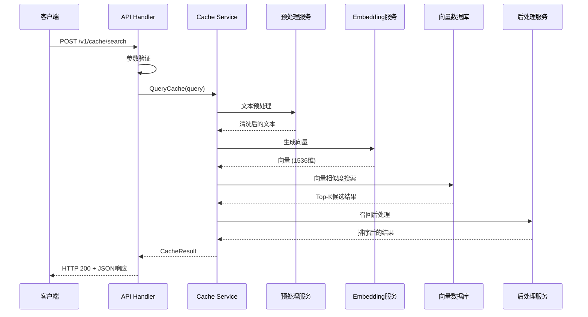
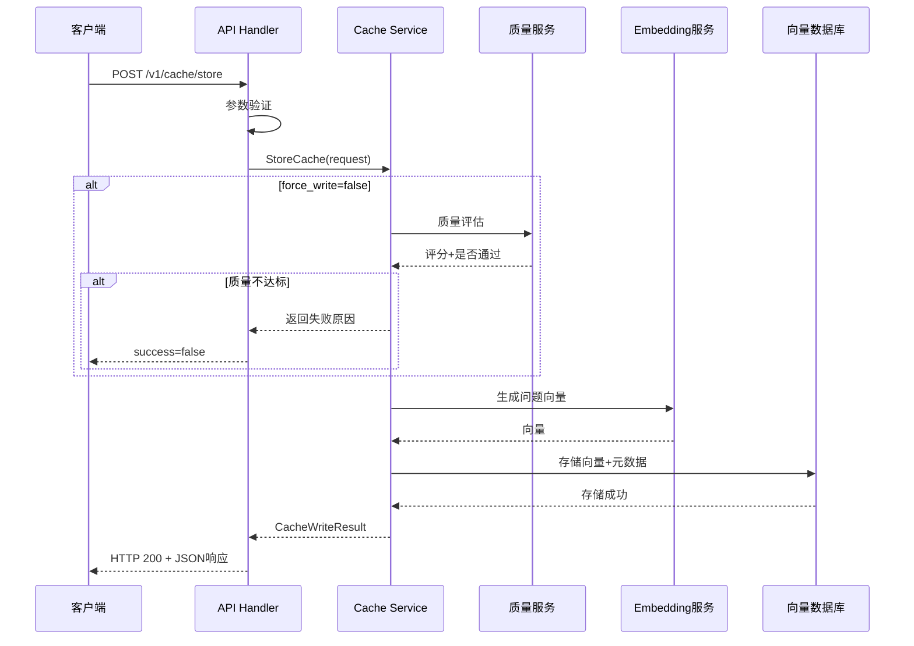

# LLM-Cache 产品需求文档 (PRD)

> **产品名称**: LLM-Cache  
> **文档版本**: v3.0 (Eino 框架重构版)  
> **创建日期**: 2025年10月1日  
> **最后更新**: 2025年12月1日  
> **产品类型**: To B - 企业级LLM语义缓存中间件  
> **技术栈**: Golang + CloudWeGo Eino 框架 + 多向量数据库支持 + 多Embedding服务支持  

---

## 📌 文档说明

**v3.0 重大更新**:
- ✅ 基于 CloudWeGo Eino 框架重构，采用 Graph 流程编排
- ✅ 支持多向量数据库（Qdrant/Milvus/Redis/ES8/VikingDB）
- ✅ 支持多 Embedding 提供商（OpenAI/ARK/Ollama/Dashscope/Qianfan/Tencentcloud）
- ✅ 内置 Callback 可观测性机制
- ✅ Handler 直接依赖 `compose.Runnable` 原生类型

**文档生成依据**:
- ✅ HTTP API接口设计 (基于`cache_handler.go`, `routes.go`)
- ✅ 数据模型定义 (基于`models/cache.go`, `models/vector.go`)
- ✅ 配置规则 (基于`configs/config.go`, `internal/eino/config/`)
- ✅ 业务流程 (基于`internal/eino/flows/`的 Graph 编排)
- ✅ 架构设计 (基于 Eino 组件和 Graph 流程)

---

## 1. 产品概述

### 1.1 产品定位

**产品描述**:  
LLM-Cache 是一个基于Golang的**高性能LLM语义缓存中间件**,通过向量相似度匹配技术智能缓存相似问答对,大幅降低LLM API调用成本并提升响应速度。

**核心技术**:
- **CloudWeGo Eino 框架**: 基于 Graph 的 LLM 应用流程编排
- **语义向量检索**: 支持 Qdrant/Milvus/Redis/ES8/VikingDB 多种向量数据库
- **多 Embedding 提供商**: OpenAI/ARK/Ollama/Dashscope/Qianfan/Tencentcloud
- **Graph 流程编排**: 查询 Graph (Preprocess → Retrieve → Select → Postprocess)
- **可插拔 Lambda 节点**: 预处理、后处理、质量检查、结果选择
- **Callback 可观测性**: 内置日志/指标/追踪，支持 Langfuse/APMPlus 集成
- **用户类型隔离**: user_type 字段实现多租户场景隔离

### 1.2 目标用户

**主要用户**: 
- **AI应用开发者**: 构建基于LLM的智能应用,需要降低API成本和提升响应速度
- **企业技术架构师**: 负责AI基础设施规划,关注系统可扩展性和运维成本
- **LLM服务集成商**: 提供AI服务的企业,需要控制运营成本并保证服务质量

**使用场景**: [推断]
1. **智能客服系统**: 缓存高频问题,实现毫秒级响应
2. **知识问答系统**: RAG场景下缓存重复查询,节省检索和生成成本
3. **内容生成助手**: 缓存常见内容模板,加速创作流程
4. **多租户SaaS平台**: 通过user_type实现不同客户的缓存隔离

### 1.3 产品价值

**用户痛点**: [推断]
- LLM API调用成本高昂,大规模应用难以承受
- API响应延迟(3-8秒)影响用户体验
- 大量重复或相似查询造成资源浪费
- 缺乏有效的成本控制和性能优化手段

**解决方案**:
- 语义缓存命中率可达70-90%,节省90%+的API成本
- 缓存命中时响应时间<100ms,提升50-100倍
- 自动质量评估过滤低质量答案,保证缓存内容质量
- 灵活的相似度阈值配置,平衡命中率与准确性

**核心价值**:
- **降本**: 大幅削减LLM API调用成本
- **增效**: 百倍提升缓存命中场景的响应速度
- **提质**: 质量评估机制确保缓存内容高质量
- **易用**: RESTful API设计,与现有系统无缝集成

### 1.4 产品目标 [待补充]

- 缓存命中率达到80%+ (需根据实际业务场景调整)
- 缓存命中响应时间<100ms (P95)
- API调用成本降低80%+
- 支持100+ QPS的并发查询

---

## 2. 功能需求

### 功能模块概览

| 模块名称 | 优先级 | 功能简述 | 实现状态 |
|---------|--------|---------|---------|
| 缓存查询 | P0 | 基于语义相似度的智能缓存匹配 | ✅ 已实现 |
| 缓存存储 | P0 | 问答对的向量化存储和质量评估 | ✅ 已实现 |
| 缓存管理 | P0 | 缓存项的查询、删除和统计 | ✅ 已实现 |
| 系统监控 | P1 | 健康检查和统计信息 | ✅ 已实现 |
| 质量控制 | P1 | 基于策略的内容质量评估 | ✅ 已实现 |
| 请求预处理 | P1 | 问题文本的清洗和标准化 | ✅ 已实现 |
| 召回后处理 | P1 | 检索结果的排序和过滤 | ✅ 已实现 |

---

### 2.1 功能模块一: 缓存查询

#### 2.1.1 功能描述

缓存查询是系统的**核心功能**,负责根据用户问题在向量数据库中检索最相似的历史问答对。通过语义向量相似度计算,可以匹配语义相近但表达不同的问题,实现智能缓存命中。

#### 2.1.2 用户故事

**Story 1: 语义缓存查询**
- **作为**: AI应用开发者
- **我希望**: 输入用户问题后系统自动查找语义相似的历史答案
- **以便**: 避免重复调用昂贵的LLM API,降低成本并提升响应速度
- **优先级**: P0

**Story 2: 相似度阈值自定义**
- **作为**: 系统管理员
- **我希望**: 可以针对不同场景动态调整相似度阈值
- **以便**: 在成本节约和答案准确性之间找到最佳平衡点
- **优先级**: P0

**Story 3: TopK结果控制**
- **作为**: AI应用开发者
- **我希望**: 可以指定返回多少个最相似的候选结果
- **以便**: 根据业务需要进行二次筛选或融合
- **优先级**: P1

#### 2.1.3 功能点清单

| 功能点 | 详细描述 | API端点 | 优先级 | 实现状态 |
|-------|---------|---------|--------|---------|
| 语义缓存查询 | 基于向量相似度检索最匹配的缓存项 | POST /v1/cache/search | P0 | ✅ |
| 相似度阈值配置 | 支持请求级别覆盖全局阈值 | 参数: similarity_threshold | P0 | ✅ |
| TopK控制 | 指定返回结果数量(1-100) | 参数: top_k | P1 | ✅ |
| 用户类型隔离 | 不同用户类型的缓存互不干扰 | 参数: user_type | P0 | ✅ |
| 统计信息返回 | 可选返回缓存项的命中统计 | 参数: include_statistics | P1 | ✅ |

#### 2.1.4 业务规则

**查询规则**:
1. **必填字段**: `question`(问题文本, 1-1000字符), `user_type`(用户类型标识)
2. **相似度阈值**: 
   - 默认值: 0.8 (在配置文件中定义)
   - 可通过请求参数`similarity_threshold`覆盖 (范围: 0.0-1.0)
   - 阈值越高,匹配越严格,命中率越低但准确性越高
3. **TopK限制**: 1-100之间,默认值可配置
4. **用户类型隔离**: 查询时只在相同`user_type`的缓存中搜索

**处理流程** (基于 Eino Graph 编排):
1. 请求参数验证 (Handler 层) → 
2. **Preprocess 节点**: 文本清洗、标准化 → 
3. **Retrieve 节点**: 调用 Eino Retriever (内含 Embedding + 向量检索) → 
4. **Select 节点**: 结果选择 (支持 first/highest_score/temperature_softmax) → 
5. **Postprocess 节点**: 格式化输出 → 
6. 返回最佳匹配结果

**Graph 流程图**:
```
START → Preprocess → Retrieve → Select → Postprocess → END
```

**相似度计算** [从配置推断]:
- 距离度量: Cosine相似度 (在Qdrant配置中指定)
- 向量维度: 根据Embedding模型确定 (如OpenAI text-embedding-ada-002为1536维)

#### 2.1.5 数据字段

**请求参数 (CacheQuery)**

| 字段名 | 类型 | 必填 | 说明 | 校验规则 | 默认值 |
|--------|------|------|------|---------|--------|
| question | string | 是 | 用户问题 | 1-1000字符 | - |
| user_type | string | 是 | 用户类型标识 | 非空字符串 | - |
| similarity_threshold | float64 | 否 | 相似度阈值 | 0.0-1.0 | 配置文件中的值 |
| top_k | int | 否 | 返回结果数量 | 1-100 | 配置文件中的值 |
| filters | map | 否 | 额外过滤条件 | - | - |
| include_statistics | bool | 否 | 是否返回统计信息 | - | false |

**响应结果 (CacheResult)**

| 字段名 | 类型 | 说明 |
|--------|------|------|
| found | bool | 是否找到匹配的缓存 |
| cache_id | string | 缓存项ID (found=true时) |
| answer | string | 缓存的答案 (found=true时) |
| similarity | float64 | 相似度分数 (0.0-1.0) |
| response_time | float64 | 响应耗时(毫秒) |
| metadata | CacheMetadata | 缓存元数据 (可选) |
| statistics | CacheStatistics | 统计信息 (可选) |
| reason | string | 未命中原因 (found=false时) |

**缓存元数据 (CacheMetadata)**

| 字段名 | 类型 | 说明 |
|--------|------|------|
| source | string | 数据来源标识 |
| quality_score | float64 | 质量评估分数 (0.0-1.0, 或-1.0表示未评估) |
| version | int | 数据版本号 |

**缓存统计 (CacheStatistics)**

| 字段名 | 类型 | 说明 |
|--------|------|------|
| hit_count | int64 | 累计命中次数 |
| like_count | int64 | 点赞次数 |
| last_hit_time | timestamp | 最后命中时间 |

#### 2.1.6 交互流程



#### 2.1.7 验收标准

- [ ] 用户可以通过POST /v1/cache/search成功查询缓存
- [ ] 相同问题多次查询返回一致的结果
- [ ] 相似问题(改变表述)能匹配到相同的缓存答案
- [ ] 相似度阈值为1.0时只匹配完全相同的问题
- [ ] 相似度阈值为0.0时匹配所有缓存项
- [ ] user_type不同的查询结果互不干扰
- [ ] 缓存未命中时返回found=false和合理的reason
- [ ] 响应时间<100ms (P95, 缓存命中场景)
- [ ] 并发查询不会出现数据错乱

---

### 2.2 功能模块二: 缓存存储

#### 2.2.1 功能描述

缓存存储功能负责将新的问答对持久化到系统中,包括文本存储和向量索引构建。系统会自动对内容进行质量评估,低质量内容可被拒绝写入。

#### 2.2.2 用户故事

**Story 1: 问答对缓存**
- **作为**: AI应用开发者
- **我希望**: LLM返回新答案后自动存入缓存系统
- **以便**: 未来相同或相似问题可直接命中缓存
- **优先级**: P0

**Story 2: 质量自动过滤**
- **作为**: 系统管理员
- **我希望**: 系统自动拒绝存储低质量答案(如错误信息、道歉回复)
- **以便**: 保持缓存内容的整体质量,避免污染
- **优先级**: P1

**Story 3: 强制写入**
- **作为**: 系统管理员
- **我希望**: 可以跳过质量检查强制写入特定内容
- **以便**: 手动修正或补充重要缓存项
- **优先级**: P2

#### 2.2.3 功能点清单

| 功能点 | 详细描述 | API端点 | 优先级 | 实现状态 |
|-------|---------|---------|--------|---------|
| 问答对存储 | 将问题和答案存入缓存系统 | POST /v1/cache/store | P0 | ✅ |
| 自动向量化 | 自动为问题生成向量表示 | (内部流程) | P0 | ✅ |
| 质量评估 | 基于策略评估答案质量 | (内部流程) | P1 | ✅ |
| 黑名单过滤 | 拒绝包含黑名单关键词的内容 | (配置驱动) | P1 | ✅ |
| 强制写入 | 跳过质量检查强制存储 | 参数: force_write | P2 | ✅ |
| 元数据存储 | 支持自定义元数据 | 参数: metadata | P1 | ✅ |

#### 2.2.4 业务规则

**存储规则**:
1. **必填字段**: 
   - `question`: 1-1000字符
   - `answer`: 1-10000字符
   - `user_type`: 用户类型标识
2. **质量评估** [从代码推断]:
   - 默认启用 (可通过`force_write=true`跳过)
   - 评估维度: 格式正确性、内容相关性
   - 评估阈值: 配置文件中指定 (默认0.7)
   - 评估失败时拒绝写入,返回失败原因
3. **黑名单检查** [从配置推断]:
   - 道歉关键词: "对不起", "抱歉", "无法回答"等
   - 错误关键词: "错误", "失败", "异常"等
   - 长度限制: 问题5-1000字符, 答案10-10000字符
4. **向量生成**:
   - 自动调用Embedding服务为问题生成向量
   - 向量维度由Embedding模型决定
   - 向量存储在Qdrant中用于后续检索

**存储流程** [从代码推断]:
1. 请求参数验证 → 
2. 质量评估(可跳过) → 
3. 问题向量化 → 
4. 向量存储(Qdrant) → 
5. 元数据存储 → 
6. 返回存储结果

#### 2.2.5 数据字段

**请求参数 (CacheWriteRequest)**

| 字段名 | 类型 | 必填 | 说明 | 校验规则 | 默认值 |
|--------|------|------|------|---------|--------|
| question | string | 是 | 问题文本 | 1-1000字符 | - |
| answer | string | 是 | 答案文本 | 1-10000字符 | - |
| user_type | string | 是 | 用户类型 | 非空字符串 | - |
| metadata | CacheMetadata | 否 | 元数据 | - | - |
| force_write | bool | 否 | 是否强制写入 | - | false |

**响应结果 (CacheWriteResult)**

| 字段名 | 类型 | 说明 |
|--------|------|------|
| success | bool | 是否写入成功 |
| cache_id | string | 缓存项ID (success=true时) |
| message | string | 结果消息/失败原因 |
| quality_score | float64 | 质量评估分数 (0.0-1.0, 或-1.0) |

#### 2.2.6 交互流程



#### 2.2.7 验收标准

- [ ] 用户可以成功存储合法的问答对
- [ ] 存储后立即查询可以命中该缓存
- [ ] 低质量答案(如"对不起,我不知道")被拒绝存储
- [ ] force_write=true可以跳过质量检查
- [ ] 超长问题/答案被拒绝
- [ ] 返回的cache_id可用于后续查询和删除
- [ ] 相同问题重复存储会更新现有缓存
- [ ] 元数据正确关联到缓存项

---

### 2.3 功能模块三: 缓存管理

#### 2.3.1 功能描述

提供缓存项的查询、删除和统计功能,便于管理员监控和维护缓存系统。

#### 2.3.2 用户故事

**Story 1: 缓存项查询**
- **作为**: 系统管理员
- **我希望**: 根据cache_id查看缓存项的详细信息
- **以便**: 审核缓存内容或排查问题
- **优先级**: P1

**Story 2: 缓存删除**
- **作为**: 系统管理员
- **我希望**: 删除错误或过时的缓存项
- **以便**: 维护缓存内容的准确性和时效性
- **优先级**: P1

**Story 3: 统计分析**
- **作为**: 产品经理
- **我希望**: 查看缓存的命中率、覆盖范围等统计数据
- **以便**: 评估缓存系统的业务价值
- **优先级**: P1

#### 2.3.3 功能点清单

| 功能点 | 详细描述 | API端点 | 优先级 | 实现状态 |
|-------|---------|---------|--------|---------|
| 根据ID查询缓存 | 获取指定缓存项的详细信息 | GET /v1/cache/:cache_id | P1 | ✅ |
| 删除单个缓存 | 删除指定的缓存项 | DELETE /v1/cache/:cache_id | P1 | ✅ |
| 批量删除缓存 | 批量删除多个缓存项 | DELETE /v1/cache/batch | P1 | ✅ |
| 缓存统计信息 | 获取全局或用户级别的统计数据 | GET /v1/cache/statistics | P1 | ✅ |
| 健康检查 | 检查缓存服务运行状态 | GET /v1/cache/health | P0 | ✅ |

#### 2.3.4 业务规则

**查询规则**:
- 必须提供`cache_id`和`user_type`
- 只能查询属于指定`user_type`的缓存项
- 可选参数`include_statistics`控制是否返回统计信息

**删除规则** [从代码推断]:
- 单个删除: 通过URL参数传递`cache_id`和`user_type`
- 批量删除: 请求体包含`cache_ids`数组和`user_type`
- 只能删除属于指定`user_type`的缓存项
- 可选参数`force`控制是否强制删除 (具体行为待确认)
- 删除操作同时清理向量索引和元数据

**统计规则** [从代码推断]:
- 可按`user_type`过滤统计范围
- 支持时间范围过滤 (time_range参数, 如"24h", "7d")
- 统计指标包括: 总缓存数、命中次数、命中率等 (具体指标待确认)

#### 2.3.5 数据字段

**删除请求 (CacheDeleteRequest)**

| 字段名 | 类型 | 必填 | 说明 |
|--------|------|------|------|
| cache_ids | []string | 是 | 要删除的缓存ID列表 |
| user_type | string | 是 | 用户类型 |
| force | bool | 否 | 是否强制删除 |

**删除结果 (CacheDeleteResult)**

| 字段名 | 类型 | 说明 |
|--------|------|------|
| success | bool | 是否删除成功 |
| deleted_count | int | 实际删除的数量 |
| failed_ids | []string | 删除失败的ID列表 |
| message | string | 结果消息 |

#### 2.3.6 验收标准

- [ ] 管理员可以根据ID查询缓存项详情
- [ ] 管理员可以删除指定的缓存项
- [ ] 删除后该缓存项无法再被查询
- [ ] 批量删除可以一次删除多个缓存项
- [ ] 统计信息准确反映缓存系统的运行状况
- [ ] 健康检查接口返回系统状态

---

### 2.4 功能模块四: 系统监控

#### 2.4.1 功能描述

提供系统健康检查和运行状态监控,确保服务稳定性。

#### 2.4.2 用户故事

**Story 1: 健康检查**
- **作为**: 运维工程师
- **我希望**: 通过健康检查接口监控服务状态
- **以便**: 及时发现和处理服务异常
- **优先级**: P0

#### 2.4.3 功能点清单

| 功能点 | 详细描述 | API端点 | 优先级 | 实现状态 |
|-------|---------|---------|--------|---------|
| 健康检查 | 检查服务和依赖组件状态 | GET /v1/cache/health | P0 | ✅ |
| 统计信息 | 获取系统运行统计数据 | GET /v1/cache/statistics | P1 | ✅ |

#### 2.4.4 验收标准

- [ ] 健康检查接口返回服务状态
- [ ] 依赖组件异常时健康检查返回错误
- [ ] 统计接口返回关键运行指标

---

## 3. API接口设计

### 3.1 接口规范

**基础规范**:
- **协议**: HTTP/1.1
- **数据格式**: JSON
- **字符编码**: UTF-8
- **HTTP状态码**: 所有接口统一返回200 (业务状态通过响应体中的`code`字段表示)
- **版本管理**: URL路径包含版本号 (如`/v1/`)

**统一响应格式**:

```json
{
  "success": true,           // 业务是否成功
  "code": 0,                 // 业务状态码 (0=成功, >0=错误)
  "message": "操作成功",      // 消息描述
  "data": {...},             // 业务数据
  "request_id": "uuid",      // 请求追踪ID
  "timestamp": 1696176000    // 响应时间戳(秒)
}
```

**业务状态码**:

| 状态码 | 标识 | 说明 |
|-------|------|------|
| 0 | OK | 成功 |
| 1001 | INVALID_PARAM | 请求参数错误 |
| 1002 | INTERNAL_ERROR | 内部错误 |
| 1003 | UNAVAILABLE | 服务不可用 |
| 1004 | NOT_FOUND | 资源不存在 |

### 3.2 核心接口清单

#### 3.2.1 缓存查询

**接口**: `POST /v1/cache/search`

**功能**: 基于语义相似度查询缓存

**请求示例**:
```json
{
  "question": "如何使用Python连接MySQL数据库?",
  "user_type": "developer",
  "similarity_threshold": 0.85,
  "top_k": 5,
  "include_statistics": true
}
```

**响应示例** (命中):
```json
{
  "success": true,
  "code": 0,
  "message": "缓存查询成功",
  "data": {
    "found": true,
    "cache_id": "abc123",
    "answer": "使用pymysql库...",
    "similarity": 0.92,
    "response_time": 45.5,
    "metadata": {
      "source": "manual",
      "quality_score": 0.88,
      "version": 1
    },
    "statistics": {
      "hit_count": 127,
      "like_count": 45,
      "last_hit_time": "2025-10-01T10:30:00Z"
    }
  },
  "request_id": "req-uuid-123",
  "timestamp": 1696176000
}
```

**响应示例** (未命中):
```json
{
  "success": true,
  "code": 0,
  "message": "缓存查询成功",
  "data": {
    "found": false,
    "reason": "no_similar_cache_found",
    "response_time": 38.2
  },
  "request_id": "req-uuid-124",
  "timestamp": 1696176001
}
```

#### 3.2.2 缓存存储

**接口**: `POST /v1/cache/store`

**功能**: 存储新的问答对到缓存

**请求示例**:
```json
{
  "question": "如何使用Python连接MySQL数据库?",
  "answer": "使用pymysql库可以连接MySQL...",
  "user_type": "developer",
  "metadata": {
    "source": "gpt-4",
    "version": 1
  },
  "force_write": false
}
```

**响应示例** (成功):
```json
{
  "success": true,
  "code": 0,
  "message": "缓存存储成功",
  "data": {
    "success": true,
    "cache_id": "abc123",
    "message": "缓存已成功存储",
    "quality_score": 0.88
  },
  "request_id": "req-uuid-125",
  "timestamp": 1696176002
}
```

**响应示例** (质量不达标):
```json
{
  "success": true,
  "code": 0,
  "message": "缓存存储成功",
  "data": {
    "success": false,
    "message": "答案质量评分不达标: 0.45 < 0.70",
    "quality_score": 0.45
  },
  "request_id": "req-uuid-126",
  "timestamp": 1696176003
}
```

#### 3.2.3 根据ID查询缓存

**接口**: `GET /v1/cache/:cache_id?user_type=xxx&include_statistics=true`

**功能**: 获取指定缓存项的详细信息

**请求示例**:
```
GET /v1/cache/abc123?user_type=developer&include_statistics=true
```

**响应示例**:
```json
{
  "success": true,
  "code": 0,
  "message": "缓存查询成功",
  "data": {
    "id": "abc123",
    "question": "如何使用Python连接MySQL数据库?",
    "answer": "使用pymysql库...",
    "user_type": "developer",
    "vector": null,
    "metadata": {
      "source": "gpt-4",
      "quality_score": 0.88,
      "version": 1
    },
    "statistics": {
      "hit_count": 127,
      "like_count": 45,
      "last_hit_time": "2025-10-01T10:30:00Z"
    },
    "create_time": "2025-09-15T08:20:00Z",
    "update_time": "2025-09-15T08:20:00Z"
  },
  "request_id": "req-uuid-127",
  "timestamp": 1696176004
}
```

#### 3.2.4 删除缓存

**接口**: `DELETE /v1/cache/:cache_id?user_type=xxx&force=false`

**功能**: 删除指定的缓存项

**请求示例**:
```
DELETE /v1/cache/abc123?user_type=developer&force=false
```

**响应示例**:
```json
{
  "success": true,
  "code": 0,
  "message": "缓存删除成功",
  "data": {
    "success": true,
    "deleted_count": 1,
    "failed_ids": [],
    "message": "缓存项已成功删除"
  },
  "request_id": "req-uuid-128",
  "timestamp": 1696176005
}
```

#### 3.2.5 批量删除缓存

**接口**: `DELETE /v1/cache/batch`

**功能**: 批量删除多个缓存项

**请求示例**:
```json
{
  "cache_ids": ["abc123", "def456", "ghi789"],
  "user_type": "developer",
  "force": false
}
```

**响应示例**:
```json
{
  "success": true,
  "code": 0,
  "message": "批量缓存删除成功",
  "data": {
    "success": true,
    "deleted_count": 2,
    "failed_ids": ["ghi789"],
    "message": "成功删除2个缓存项,1个失败"
  },
  "request_id": "req-uuid-129",
  "timestamp": 1696176006
}
```

#### 3.2.6 获取缓存统计

**接口**: `GET /v1/cache/statistics?user_type=xxx&time_range=24h`

**功能**: 获取缓存系统的统计信息

**请求示例**:
```
GET /v1/cache/statistics?user_type=developer&time_range=24h
```

**响应示例** [推断]:
```json
{
  "success": true,
  "code": 0,
  "message": "缓存统计查询成功",
  "data": {
    "total_cache_count": 15234,
    "total_hit_count": 45678,
    "hit_rate": 0.82,
    "avg_similarity": 0.89,
    "time_range": "24h",
    "user_type": "developer"
  },
  "request_id": "req-uuid-130",
  "timestamp": 1696176007
}
```

#### 3.2.7 健康检查

**接口**: `GET /v1/cache/health`

**功能**: 检查服务健康状态

**响应示例**:
```json
{
  "success": true,
  "code": 0,
  "message": "服务正常",
  "data": {
    "status": "healthy",
    "components": {
      "embedding_service": "ok",
      "vector_database": "ok",
      "cache_service": "ok"
    },
    "uptime_seconds": 86400,
    "version": "v1.0.0"
  },
  "request_id": "req-uuid-131",
  "timestamp": 1696176008
}
```

---

## 4. 数据模型

### 4.1 核心实体

#### 4.1.1 缓存项 (CacheItem)

**实体说明**: 代表一个完整的问答对缓存记录

| 字段名 | 类型 | 必填 | 说明 | 约束 |
|--------|------|------|------|------|
| id | string | 是 | 缓存项唯一标识 | UUID格式 |
| question | string | 是 | 用户原始问题 | 1-1000字符 |
| answer | string | 是 | LLM生成的答案 | 1-10000字符 |
| user_type | string | 是 | 用户类型标识 | 非空字符串 |
| vector | []float32 | 否 | 问题的向量表示 | 维度由模型决定 |
| metadata | CacheMetadata | 否 | 元数据 | - |
| statistics | CacheStatistics | 否 | 统计信息 | - |
| create_time | timestamp | 是 | 创建时间 | ISO 8601格式 |
| update_time | timestamp | 是 | 更新时间 | ISO 8601格式 |

#### 4.1.2 向量 (Vector)

**实体说明**: 向量数据结构,用于语义检索

| 字段名 | 类型 | 必填 | 说明 |
|--------|------|------|------|
| id | string | 是 | 向量唯一标识 |
| values | []float32 | 是 | 向量值数组 |
| dimension | int | 是 | 向量维度 |
| create_time | timestamp | 是 | 创建时间 |
| update_time | timestamp | 是 | 更新时间 |
| normalized | bool | 是 | 是否已归一化 |
| model_name | string | 否 | 生成向量的模型名称 |

### 4.2 实体关系图

```
┌─────────────────────┐
│    CacheItem        │
│  - id (PK)          │
│  - question         │
│  - answer           │
│  - user_type        │ ───── 场景隔离
│  - vector           │ ─┐
│  - metadata         │  │
│  - statistics       │  │
│  - create_time      │  │
│  - update_time      │  │
└─────────────────────┘  │
                         │
                         │ 关联
                         │
                         ▼
              ┌──────────────────┐
              │     Vector       │
              │  - id (PK)       │
              │  - values        │ ◄─── 向量检索
              │  - dimension     │
              │  - model_name    │
              └──────────────────┘
                         │
                         │ 存储于
                         ▼
              ┌──────────────────┐
              │  Qdrant DB       │
              │  - Collection    │
              │  - Index         │
              └──────────────────┘
```

---

## 5. 非功能需求

### 5.1 性能需求

**响应时间** [从配置推断]:
- 缓存命中查询: P95 < 100ms, P99 < 200ms
- 缓存写入: P95 < 500ms (包含向量生成和存储)
- 健康检查: < 50ms

**吞吐量** [待补充]:
- 单节点查询QPS > 100 (需压测验证)
- 单节点写入QPS > 50 (需压测验证)
- 并发连接数 > 1000

**Embedding服务性能** [从配置推断]:
- 超时时间: 30秒 (可配置)
- 最大重试次数: 3次 (可配置)
- 重试延迟: 可配置

**向量数据库性能** [从配置推断]:
- Qdrant连接超时: 可配置
- 最大重试次数: 可配置
- 重试延迟: 可配置

### 5.2 安全需求

**认证授权** [待实现]:
- ⚠️ 当前代码中未见API Key认证机制
- ⚠️ 建议实现: JWT Token或API Key认证
- ⚠️ 建议实现: 基于user_type的权限隔离

**数据安全**:
- user_type字段实现多租户数据隔离
- 敏感配置(API Key)需加密存储或使用环境变量

**传输安全** [待实现]:
- ⚠️ 建议启用HTTPS/TLS加密

**防护措施** [待实现]:
- ⚠️ 建议实现请求频率限制
- ⚠️ 建议实现输入内容安全检查

### 5.3 可用性需求

**服务可用性** [推断]:
- 目标: 99.9% (单节点模式)
- 优雅关闭: 30秒超时 (从代码读取)

**日志监控** [已实现]:
- 基于slog的结构化日志
- 支持多种日志级别: debug, info, warn, error
- 支持多种输出方式: stdout, stderr, file
- 每个请求分配唯一request_id用于追踪

**健康检查** [已实现]:
- 提供`/v1/cache/health`接口
- 检查依赖组件状态 (Embedding服务、向量数据库)

**容错机制** [从配置推断]:
- Embedding服务调用失败自动重试 (最多3次)
- 向量数据库连接失败自动重试
- Gin框架的Recovery中间件捕获panic

### 5.4 兼容性需求

**API兼容**:
- RESTful API规范
- JSON数据格式
- 版本化URL路径 (/v1/)

**存储兼容** [从代码推断]:
- 当前支持Qdrant向量数据库
- 架构设计支持扩展其他向量数据库 (通过VectorRepository接口)

**Embedding兼容** [从代码推断]:
- 当前支持远程Embedding服务
- 架构设计支持本地Embedding模型 (配置中有local选项)

### 5.5 可扩展性需求

**水平扩展** [待实现]:
- ⚠️ 当前为单节点架构
- ⚠️ 建议实现负载均衡支持
- ⚠️ 建议实现分布式缓存一致性

**模块化设计** [已实现]:
- 清晰的分层架构 (Handler → Service → Infrastructure)
- 接口抽象 (CacheService, VectorRepository, EmbeddingService)
- 可插拔的组件设计 (预处理、后处理、质量评估)

**配置化管理** [已实现]:
- YAML配置文件
- 环境变量支持 (待确认)
- 配置验证机制

---

## 6. 系统架构

### 6.1 整体架构

```
┌──────────────────────────────────────────────────────────────┐
│                        客户端应用                              │
│              (AI应用、聊天机器人、知识库等)                     │
└──────────────────────────────────────────────────────────────┘
                             │ HTTP/JSON
                             ▼
┌──────────────────────────────────────────────────────────────┐
│                      应用层 (App Layer)                        │
│  ┌─────────────────┐    ┌──────────────────────────────┐    │
│  │  Gin HTTP Server│    │  Middleware                   │    │
│  │  - Routes       │◄───│  - Logging                    │    │
│  │  - Handlers     │    │  - Recovery                   │    │
│  │  - Validation   │    │  - RequestID                  │    │
│  └─────────────────┘    └──────────────────────────────┘    │
└──────────────────────────────────────────────────────────────┘
                             │
                             ▼
┌──────────────────────────────────────────────────────────────┐
│                   领域层 (Domain Layer)                        │
│  ┌────────────────────────────────────────────────────┐      │
│  │               CacheService (核心业务)                │      │
│  │  - QueryCache     缓存查询                          │      │
│  │  - StoreCache     缓存存储                          │      │
│  │  - DeleteCache    缓存删除                          │      │
│  │  - GetCacheByID   缓存查询                          │      │
│  └────────────────────────────────────────────────────┘      │
│                             │                                 │
│         ┌───────────────────┼───────────────────┐            │
│         ▼                   ▼                   ▼            │
│  ┌──────────┐      ┌──────────────┐    ┌──────────────┐    │
│  │ Vector   │      │  Embedding   │    │  Quality     │    │
│  │ Service  │      │  Service     │    │  Service     │    │
│  └──────────┘      └──────────────┘    └──────────────┘    │
└──────────────────────────────────────────────────────────────┘
                             │
                             ▼
┌──────────────────────────────────────────────────────────────┐
│                基础设施层 (Infrastructure Layer)               │
│  ┌──────────────┐  ┌──────────────┐  ┌──────────────┐       │
│  │ Request      │  │ Recall       │  │ Quality      │       │
│  │ Preprocessing│  │ Postprocessing│  │ Assessment   │       │
│  │  - 文本清洗   │  │  - 结果排序   │  │  - 黑名单    │       │
│  │  - 标准化     │  │  - 过滤       │  │  - 策略评估  │       │
│  └──────────────┘  └──────────────┘  └──────────────┘       │
│                                                               │
│  ┌──────────────────────┐  ┌─────────────────────────┐      │
│  │  Qdrant Vector Store │  │ Remote Embedding Service│      │
│  │  - 向量存储          │  │ - OpenAI/其他API        │      │
│  │  - 相似度搜索        │  │ - 向量生成              │      │
│  └──────────────────────┘  └─────────────────────────┘      │
└──────────────────────────────────────────────────────────────┘
```

### 6.2 数据流转

**缓存查询流程**:

```
用户问题
  │
  ▼
请求预处理 (清洗、标准化)
  │
  ▼
向量生成 (调用Embedding服务)
  │
  ▼
向量检索 (Qdrant相似度搜索)
  │
  ▼
召回后处理 (排序、过滤)
  │
  ▼
返回最佳匹配
```

**缓存存储流程**:

```
问答对
  │
  ▼
质量评估 (可跳过)
  │
  ├─ 不达标 → 拒绝存储
  │
  ▼
问题向量化
  │
  ▼
向量存储 (Qdrant)
  │
  ▼
元数据存储
  │
  ▼
返回存储结果
```

### 6.3 技术选型

| 层次 | 组件 | 技术选型 | 说明 |
|------|------|---------|------|
| 应用层 | HTTP框架 | Gin | 高性能Go Web框架 |
| 应用层 | 日志 | slog | Go 1.21+标准库 |
| 领域层 | 语言 | Golang | 高性能、高并发 |
| 基础设施 | 向量数据库 | Qdrant | 开源高性能向量数据库 |
| 基础设施 | Embedding | 远程API | OpenAI等云服务 |
| 配置 | 格式 | YAML | 可读性强 |

---

## 7. 配置说明

### 7.1 配置文件结构

**文件路径**: `configs/config.yaml`

**配置分类**:
1. Server配置 - HTTP服务器参数
2. Database配置 - Qdrant向量数据库连接
3. Embedding配置 - 向量化服务配置
4. Logging配置 - 日志输出配置
5. Cache配置 - 缓存行为参数
6. Quality配置 - 质量评估规则

### 7.2 关键配置项

#### 7.2.1 服务器配置

```yaml
server:
  host: "0.0.0.0"                       # 监听地址
  port: 8080                            # 监听端口
  read_timeout: 30s                     # 读超时
  write_timeout: 30s                    # 写超时
  idle_timeout: 120s                    # 空闲超时
  graceful_shutdown_timeout: 30s        # 优雅关闭超时
  max_connections: 10000                # 最大连接数
```

#### 7.2.2 Qdrant配置

```yaml
database:
  type: "qdrant"
  qdrant:
    host: "localhost"                   # Qdrant地址
    port: 6333                          # Qdrant端口
    api_key: ""                         # API密钥(可选)
    collection_name: "llm_cache"        # 集合名称
    vector_size: 1536                   # 向量维度(与Embedding模型匹配)
    distance: "cosine"                  # 距离度量(cosine/euclidean/dot)
    timeout: 30s                        # 连接超时
    max_retries: 3                      # 最大重试次数
    retry_delay: 1s                     # 重试延迟
```

#### 7.2.3 Embedding配置

```yaml
embedding:
  type: "remote"                        # local/remote
  remote:
    api_endpoint: "https://api.openai.com/v1/embeddings"
    api_key: "sk-xxx"                   # API密钥
    model_name: "text-embedding-ada-002"  # 模型名称
    timeout: 30s                        # 超时时间
    max_retries: 3                      # 最大重试次数
    retry_delay: 1s                     # 重试延迟
    headers:                            # 自定义请求头
      User-Agent: "LLM-Cache/1.0"
```

#### 7.2.4 缓存配置

```yaml
cache:
  similarity_threshold: 0.8             # 默认相似度阈值(0.0-1.0)
  top_k: 10                             # 默认返回结果数
  ttl: 720h                             # 缓存过期时间(30天)
  max_cache_size: 1000000               # 最大缓存项数
  enable_async_update: true             # 启用异步更新
  update_batch_size: 100                # 批量更新大小
  update_interval: 10s                  # 更新间隔
```

#### 7.2.5 质量评估配置

```yaml
quality:
  enabled: true                         # 是否启用质量评估
  threshold: 0.7                        # 质量阈值
  strategies:                           # 评估策略
    - name: "format"                    # 格式检查
      weight: 0.3
      enabled: true
      config:
        check_length: true
    - name: "relevance"                 # 相关性检查
      weight: 0.7
      enabled: true
      config: {}
  blacklist:                            # 黑名单规则
    apology_keywords:                   # 道歉关键词
      - "对不起"
      - "抱歉"
      - "无法回答"
    error_keywords:                     # 错误关键词
      - "错误"
      - "失败"
      - "异常"
    min_answer_length: 10               # 最小答案长度
    max_answer_length: 10000            # 最大答案长度
    min_question_length: 5              # 最小问题长度
    max_question_length: 1000           # 最大问题长度
```

---

## 8. 部署运维

### 8.1 部署要求

**环境要求** [推断]:
- Go 1.21+ (代码使用slog包)
- Qdrant向量数据库 (可Docker部署)
- Embedding服务访问权限 (如OpenAI API)

**资源需求** [待补充]:
- CPU: 建议4核+
- 内存: 建议8GB+
- 磁盘: 根据缓存规模确定 (建议SSD)
- 网络: 稳定的外网访问 (调用Embedding API)

### 8.2 启动流程

1. 准备配置文件 `configs/config.yaml`
2. 启动Qdrant向量数据库
3. 配置Embedding服务API密钥
4. 编译: `go build -o llm-cache cmd/server/main.go`
5. 运行: `./llm-cache`
6. 健康检查: `curl http://localhost:8080/v1/cache/health`

### 8.3 日志管理

**日志级别**:
- `debug`: 详细调试信息
- `info`: 常规运行信息 (默认)
- `warn`: 警告信息
- `error`: 错误信息

**日志输出**:
- `stdout`: 标准输出
- `stderr`: 标准错误
- `file`: 文件输出 (需配置`file_path`)

**日志格式**:
- 结构化JSON格式 (slog默认)
- 包含request_id用于请求追踪
- 自动记录请求耗时

---

## 9. 业务规则总结

### 9.1 相似度阈值规则

**全局默认值**: 0.8 (在配置文件中定义)

**请求级别覆盖**: 通过`similarity_threshold`参数指定 (0.0-1.0)

**推荐配置** [推断]:
- **高精度场景** (法律、金融): 0.9+
- **通用场景**: 0.8-0.9
- **高召回场景** (创意、闲聊): 0.6-0.8
- **实验调试**: 0.0 (返回所有结果)

### 9.2 质量评估规则

**启用条件**: `force_write=false` (默认)

**评估维度**:
1. **格式检查** (权重30%):
   - 长度合规性
   - 字符有效性
2. **相关性检查** (权重70%):
   - 问题与答案的相关性 (具体实现待确认)

**黑名单规则**:
- 包含道歉关键词 → 拒绝
- 包含错误关键词 → 拒绝
- 长度超出范围 → 拒绝

**通过标准**: 综合评分 ≥ 阈值 (默认0.7)

### 9.3 用户类型隔离

**隔离机制**: 所有接口必须提供`user_type`参数

**隔离范围**:
- 查询: 只在相同`user_type`的缓存中检索
- 存储: 新缓存项标记`user_type`
- 删除: 只能删除相同`user_type`的缓存项

**应用场景** [推断]:
- 多租户SaaS: 每个客户一个`user_type`
- 场景隔离: 不同业务场景使用不同`user_type`
- A/B测试: 不同实验组使用不同`user_type`

---

## 10. 未来规划

### 10.1 短期优化 (Q4 2025)

- [ ] 实现API Key认证机制
- [ ] 实现请求频率限制
- [ ] 优化向量检索性能
- [ ] 完善监控和统计功能
- [ ] 添加缓存预热功能

### 10.2 中期规划 (2026 H1)

- [ ] 支持批量查询接口
- [ ] 支持更多Embedding模型 (本地ONNX模型)
- [ ] 支持多种向量数据库 (Milvus, Weaviate)
- [ ] 实现分布式集群模式
- [ ] 提供管理后台界面

### 10.3 长期展望 (2026 H2+)

- [ ] 支持多模态缓存 (图片、音频)
- [ ] 智能缓存淘汰策略
- [ ] 自动化质量评估模型
- [ ] 缓存效果分析和推荐
- [ ] 云原生部署支持 (Kubernetes)

---

## 11. FAQ

### 11.1 技术问题

**Q: 向量维度必须与Embedding模型匹配吗?**
A: 是的。Qdrant配置中的`vector_size`必须与Embedding服务返回的向量维度一致。例如OpenAI的text-embedding-ada-002模型返回1536维向量,配置中也应设置为1536。

**Q: 如何选择相似度阈值?**
A: 建议从0.8开始测试。阈值越高匹配越严格,命中率越低但准确性越高。可以根据业务场景和实际效果调整。建议通过A/B测试找到最佳平衡点。

**Q: 是否支持中文?**
A: 支持。只要Embedding模型支持中文(如OpenAI的模型),系统就能处理中文问答对。

**Q: 缓存会自动过期吗?**
A: 配置中有`ttl`参数,但具体过期机制需要确认是否已实现。[待补充]

### 11.2 业务问题

**Q: 如何评估缓存效果?**
A: 关键指标包括:
- 缓存命中率 (通过统计接口获取)
- API成本节约比例
- 平均响应时间对比
- 用户满意度变化

**Q: 低质量答案被拒绝后怎么办?**
A: 有两种方案:
1. 优化答案内容,重新存储
2. 使用`force_write=true`强制写入 (谨慎使用)

**Q: 不同业务场景如何隔离?**
A: 使用不同的`user_type`值。例如:
- 客服场景: `user_type=customer_service`
- 技术支持: `user_type=tech_support`
- 销售咨询: `user_type=sales`

---

## 12. 附录

### 12.1 术语表

| 术语 | 英文 | 定义 |
|------|------|------|
| 语义缓存 | Semantic Cache | 基于语义相似度而非精确匹配的智能缓存 |
| 向量化 | Embedding | 将文本转换为高维向量表示的过程 |
| 相似度阈值 | Similarity Threshold | 判断两个向量是否相似的分数下限 |
| TopK | Top-K | 返回相似度最高的K个结果 |
| 用户类型 | User Type | 用于场景隔离的标识符 |
| 召回 | Recall | 从向量数据库检索候选结果的过程 |
| 后处理 | Post-processing | 对召回结果进行排序、过滤等操作 |
| 质量评估 | Quality Assessment | 对答案内容进行质量评分的过程 |

### 12.2 参考资料

- 项目文档: `docs/project/LLM-Cache产品文档.md`
- 架构文档: `docs/project/AECHITECTURE.md`
- API代码: `internal/app/handlers/cache_handler.go`
- 数据模型: `internal/domain/models/`
- 配置定义: `configs/config.go`

---

**文档维护**:
- 本文档基于当前代码实现生成,后续需根据实际业务需求和代码变更持续更新
- 标注[推断]的内容需要与产品团队确认
- 标注[待补充]的内容需要补充具体信息
- 标注⚠️的内容需要重点关注或改进

**生成日期**: 2025年10月1日  
**代码版本**: 基于当前main分支  
**文档状态**: 草稿v2.0 - 待产品团队审核

